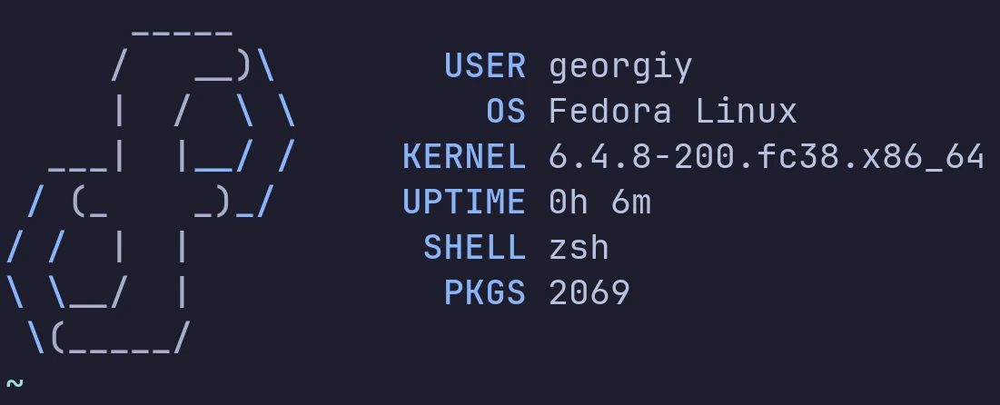
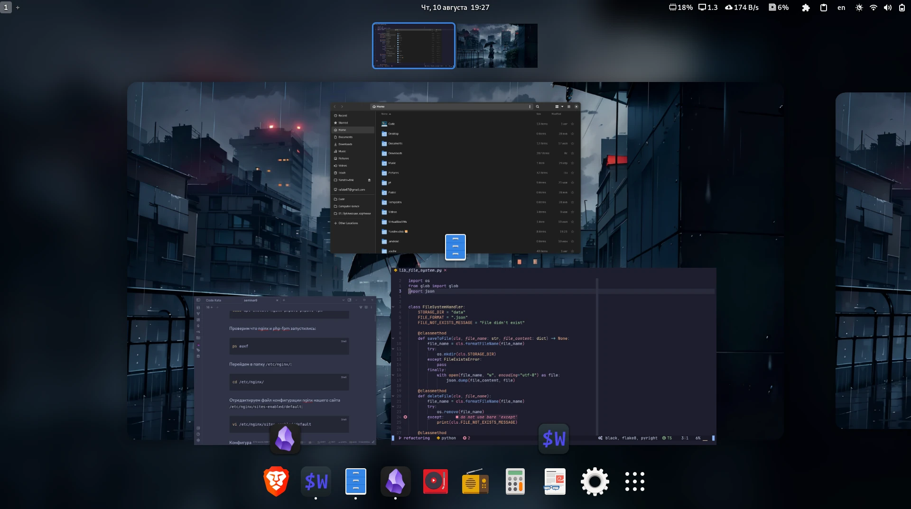
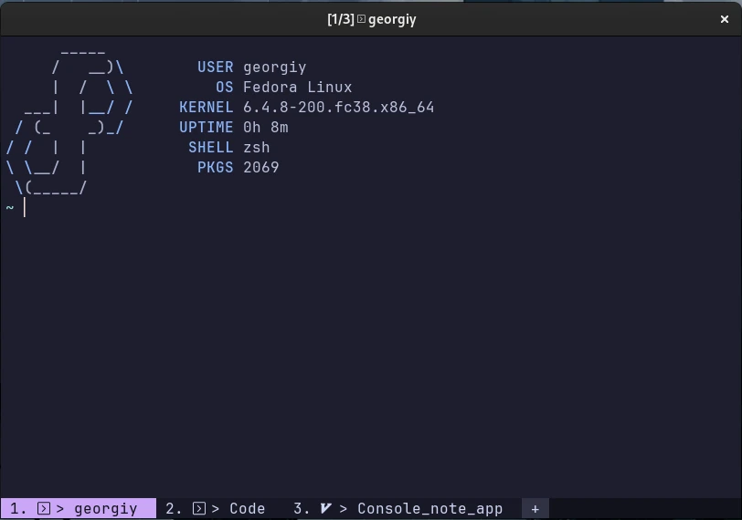
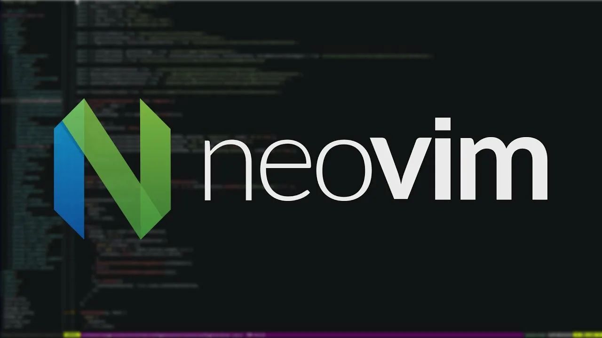
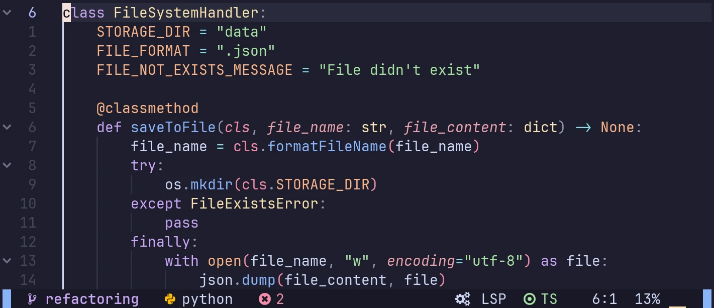

> Создай себе досуг для того, чтобы научиться чему-нибудь хорошему и перестать блуждать без цели. Следует беречься также и другого тяжкого заблуждения. Ведь безумны люди, которые всю жизнь без сил от дел и не имеют все-таки цели, с которой они сообразовали бы всецело все стремления и представления.

## Обо мне

Меня зовут Георгий Кузора, я занимаюсь разработкой программного обеспечения.

### Мои компетенции

Моя основная компетенция - программирование веб-приложений на языке Python. Кроме того, я обладаю дополнительными компетенциями:

- Django
- Java
- Linux
- Docker
- SQL
- HTML
- CSS

### Мои проекты

Я обладаю опытом работы над несколькими проектами:

- Я автоматизировал работу инженера-технолога при обработке данных из системы SAP.
- Я создал приложение для получения размеров упаковки готовой продукции.
- Я разработал сайт для блогинга с использованием фреймворка Django.
- Я также создал сайт-агрегатор предложений о работе при помощи фреймворка Django.

### Мои планы на будущее

- Развивать свои навыки в области разработки программного обеспечения и улучшать свои знания в этой области.
- Продолжать работу над сайтом агрегатора вакансий, настраивать и обучать модель для определения подходящих вакансий для пользователей.
- Еще глубже изучить технологии машинного обучения и искусственного интеллекта.
- Начать изучать язык программирования Go и использовать его в своей работе.

### Мои интересы

В настоящее время я больше всего увлечен разработкой программного обеспечения и иностранными языками.

#### Разработка программного обеспечения

Меня интересуют программирование, разработка ПО и все, что связано с этими темами: Linux, среды разработки, эмуляторы терминалов и другие инструменты. Кроме того, я уделяю свое личное время разработке своих личных проектов вне работы.

#### Иностранные языки

Также меня интересует изучение иностранных языков, в частности японского. Я свободно владею английским, и практически все, что я читаю, смотрю и слушаю, я делаю на этом языке. Кроме того, за последние четыре года я изучал японский язык на курсах в [Санкт-Петербургском Японском центре](https://spb.jc.org.ru/ru/index.html). Хотя я еще не побывал в Японии, я люблю читать мангу и японскую литературу в оригинале.

### Моя среда разработки

[Dotfiles](https://github.com/GeorgeKuzora/dotfiles-fedora) - конфигурация моей среды разработки.

#### Операционная система

Я использую операционную систему [Linux Fedora Workstation](https://fedoraproject.org/workstation/). Считаю, что Fedora представляет собой удачный баланс между стабильностью [Debian](https://www.debian.org/index.ru.html) и свежестью пакетов, присущей [Arch](https://archlinux.org/).

#### Окружение рабочего стола

Я использую [Gnome](https://www.gnome.org/) в качестве своей рабочей среды. Мне нравится в нем функциональность и простота использования. Благодаря единому дизайну своих приложений и рабочего стола он выглядит как целостная система, где все элементы работают в унисон.

#### Эмулятор терминала

Я использую [WezTerm](https://wezfurlong.org/wezterm/index.html) в качестве своего эмулятора терминала. Он написан на языке Rust, а файл конфигурации - на Lua. WezTerm обладает всеми функциями, которые должен иметь современный терминал: поддержка глифов, вкладок, окон, встроенный мультиплексор, режим редактирования и сохранения скроллбэка.

#### Терминальный мультиплексор

Мой выбор в качестве терминального мультиплексора - [Zellij](https://zellij.dev/) (он написан на Rust). Это современный мультиплексор с понятным пользовательским интерфейсом.

#### Текстовый редактор (IDE)

В качестве редактора для работы с кодом я использую [Neovim](https://neovim.io/) - программу, сочетающую в себе функции редактора кода и IDE. Горячими клавишами Vim я пользуюсь с момента, когда узнал о них, и до сих пор считаю их очень удобными. Я пробовал различные редакторы, в том числе [Neovim](https://neovim.io/), [VS Code](https://code.visualstudio.com/) и [JetBrains](https://www.jetbrains.com/ru-ru/), и выбрал Neovim как наиболее подходящий для меня из-за моей любви к работе в терминале. Для настройки Neovim на работу как полноценной IDE я использую [AstroNvim](https://astronvim.com/) - пакет расширений, поддерживаемый сообществом. Он позволяет экономить время и не бояться, что при обновлении программы что-то пойдет не так.

#### Цветовая схема

Моя любимая цветовая схема - [Catppuccin Mocha](https://github.com/catppuccin/catppuccin) с пастельными оттенками и хорошей контрастностью. Ассоциации, которые у меня вызывает эта цветовая гамма, - карамельные тона, летний вечер в городе и музыка в стиле [Lo-fi hip hop](https://www.youtube.com/watch?v=jfKfPfyJRdk).

## О сайте

Я не являюсь поклонником социальных сетей, но мне нравится иметь свое личное пространство в интернете. Для этой цели я создал данный сайт. Здесь я могу делиться своим мнением и знаниями, а также публиковать свои творческие идеи на различные темы, которые меня интересуют.

Сайт находится на серверах компании [Timeweb](https://timeweb.com/ru/), и был создан с помощью генератора статических сайтов [Hugo](https://gohugo.io/). Используемая тема сайта - [hugo-theme-cleanwhite](https://github.com/GeorgeKuzora/hugo-theme-cleanwhite).
