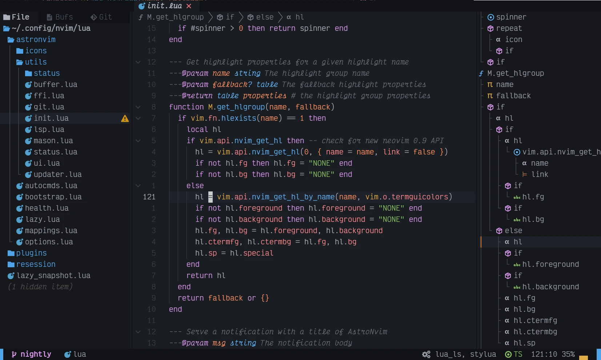

Меня зовут Георгий Кузора. Я занимаюсь разработкой программного обеспечения.

## Профессиональный путь

Я работаю инженером машинного обучения в сфере финтеха.

Вы спросите: "А чем занимается инженер машинного обучения?". Мои каждодневные задачи связаны с разработкой и поддержкой микросервисов, которые используют модели машинного обучения для обработки данных. Это классические (не генеративные) модели. Основные направления работы моделей это распознование, анализ, классификация изображений (фото), а также кредитный скоринг.

В целом моя специализация, это то что называют MLOps.

Стэк с которым я работаю:

- Python
- FastAPI
- Linux
- Kubernetes
- Helm
- Docker
- Kafka
- Prometheus
- Grafana
- Jaeger
- Sentry
- Clickhouse
- Metabase

## Личные интересы

Кроме работы у меня есть ряд личных интересов.

### Разработка программного обеспечения

Кроме профессиональной деятельности, я занимаюсь программированием и в личное время. Я влюблен в темы связанные с программированием: Linux, среды разработки, эмуляторы терминалов, языки программирования и тд.

Я развиваю свои навыки в программировании на [Go](https://go.dev/) и [Rust](https://rust-lang.org/). Для этого я работаю над рядом пет проектов. Их вы можете посмотреть на [моей странице Github](https://github.com/GeorgeKuzora).

#### Моя среда разработки

Я поддерживаю свою среду разработки в виде git репозитория [Dotfiles](https://github.com/GeorgeKuzora/dotfiles). Для управления dotfiles я использую программу [chezmoi](https://gkuzora.ru/posts/chezmoi/).

Я предпочитаю работать в терминале и использовать Vim режим при редактировании кода.

#### Операционная система

Профессиональную разработку я веду на корпоративном Macbook, но дома предпочитаю использовать Linux.

Я использую операционную систему [Linux Fedora Workstation](https://fedoraproject.org/workstation/). Считаю, что Fedora представляет собой удачный баланс между стабильностью [Debian](https://www.debian.org/index.ru.html) и свежестью пакетов, присущей [Arch](https://archlinux.org/).

#### Окружение рабочего стола

Я использую [Gnome](https://www.gnome.org/) в качестве своей рабочей среды. Мне нравится в нем функциональность и простота использования. Благодаря единому дизайну своих приложений и рабочего стола он выглядит как целостная система, где все элементы работают в унисон.

#### Эмулятор терминала

Я использую [Ghostty](https://ghostty.org/) в качестве своего эмулятора терминала. Ghostty создан [Mitchell Hashimoto](https://github.com/mitchellh). Терминал написан на языке [Zig](https://ziglang.org/).

Ghostty обладает всеми функциями, которые должен иметь современный терминал: поддержка глифов, вкладок, окон, меню команд, поиск по содержимому вывода и тд. Один из главных его плюсов по сравнению с другими эмуляторами, это то что Ghostty разработан таким образом, чтобы выглядеть и вести себя так, как вы ожидаете от приложения в среде вашего рабочего стола.

#### Текстовый редактор

Мой любимый редактор это [Neovim](https://neovim.io/). Но редактор [Zed](https://zed.dev/) стал настолько хорош, что я все больше нахожу себя используя его вместо Neovim.

О Vim я узнал практически одновременно с тем, как начал изучать программирование. Мне очень понравилась идея модального редактора и с тех пор я пользуюсь Vim раскладкой какой-бы редактор я не использовал.

Я использую свою собственную [конфигурацию Neovim](https://github.com/GeorgeKuzora/dotfiles/tree/main/dot_config/nvim). Я стараюсь использовать как можно меньше расширений Neovim и опираюсь на встроенный в редактор функционал.

#### Цветовая схема

Моя любимая цветовая схема - [Catppuccin Mocha](https://github.com/catppuccin/catppuccin) с пастельными оттенками и хорошей контрастностью. Ассоциации, которые у меня вызывает эта цветовая гамма: карамельные тона, летний вечер в городе и музыка в стиле [Lo-Fi hip hop](https://www.youtube.com/watch?v=jfKfPfyJRdk).

### Философия

В один момент своей жизни я обратился к чтению поздних стоиков. Мне это было необходимо, чтобы суметь пережить травматические события происходившие в тот момент. Марк Аврелий, Эпиктет, Сенека помогли мне преодолеть тот сложный период. Вместе с этим я в целом заинтересовался философией.

Я постепенно расширяю свои познания в этой области. Читаю оригинальные работы философов. Размышляю и анализирую их подходы. Я стараюсь разобраться, какие принципы и понятия, тот или иной философ вкладывает в свои работы. Не со всеми идеями я соглашаюсь, но то, что я нахожу верным, я стараюсь использовать в своей жизни.

Я изучал работы ряда авторов:

- Марк Аврелий
- Эпиктет
- Сенека
- Платон (Сократ)
- Айн Рэнд
- Аристотель
- Фридрих Ницше

### Иностранные языки

Также меня интересует изучение иностранных языков, в частности японского. Я свободно владею английским, и практически все, что я читаю, смотрю и слушаю, я делаю на этом языке. Кроме того, я изучал японский язык на курсах в [Санкт-Петербургском Японском центре](https://spb.jc.org.ru/ru/index.html). Я пока что еще не побывал в Японии, но люблю читать мангу и японскую литературу в оригинале.

## Планы на будущее

- Развивать свои знания и навыки в области разработки программного обеспечения.
- Глубже погрузиться в технологии связанные с машинным обучением и искусственным интеллектом.
- Использовать Go и Rust в личных проектах и при создании инструментов в профессиональной деятельности.
- Писать мини-эссе, в которых разбирать аспекты философских подходов применительно к реальной жизни.
- Наконец-то побывать в Японии.

## Об этом сайте

Мне нравится иметь свое личное пространство в интернете. На этом сайте я делюсь своими мнениями и знаниями, а также публикую свои творческие идеи на интересующие меня темы.

Сайт находится на серверах компании [Timeweb](https://timeweb.com/ru/), и был создан с помощью генератора статических сайтов [Hugo](https://gohugo.io/). Используемая тема сайта - [risotto](https://github.com/GeorgeKuzora/risotto).
