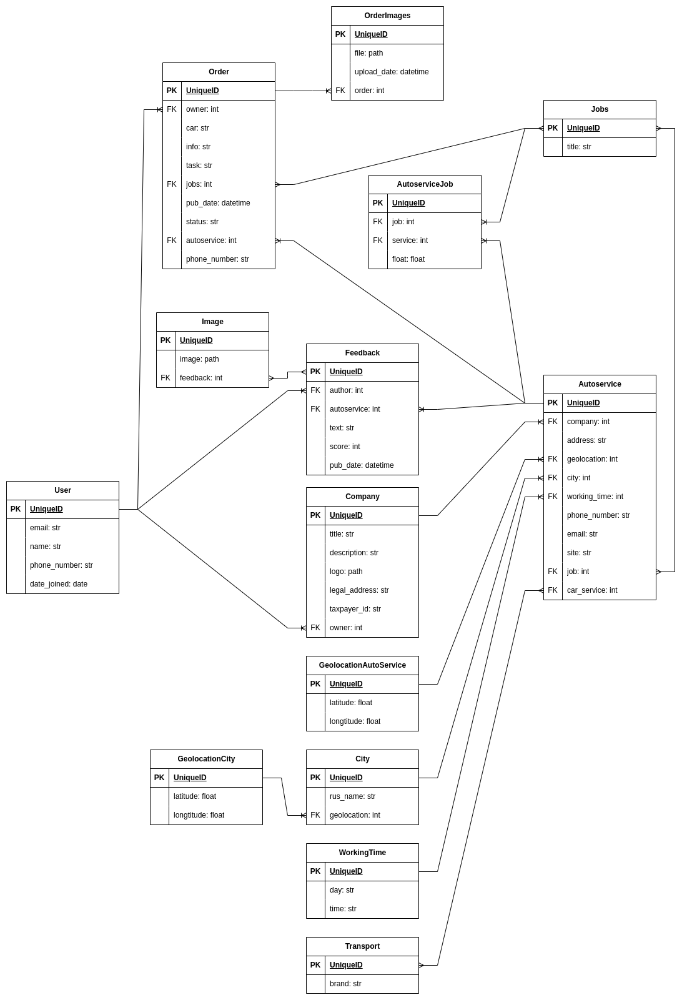

## Оглавление

1. Вступление
2. Описание проекта
2.1. Цель проекта
2.2. Структура проекта
2.3.1. Backend репозиторий проекта
2.4.2. Frontend репозиторий проекта
2.5. Технологии и инструменты
3. Подготовка окружения для разработки приложения
3.1. Выбор операционной системы для работы приложения
3.2. Установка Linux для разработки и тестирования приложения
3.3. Установка Python при помощи pyenv
3.4. Установка Poetry
3.5. Установка редактора
4. Создание проекта
4.1. Создание проекта при помощи Poetry
4.2. Управление зависимостями
4.3. Дополнительных инструменты для редактирования кода
4.4.1. Языковой сервер и статический анализатор кода Pyright
4.5.2. Линтер Flake8
4.6.3. Форматер Black
4.7. Установка зависимостей в проект
4.8. Запуск виртуального окружения Poetry
5. Работа над проектом
5.1. Выбор Django в качестве фреймворка для проекта
5.2. Структура проекта Django
5.3. Приложения Django
5.3.1. Структура Django и pyproject.toml
5.4. Структура данных проекта
5.4.1. Структура
5.4.2. Базовые модели проекта
5.4.2.1. User (CustomUser)
5.4.2.2. Company
5.4.2.3. Autoservice
5.4.2.4. Geolocation
5.4.2.5. City
5.4.2.6. GeolocationCity
5.4.2.7. WorkingTime
5.4.2.8. Transport
5.4.2.9. Jobs
5.4.2.10. Order
5.4.2.11. OrderImages
5.4.2.12. Feedback
5.5. API проекта.
5.5.1. Что такое REST API
5.5.2. Описание API проекта
5.6. API документация
5.6.1. Django Rest Framework Self describing APIs
5.6.2. SwaggerUI
5.6.3. ReDoc
5.7. Djoser - пользователи и аутентификация
5.7.1. Система аутентификации Django
5.7.2. Система аутентификации Django Rest Framework
5.7.3. Библиотека Djoser
5.#. Приложения проекта
5.##. Приложение Users
5.##. Приложение Autoservice
5.##. Приложение Order
6. Тестирование и отладка проекта
##. Тестирование
##. Тестовый фреймворк django
###. Структура тестов в Django
###. Пример тестирования при помощи django.tests
##. Тестирование API
###. Обзор
###. Docker контейнер для тестирования API
###. Требования к Docker контейнеру
###. Dockerfile
###. Описание Dockerfile
####. BASE
####. STAGING
####. DEVELOPMENT
###. Docker compose файлы
###. Файл docker-compose.dev.yml
###. Подготовка среды для запуска development контейнера
####. Клонирование репозитория
####. Установить Docker на локальный компьютер
####. Создать файл .env
###. Сборка и первый запуск контейнера
###. Работа с контейнером
####. Миграция базы данных
####. Создание суперпользователя
####. Запуск, перезапуск и остановка контейнера
###. Тестирование API с использованием Docker контейнера
####. Переменные окружения
####. Запросы
####. Ответы
7. Развертывание проекта на сервере
##. Как происходит развертывание проекта
##. Выбор сервера
##. Docker контейнер для запуска приложения на сервере
##. Dockerfile для приложения в продакшн
###. Этап build
###. Этап production
###. Файл docker-compose.production.yml
##. GitHub actions CI-CD pipeline
8. Итоги работы над проектом
##. Результаты работы над проектом
###. Общие выводы
###. Что было реализовано в проекте
###. Что пока не реализовано в проекте
##. Полученные знания и опыт
9. Приложения
##. Где искать проект
##. Использованные материалы

## Вступление

В современном мире, когда технологии развиваются с невероятной скоростью, многие сферы жизни человека претерпевают кардинальные изменения. Одной из таких сфер является автомобильный транспорт и обслуживание автомобилей. С ростом числа автомобилей на дорогах, увеличивается и потребность в качественных автосервисах, которые могут удовлетворить потребности автовладельцев в ремонте, обслуживании и диагностике.

Актуальность темы данной дипломной работы заключается в том, что создание удобного и эффективного веб-приложения для поиска автосервисов может значительно упростить жизнь автовладельцам, предоставив им доступ к актуальной информации о ближайших автосервисах, их услугах, ценах и отзывах других клиентов. Кроме того, такое приложение может помочь автосервисам увеличить свою клиентскую базу, улучшить качество обслуживания и оптимизировать рабочие процессы.

В ходе работы над бэкенд частью проекта будут использоваться современные технологии, такие как Django, PostgreSQL, Docker, Poetry, REST, Python и другие.

Разработанное веб-приложение для поиска автосервисов будет доступно для использования широкой аудитории автовладельцев, а также сможет стать полезным инструментом для автосервисов в продвижении своих услуг и улучшении качества обслуживания клиентов. Результаты данной дипломной работы могут быть использованы как в коммерческих, так и в некоммерческих целях, способствуя развитию отрасли автосервиса и улучшению качества жизни автовладельцев.

## Описание проекта

### Цель проекта

Целью данной дипломной работы является разработка бэкенд части веб-приложения, которое будет обеспечивать эффективный поиск автосервисов, а также предоставление пользователям подробной информации о каждом автосервисе. Для достижения данной цели необходимо решить следующие задачи:

1. Разработать архитектуру веб-приложения с учетом современных требований и стандартов веб-разработки.
2. Реализовать функционал поиска и фильтрации автосервисов по различным параметрам, таким как местоположение, предоставляемые услуги, стоимость и отзывы клиентов.
3. Обеспечить интеграцию с внешними сервисами для получения актуальной информации об автосервисах и отзывов клиентов.
4. Разработать удобный пользовательский интерфейс, который позволит пользователям быстро и легко находить необходимую информацию.
5. Протестировать разработанное веб-приложение на предмет его эффективности, надежности и удобства использования.
6. Развернуть и запустить полнофункциональное приложение на сервере, объединяющее в себе бэкенд, фронтенд, базу данных и веб-сервер,

По результатам разработки, приложение должно соответствовать требованиям и обладать минимально необходимым набором функций. В этот набор должны входить:

- регистрация пользователя в приложении;
- регистрация представителя автосервиса в приложении;
- возможность изменения личных данных пользователя в его личном кабинете;
- возможность корректировки информации о представителе автосервиса в его личном кабинете;
- отображение списка ближайших автосервисов для пользователя;
- опция отправки запроса на обслуживание в автосервисе;
- просмотр запросов на ремонт представителем автосервиса;
- общение с клиентом через приложение по отправленному запросу;
- смена статуса запроса;
- закрытие запроса с различными статусами.

### Структура проекта

Современные веб-приложения имеют сложную структуру, состоящую из множества компонентов. Одним из популярных подходов к разработке веб-приложений является использование React для фронтенд-части и Django/PostgreSQL для бэкенд-части. В этом случае, фронтенд и бэкенд могут быть расположены в разных репозиториях для удобства разработки и масштабирования.

В таком случае, веб-приложение будет состоять из двух частей: фронтенд на React и бэкенд на Django/PostgreSQL. Обе части будут работать вместе, обмениваясь данными через API.

Для реализации такого подхода, необходимо выполнить следующие шаги:

1. Разработать фронтенд-часть на React. Это включает в себя создание компонентов, которые будут использоваться для отображения данных, и разработку логики работы с API.
2. Разработать бэкенд на Django. Это включает создание моделей для работы с данными, разработку API и создание контроллеров для обработки запросов.
3. Создать базу данных и таблицы для хранения данных.
4. Интегрировать React и Django. Для этого необходимо создать RESTful API, который будет обрабатывать запросы от фронтенда и возвращать ответы.
5. Протестировать работу приложения. Необходимо провести тестирование как фронтенд, так и бэкенд-части приложения, чтобы убедиться в их корректной работе.

Такой подход позволяет создавать масштабируемые и гибкие веб-приложения с высокой производительностью.

#### Backend репозиторий проекта

Бэкенд репозиторий проекта расположен на GitHub по адресу - https://github.com/car-service-with-geolocation/backend

Так как моей специализацией является бэкенд разработка на Python это основной репозиторий где я работал.

#### Frontend репозиторий проекта

Фронтенд репозиторий проекта расположен на GitHub по адресу - https://github.com/car-service-with-geolocation/frontend

В репозитории фронтенда размещен код для веб-сайта. Над разработкой фронтальной части приложения работает команда фронтенд-разработчиков. Я использовал этот репозиторий для запуска фронтальной части приложения в контейнере Docker для тестирования интеграции фронтенда и бэкенда через API.

### Технологии и инструменты

- Для работы приложения на сервере используется операционная система Linux. В свою очередь, на рабочей станции я также использую Linux, а конкретно - Fedora Workstation - https://fedoraproject.org/workstation/
- Для размещения готового приложения на сервере, а также для облегчения процесса разработки через создание контейнеров для тестирования фронтенд и бэкенд частей, используется Docker - https://www.docker.com/
- GitHub Actions помогает в развертывании приложения на сервере и организует процесс CI-CD (непрерывная интеграция и доставка) - https://docs.github.com/en/actions
- Django фреймворк для создания веб-приложений - https://www.djangoproject.com/
- Django REST Framework используется для создания API - https://www.django-rest-framework.org/
- С помощью DRF Spectacular создается документация для API - https://drf-spectacular.readthedocs.io/en/latest/
- Poetry служит для управления зависимостями проекта, сборки и управления пакетами - https://python-poetry.org/
- Black используется для форматирования кода на Python - https://pypi.org/project/black/
- Flake8 - это линтер кода на Python, который помогает находить и исправлять ошибки в коде - https://flake8.pycqa.org/en/latest/
- Pyright - это языковой сервер, который предоставляет автодополнение в редакторе и выполняет статический анализ кода - https://github.com/microsoft/pyright
- В качестве редактора кода я использую Neovim - https://neovim.io/

Далее я более подробно разберу использование каждого из этих инструментов и технологий.

## Подготовка окружения для разработки приложения

### Выбор операционной системы для работы приложения

Для операционной системы сервера, на котором будет функционировать приложение, в рамках проекта был выбран Linux. Эта ОС идеально подходит для данной задачи по ряду причин:

- Открытость. Linux является открытым исходным кодом, что даёт пользователям и разработчикам право свободно изучать, модифицировать и распространять систему. Такой подход обеспечивает гибкость и возможность адаптации системы под индивидуальные потребности.
- Бесплатное распространение. Linux предлагается бесплатно, что помогает снизить затраты на внедрение и поддержку сервера.
- Поддержка сообщества. Linux обладает огромным и активным сообществом разработчиков, пользователей и поставщиков, что обеспечивает поддержку и развитие системы.
- Безопасность. В Linux применяется модель безопасности на основе привилегий, которая препятствует несанкционированному доступу к системе. Помимо этого, ядро Linux создано так, чтобы минимизировать уязвимости и эксплойты.
- Надёжность. Linux зарекомендовал себя как стабильная и надёжная операционная система для серверов. Он обеспечивает бесперебойную работу и устойчивость к сбоям, что особенно важно для онлайн-сервисов и веб-приложений.
- Масштабируемость. Linux без труда масштабируется для работы на различных типах серверов, от небольших и недорогих до высокопроизводительных и мощных. Это позволяет использовать Linux для различных задач, включая веб-хостинг, облачные вычисления, базы данных и многое другое.
- Совместимость. Linux поддерживает множество аппаратных и программных компонентов, что делает его совместимым с широким спектром оборудования. Это облегчает процесс развертывания и поддержки сервера.
- Гибкость и настраиваемость. Linux предлагает богатый выбор дистрибутивов и пакетов, что позволяет быстро и легко адаптировать систему для решения конкретных задач.

Один из популярных дистрибутивов Linux - Ubuntu. Именно он был выбран для запуска на сервере.

### Установка Linux для разработки и тестирования приложения

Для разработки и тестирования приложения, предназначенного для платформы Linux, необходимо создать среду разработчика, позволяющую запускать и тестировать приложение непосредственно на целевой платформе. Следовательно, требуется установка Linux в среде разработчика.

Варианты установки Linux в среду разработчика могут быть разными, в зависимости от требований к оборудованию, удобству использования и доступности инструментов. Вот несколько вариантов:

- Использование виртуальной машины (VM): Этот вариант подходит для тех, кто работает на платформе Windows или macOS и хочет протестировать свое приложение на Linux без необходимости установки этой операционной системы на свой компьютер. Виртуальная машина позволяет создать изолированную среду Linux, которую можно запускать на компьютере без влияния на основную операционную систему. Преимущества: простота использования, возможность легкого переключения между разными версиями Linux, совместимость с различными платформами. Недостатки: производительность может быть ниже, чем при использовании реальной установки Linux, некоторые приложения могут не работать должным образом.
- Установка Linux на отдельный жесткий диск или раздел: Этот вариант идеально подходит для тех, кому нужно постоянное и стабильное окружение для разработки на Linux. Преимущества: стабильная среда, возможность использовать все доступные инструменты Linux, высокая производительность. Недостатки: требуется больше времени на первоначальную настройку, нужен отдельный компьютер или отдельный раздел на компьютере.
- Использование облачной платформы: Некоторые облачные платформы, такие как Amazon Web Services (AWS), Microsoft Azure и Google Cloud Platform, предлагают предустановленные образы Linux для разработки и тестирования. Преимущества: возможность быстро развернуть среду Linux в облаке, масштабируемость, доступность инструментов для разработки. Недостатки: возможно, потребуется оплатить подписку на облако, производительность может зависеть от качества соединения с интернетом.
- Использование контейнеров: Это относительно новый подход к развертыванию и управлению приложениями, который позволяет упаковывать приложение и все его зависимости в один легкий и переносимый контейнер. Преимущества: быстрое развертывание и масштабирование, легкое обновление и миграция приложений. Недостатки: некоторые инструменты могут быть сложнее в использовании, чем виртуальные машины.

Я решил установить Linux на жесткий диск, чтобы не только иметь возможность разрабатывать приложение непосредственно для той платформы, на которой оно будет использоваться, но и воспользоваться всеми остальными преимуществами этой системы.

Для установки на свой домашний компьютер я выбрал дистрибутив Fedora Workstation - https://fedoraproject.org/workstation/

### Установка Python при помощи pyenv

Проект использует Python версии 3.9.18, в то время как Fedora 39 включает в себя версию Python 12. Чтобы использовать версию 3.9.18 для проекта, утилита pyenv была установлена. Pyenv обеспечивает удобное переключение между различными версиями Python.

Для установки pyenv перейдем на официальный сайт проекта - https://github.com/pyenv/pyenv

Воспользуемся официальным скриптом для установки pyenv на UNIX системы:

```bash
curl https://pyenv.run | bash
```

> curl - это универсальная утилита командной строки, которая используется для передачи данных с или на сервер. Она поддерживает множество протоколов и может использоваться для выполнения различных задач, таких как загрузка файлов, отправка форм, передача данных в формате HTTP и т.д. Curl также может работать с защищенными соединениями (HTTPS) и поддерживает передачу файлов большого размера.

Чтобы использовать pyenv, нужно добавить соответствующие конфигурации в файл настроек моей оболочки (shell). Я использую zsh, поэтому файл конфигурации называется `$HOME/.config/zsh/.zshrc`. Нужно добавить в него следующие строки:

```bash
export PYENV_ROOT="$HOME/.pyenv"
[[ -d $PYENV_ROOT/bin ]] && export PATH="$PYENV_ROOT/bin:$PATH"
eval "$(pyenv init -)"
```

Перезапустив оболочку установим python версии 3.9.18 следующей командой:

```bash
pyenv install 3.9.18
```

Создадим в директории проекта файл `.python-version`. Запишем в него версию python для проекта: `3.9.18`.

Теперь при переходе в директорию проекта, текущая версия python будет автоматически переключаться на 3.9.18.


### Установка Poetry

Poetry - это инструмент управления зависимостями и виртуальной средой для проектов на Python. Он позволяет устанавливать и управлять зависимостями проекта, создавать виртуальную среду и управлять ее настройками.

Poetry заменяет `setup.py`, `requirements.txt`, `setup.cfg`, `MANIFEST.in` и `Pipfile` на простой формат файла проекта `pyproject.toml`.

Чтобы начать использовать Python Poetry, его нужно установить. Это можно сделать разными способами:

- Если виртуальное окружение для проекта уже создано, установить Poetry можно с помощью команды pip: `pip install poetry`.
- Для установки Poetry глобально можно использовать pipx. Этот инструмент изолирует Poetry в виртуальном окружении и позволяет управлять обновлениями и удалениями.
- Пользовательская программа установки Poetry позволяет установить его в новое виртуальное окружение. После установки Poetry может управлять своим окружением.

Я использовал официальный пользовательский установщик Poetry. Для этого я скачал и запустил установочный скрипт с официального сайта:

```bash
curl -sSL https://install.python-poetry.org | python3 -
```

Программа установки создает wrapper для использования Poetry из командной строки. В Linux он обычно размещается в каталоге `$HOME/.local/bin`. Этот каталог содержит исполняемые файлы, привязанные к конкретному пользователю. Чтобы добавить этот каталог в переменную окружения PATH, я добавил следующую строку в файл конфигурации оболочки zsh - `$HOME/.config/zsh/.zshrc`:

```bash
PATH="$PATH:$HOME/.local/bin"
export PATH
```

Это позволит использовать Poetry из любой директории, не указывая полный путь к исполняемому файлу.

### Установка редактора

> В 2023 году мы с прискорбием узнали, что Брам Моленар, создатель редактора Vim, покинул нас в возрасте 62 лет. Эта часть посвящается ему.

Редактор текста это основной инструмент разработчика. Поэтому среди разработчиков популярна тема выбора подходящего текстового редактора.

Популярные варианты включают полнофункциональные интегрированные среды разработки (IntelliJ IDEA, PyCharm, Visual Studio), редакторы с графическим интерфейсом (VSCode, Sublime Text) и редакторы для эмуляторов терминала (Neovim, Vim). Опросив разработчиков на сайте Stack Overflow, мы составили диаграмму популярности текстовых редакторов:

- Полноценные IDE такие как IntelliJ IDEA, PyCharm, Visual Studio.
- Редакторы с графическим интерфейсом такие как VSCode, Sublime Text.
- Редакторы используемые внутри эмулятора терминала такие как Neovim, Vim, Helix.

На диаграмме представлены наиболее популярные текстовые редакторы согласно данным опроса, проведенного на сайте Stack Overflow:


В начале карьеры разработчика я узнал о редакторе Vim и его системе горячих клавиш. Мне очень понравилась идея такого подхода к редактированию текста, и я начал осваивать Vim параллельно с программированием. Теперь я не могу представить, как можно редактировать код без горячих клавиш Vim. Я убеждён, что освоение горячих клавиш Vim - одна из лучших инвестиций времени для разработчика.

Я пишу код в [Neovim](https://neovim.io/) - современном форке классического [Vim](https://www.vim.org/), созданного Брамом Моленаром (Эта пояснительная записка, также полностью написана в Neovim).


Neovim обогатил и улучшил функциональность Vim. Он поддерживает все функции современных редакторов: автодополнение, статический анализ кода, навигацию в проекте, линтинг и форматирование. У Neovim есть преимущества перед другими текстовыми редакторами:

- Визитная карточка Neovim – система горячих клавиш Vim. Это позволяет отказаться от мыши для выделения и перемещения текста, все действия выполняются с помощью клавиатуры, руки остаются на среднем ряду клавиатуры. Хотя в других редакторах тоже можно установить расширения для поддержки клавиш Vim, они все уступают встроенной поддержке Neovim.
- Горячие клавиши Vim работают не только в самом редакторе. Их могут использовать и другие программы. Zsh, Obsidian, Logseq, Emacs, Visual Studio Code и продукты JetBrains поддерживают горячие клавиши Vim. Благодаря этому при переходе на новую среду разработки можно продолжать использовать привычные комбинации клавиш, не тратя время на запоминание новых.
- Neovim как и Vim - консольное приложение, работающее в терминале. Это удобно, потому что можно работать с текстом на удалённом сервере без установки дополнительного ПО. Vim предустановлен на большинстве Unix-подобных систем. Работа в терминале позволяет использовать команды терминала прямо в редакторе: вставлять путь рабочей директории, фильтровать и форматировать текст с помощью grep и sed, выполнять Git-команды.
- В паре с Tmux Neovim становится мощной средой разработки, в которой можно работать над проектами, сохранять и восстанавливать состояние среды между сессиями. Тестирование и отладка кода возможны прямо в терминале, а переключение между редактором и процессом в консоли почти мгновенно.
- Конфигурация Neovim происходит через текстовые файлы с использованием Vim script или Lua. Для новичков это может показаться необычным, ведь они привыкли к графическому интерфейсу. Однако такой метод конфигурации проще и понятнее: пользователь сам решает, какие настройки добавить. Он может постепенно понять, как влияют на него выбранные опции. Изменения в текстовых файлах легко отслеживать через Git. Если изменение настроек не понравилось пользователю, их можно легко откатить к предыдущему состоянию.
- Neovim предлагает множество плагинов и расширений, которые увеличивают его функциональность и превращают его в полноценную среду разработки. Среди них LSP, дополнения, tree-sitter и другие. В зависимости от нужд пользователя Neovim может быть как простым текстовым редактором, так и соперником продуктов Jetbrains по функциональности.

## Создание проекта

### Создание проекта при помощи Poetry

В этом проекте я использую Poetry для управления зависимостями и конфигурации проекта.

Создание проекта Poetry начинается с команды:

```bash
poetry init
```

Я использую `init` вместо `new`, поскольку планирую применять Django - фреймворк с собственной предпочитаемой структурой проекта. Мне не нужна Poetry структура проекта, нам нужен лишь `pyproject.toml`, который создаётся интерактивно через `init`. Полученный файл будет содержать следующее:

```toml
[tool.poetry]
name = "car-service-with-geolocation"
version = "0.1.0"
description = "Веб-приложение для заказа услуг автосервиса с использованием геолокации."
authors = ["Car Service <carservice@carservice.com>"]
readme = "README.md"

[tool.poetry.dependencies]
python = "3.9.18"

[build-system]
requires = ["poetry-core"]
build-backend = "poetry.core.masonry.api"
```

### Управление зависимостями

Добавление зависимостей в проект происходит через файл `pyproject.toml`, находящийся в корне проекта. В нём хранится информация о зависимостях и другие настройки проекта. Зависимости добавляются двумя способами:

- Командой poetry add: `poetry add some-dependency`.
- Прямым указанием в файле `pyproject.toml`.

Когда мы используем Poetry, мы явно указываем зависимости в файле `pyproject.toml`. Также Poetry позволяет группировать зависимости по группам использования. Основная группа используется для зависимостей, одновременно необходимых в разработке, тестировании и продакшене. Отдельная группа `dev` включает зависимости, нужные только для разработки и тестирования, но лишние в продакшене. Это тестовые фреймворки, линтеры, языковые серверы и подобное.

При сборке приложения и компиляции wheel файлов группа `dev` может быть исключена из финального образа при помощи флага `--without dev`.

В файле pyproject.toml для этого проекта я определил следующие окончательные зависимости:

```toml
[tool.poetry.dependencies]
python = "3.9.18"
djangorestframework = "3.14.0"
Django = "3.2.16"
djoser = "2.1.0"
drf-extra-fields = "3.4.1"
drf-spectacular = "0.26.5"
drf-spectacular-sidecar = "*"
drf-yasg = "1.21.5"
django-filter = "22.1"
django-cors-headers = "3.14.0"
geoip2 = "2.9.0"
gunicorn = "20.1.0"
python-dotenv = "0.21.0"
Pillow = "9.3.0"
pytz = "2023.3.post1"
requests = "2.28.1"


[tool.poetry.group.dev.dependencies]
black = "*"
Flake8-pyproject = "*"
django-extensions = "*"
Werkzeug = "*"
pyOpenSSL = "*"
django-stubs = "*"
djangorestframework-stubs = "*"
```

Зависимости в проекте разделены на две группы: `main` и `dev`. В первую входят обязательные основные зависимости. Во вторую - необязательные, нужные только на этапе разработки.

Описание назначения основных зависимостей в проекте:

**Основные зависимости**

- `python` - Версия Python, на которой будет работать проект
- `djangorestframework` - Фреймворк для создания REST API на Django
- `Django` - Фреймворк для веб-разработки на Python
- `djoser` - Пакет для управления пользователями и авторизацией в Django
- `drf-extra-fields` - Расширение для drf, предоставляющее дополнительные поля для моделей
- `drf-spectacular` - Генератор документации для DRF
- `drf-spectacular-sidecar` - Дополнительный инструмент для drf-spectacular
- `drf-yasg` - Другой генератор документации для DRF
- `django-filter` - Пакет для создания мощных фильтров в Django
- `django-cors-headers` - Пакет для добавления CORS заголовков в ответы Django
- `geoip2` - Библиотека для работы с GeoIP
- `gunicorn` - Веб-сервер WSGI для Python
- `python-dotenv` - Пакет для чтения переменных окружения из .env файла
- `Pillow` - Библиотека для работы с изображениями
- `pytz` - Библиотека для работы с часовыми поясами
- `requests` - Модуль для отправки HTTP запросов

**Необязательные зависимости для разработки**

- `black` - Форматер кода
- `Flake8-pyproject` - Статический анализатор кода
- `django-extensions` - Расширения для Django
- `Werkzeug` - WSGI веб-сервер и вспомогательные модули
- `pyOpenSSL` - Модуль для работы с SSL
- `django-stubs` - Stub-файлы для Django
- `djangorestframework-stubs` - Stub-файлы для drf

> Stub-файлы в Python используются для упрощения процесса разработки и отладки кода. Они представляют собой псевдокод для отсутствующих или недоступных модулей и классов, что позволяет IDE (интегрированной среде разработки) предоставлять контекстную информацию и подсказки, даже если реальный код ещё не написан или не доступен.
>
> Stub-файлы особенно полезны при использовании фреймворков, таких как Django, где многие части приложения могут быть реализованы позже или зависеть от внешних библиотек. Они помогают поддерживать непрерывность разработки и ускоряют процесс написания кода, предоставляя базовую структуру и информацию о типах данных и методах, которые должны быть реализованы.
>
> Stub-файлы также могут использоваться для тестирования кода до полной реализации зависимостей, что позволяет разработчикам быстрее находить и исправлять ошибки.

### Дополнительных инструменты для редактирования кода

#### Языковой сервер и статический анализатор кода Pyright

Статические анализаторы кода и языковые серверы – неотъемлемые инструменты современного программиста. Анализаторы, как CLI-инструменты, парсят код и находят ошибки синтаксиса, типов и логики. Отчеты с рекомендациями по исправлению предоставляются разработчику. Language Server Protocol (LSP), предложенный Microsoft, стандартизировал взаимодействие между анализаторами и редакторами кода.

Языковые серверы обрабатывают код и статически анализируют его. Редакторы кода, инструменты командной строки и другие клиенты могут взаимодействовать с ними через LSP. Большинство современных редакторов поддерживают интеграцию с языковыми серверами, включая популярный Pyright для Python.

В данном проекте Pyright добавлен как зависимость разработки в `pyproject.toml`. Это позволяет использовать его из командной строки и служит документацией для других разработчиков. Neovim, поддерживающий LSP, использует Pyright для предоставления автодополнения, подсветки ошибок и статического анализа в реальном времени.

Настройки статического анализатора кода задаются в `pyproject.toml` в разделе `[tool.pyright]`.

```toml
[tool.pyright]
include = []
exclude = [".pytest_cache",
    "**/__pycache__",
]
pythonVersion = "3.9.18"
typeCheckingMode = "standard"
```

В `pyproject.toml` настраивается работа статического анализатора кода Pyright.

- `include` - файлы и директории, которые явно включаются в область анализа.
- `exclude` - файлы и директории, которые исключаются из анализа для ускорения работы инструмента.
- `pythonVersion` - версия Python, от которой зависит работа Pyright. В зависимости от версии анализатор указывает на устаревшие или ещё не используемые в данной версии синтаксические конструкции.
- `typeCheckingMode` - уровень строгости, с которым Pyright подходит к анализу кода.

#### Линтер Flake8

Линтер - программа, проверяющая код на соответствие правилам форматирования. Она следит за отступами, количеством пустых строк и другими параметрами. Среди популярных линтеров для Python - flake8, pylint, ruff. В данном проекте используется flake8, который проверяет код на соответствие стандарту PEP8.

Flake8 можно установить локально в проект, глобально на систему или внутри редактора кода. В данном случае он добавлен в `pyproject.toml` как зависимость разработки, что позволяет использовать его из командной строки и служит документацией для других разработчиков.

Настройки линтера кода также задаются в `pyproject.toml` в разделе `[tool.flake8]`.

```toml
[tool.flake8]
max-line-length = 88
extend-ignore = ["E203", "I001", "I005", "R504"]
exclude = [
    ".git",
    "__pycache__",
    "env",
    "migrations",
    "settings.py",
    "venv",
    "management"
]
max-complexity = 10
```

В `pyproject.toml` настраивается линтер flake8.

- `max-line-length` - максимальная длина строки кода.
- `extend-ignore` - список кодов ошибок, которые будут игнорироваться при проверке кода.
- `exclude` - глобальные паттерны, которые будут исключены из проверок.
- `max-complexity` - максимально допустимая сложность кода по шкале McCabe.

> Сложность кода по шкале McCabe - это мера сложности алгоритма, основанная на количестве независимых путей через него. Она помогает оценить сложность понимания и тестирования кода. Чем ниже значение сложности, тем проще и понятнее код.

#### Форматер Black

Форматер кода автоматически редактирует код в соответствии с выбранными правилами. Среди популярных форматеров для Python - Black и Ruff. В данном проекте используется Black. Он позволяет форматировать код согласно заданным правилам или выбранным по умолчанию.

Black называют _optionated_, потому что некоторые его правила не соответствуют стандартам PEP8. Например, PEP8 определяет максимальную длину строки в 79 символов, а Black по умолчанию устанавливает 88 символов.

Black можно установить локально в проект, глобально на систему или внутри редактора кода. В данном случае он добавлен в `pyproject.toml` как зависимость разработки, что позволяет использовать его из командной строки и служит документацией для других разработчиков.

Настройки форматера кода задаются в `pyproject.toml` в разделе `[tool.black]`.

```toml
[tool.black]
line-length = 88
```

- `line-length` - В `pyproject.toml` для Black устанавливается максимальная длина строки в 88 символов. Остальные правила используются по умолчанию.

### Установка зависимостей в проект

Для установки зависимостей в проект с помощью Poetry выполняется команда:

```bash
poetry install
```

Если нужно установить только зависимости проекта, без пакетов, используется флаг --no-root:

```bash
poetry install --no-root.
```

Если мы никогда раньше не выполняли эту команду, а также отсутствует файл `poetry.lock`, Poetry просто разрешит все зависимости, перечисленные в файле `pyproject.toml`, и загрузит последнюю версию их файлов.

После завершения установки Poetry записывает все пакеты и их точные версии, которые были загружены, в файл `poetry.lock`, фиксируя проект до этих конкретных версий. Нужно зафиксировать файл `poetry.lock` в репозитории проекта, чтобы все люди, работающие над проектом, имели одинаковые версии зависимостей.

Если при запуске `poetry install` уже есть файл `poetry.lock`, а также файл `pyproject.toml`, это означает, что либо мы выполнили команду install раньше, либо кто-то другой в проекте выполнил команду install и зафиксировал файл `poetry.lock` в проекте.

Запуск install при наличии файла `poetry.lock` разрешает и устанавливает все зависимости, которые мы перечислили в `pyproject.toml`, но Poetry использует точные версии, перечисленные в `poetry.lock`, чтобы гарантировать, что версии пакетов будут согласованы для всех, кто работает над нашим проектом. В результате у наш будут все зависимости, запрошенные в файле `pyproject.toml`, но не все они могут быть в самых последних доступных версиях (некоторые зависимости, перечисленные в файле poetry.lock, могли выпустить более новые версии с момента создания файла). Это сделано специально, чтобы наш проект не сломался из-за неожиданных изменений в зависимостях.

Разработчики приложений фиксируют `poetry.lock`, чтобы получить более воспроизводимые сборки.

Коммит этого файла в систему контроля версий важен, потому что он заставит всех, кто устанавливает проект, использовать точно такие же версии зависимостей, которые используем мы. Наш CI-сервер, рабочие машины, другие разработчики в нашей команде - все работают на одних и тех же зависимостях, что снижает вероятность возникновения ошибок, затрагивающих только некоторые части развертываний. Даже если мы разрабатываем в одиночку, мы можем быть уверены, что установленные зависимости все еще работают, даже если с тех пор наши зависимости выпустили множество новых версий.

### Запуск виртуального окружения Poetry

Poetry по умолчанию создает виртуальное окружение в `{cache-dir}/virtualenvs`. Можно изменить `cache-dir`, отредактировав конфигурацию Poetry, или использовать `virtualenvs.in-project` для создания окружения в каталоге проекта.

Чтобы запустить скрипт в этом окружении, используем `poetry run python your_script.py`. Для инструментов командной строки, таких как pytest или black, используем `poetry run pytest`.

Самый простой способ активировать виртуальное окружение - создать вложенную оболочку с помощью `poetry shell`. Чтобы деактивировать окружение и выйти из оболочки, введем `exit`. Для деактивации, не выходя из оболочки, используем `deactivate`.

## Работа над проектом

### Выбор Django в качестве фреймворка для проекта

Django — один из самых популярных фреймворков на Python. Он предлагает структуру MVT (Model View Template) для приложений. Благодаря стандартизации Django разработчики могут быстро создавать приложения на фреймворке, не тратя время на изобретение собственных решений. Это ускоряет процесс разработки.

### Структура проекта Django

Когда мы используем Django, нам придется позаботиться о создании проекта Django и его начальной настройке. Нам нужно будет автоматически сгенерировать структуру и файлы проекта Django: набор настроек для экземпляра Django, включая конфигурацию базы данных, специфические для Django опции и настройки для приложения.

Чтобы сделать это, В командной строке перейдем в каталог, где будет храниться наш код, и выполним следующую команду:

```bash
django-admin startproject car_service
```

Начальная структура будет выглядеть так:

```
car_service/
    manage.py
    car_service/
        __init__.py
        settings.py
        urls.py
        asgi.py
        wsgi.py
```

Эти файлы:

- Внешний корневой каталог `car_service/`: это контейнер для нашего проекта.
- `manage.py`: Утилита командной строки, которая позволяет вам взаимодействовать с проектом Django различными способами.
- Внутренний каталог `mysite/`: это собственно Python-пакет для проекта.
- `mysite/__init__.py`: Пустой файл, который сообщает Python, что эта директория должна считаться пакетом Python.
- `mysite/settings.py`: Настройки/конфигурация для этого проекта Django.
- `mysite/urls.py`: Декларации URL для этого Django-проекта.
- `mysite/asgi.py`: Точка входа для ASGI-совместимых веб-серверов для обслуживания проекта.
- `mysite/wsgi.py`: Точка входа для WSGI-совместимых веб-серверов для обслуживания проекта.

### Приложения Django

Приложение в Django, состоит из пакета Python, который следует определенным соглашениям. Django поставляется с утилитой, которая автоматически генерирует базовую структуру каталогов приложения.

В чем разница между проектом и приложением? Приложение - это веб-приложение, которое что-то делает - например, система блогов, база данных публичных записей или небольшое приложение для опросов. Проект - это набор конфигураций и приложений для определенного веб-сайта. Проект может содержать несколько приложений. Приложение может находиться в нескольких проектах.

Чтобы создать приложение, выполним команду:

```bash
python manage.py startapp autoservice
```

Создаст создает новое приложение с именем `autoservice` в текущем проекте.

1. Создается новая директория с именем `autoservice` внутри приложения Django.
2. В этой директории создаются файлы и папки, которые являются стандартными для приложения Django:
   - `models.py`: содержит определения моделей данных.
   - `views.py`: содержит определения представлений.
   - `admin.py`: содержит определения админ-панели для моделей.
   - `tests.py`: содержит начальный файл тестов для приложения.
   - `migrations`: папка, которая будет использоваться для управления миграциями базы данных.
   - `__init__.py`: пустой файл, который делает директорию распознаваемой как пакет Python.
3. Если в проекте уже есть модели данных, команда также создает файл начальной миграции, который будет содержать информацию о структуре базы данных, необходимую для создания приложения.

При разработке приложения на Django стоит придерживаться современного дизайна, например «Domain Driven Development» или «Hexagonal Architecture». Этому способствует разделение проекта на приложения, каждое из которых представляет отдельную доменную область. Такой подход облегчает рефакторинг монолитного проекта и его преобразование в систему сервисов и микросервисов в соответствии с подходом к разработке облачных приложений.

> Domain-driven design (DDD) — это методология разработки программного обеспечения, которая применяется при создании крупных программных систем. Она помогает разработчикам лучше понять доменную область, которую они разрабатывают, и создать код, который лучше соответствует потребностям пользователей. В основе DDD лежит идея о том, что разработчики должны тесно сотрудничать с экспертами в предметной области, чтобы лучше понять их потребности и создать программное обеспечение, которое будет удовлетворять этим потребностям. Это достигается за счет использования UML-диаграмм, моделей бизнес-процессов и других инструментов для моделирования доменной области.

> Hexagonal Architecture, также известная как Ports and Adapters, — это архитектурный шаблон, который помогает разработчикам создавать более гибкие и легко поддерживаемые программные системы. Основная идея Hexagonal Architecture заключается в том, чтобы изолировать бизнес-логику от внешних зависимостей, таких как базы данных, веб-серверы, API и т.д. Это позволяет разработчикам легко изменять и расширять функциональность приложения, не затрагивая его ядро.

В текущем проекте гибкий дизайн приложения и постоянный рефакторинг кода подкачали. Мы, новички в программировании, спроектировали связанные приложения, похожие на таблицы в базе данных.

В каждом приложении есть модели, относящиеся к похожим понятиям. Например, модель автосервисов, модель данных о геолокации автосервисов и модель данных отзывов об автосервисе.

Финальная структура проекта выглядит следующим образом:

```
backend
├── api
│   ├── apps.py
│   ├── __init__.py
│   ├── urls.py
│   └── v1
│       ├── autoservice
│       │   ├── filters.py
│       │   ├── __init__.py
│       │   ├── permissions.py
│       │   ├── serializers.py
│       │   ├── tests
│       │   │   ├── __init__.py
│       │   │   └── test_company_owner_viewset.py
│       │   ├── urls.py
│       │   └── views.py
│       ├── core
│       │   ├── __init__.py
│       │   ├── urls.py
│       │   └── views.py
│       ├── __init__.py
│       ├── order
│       │   ├── __init__.py
│       │   ├── permissions.py
│       │   ├── serializers.py
│       │   ├── tests
│       │   │   ├── __init__.py
│       │   │   ├── setup_test_db.py
│       │   │   ├── test_current_user_view.py
│       │   │   └── test_order_view.py
│       │   ├── urls.py
│       │   ├── utils.py
│       │   └── views.py
│       ├── urls.py
│       └── users
│           ├── exceptions.py
│           ├── __init__.py
│           ├── serializers.py
│           ├── tests
│           │   ├── __init__.py
│           │   ├── test_company_owner_post.py
│           │   └── test_current_user_patch.py
│           ├── urls.py
│           └── views.py
├── autoservice
│   ├── admin.py
│   ├── apps.py
│   ├── __init__.py
│   ├── migrations
│   │   ├── __init__.py
│   ├── models.py
├── car_service
│   ├── __init__.py
│   ├── settings.py
│   ├── urls.py
│   └── wsgi.py
├── core
│   ├── apps.py
│   ├── __init__.py
│   ├── management
│   │   ├── commands
│   │   │   ├── import_autoservice.py
│   │   │   ├── import_city.py
│   │   │   ├── import_user.py
│   │   │   ├── __init__.py
│   │   ├── __init__.py
│   ├── utils.py
│   └── validators.py
├── docker-compose.dev.yml
├── docker-compose.production.yml
├── Dockerfile
├── isort.cfg
├── manage.py
├── order
│   ├── admin.py
│   ├── apps.py
│   ├── __init__.py
│   ├── migrations
│   │   ├── __init__.py
│   ├── models.py
├── poetry.lock
├── pyproject.toml
├── README.md
├── setup.cfg
└── users
    ├── admin.py
    ├── apps.py
    ├── backends.py
    ├── __init__.py
    ├── migrations
    │   ├── __init__.py
    ├── models.py
```

1. `manage.py`: Этот файл используется для управления проектом Django. Он содержит команды для запуска сервера, создания приложений, миграции базы данных и т.д.
2. `settings.py`: Файл настроек проекта. Здесь определяются настройки приложения, такие как подключение к базе данных, настройки сайта, пути к статическим файлам и т.д.
3. `urls.py`: Файлы, которые содержат маршрутизацию приложения. Здесь определяются URL-адреса, которые соответствуют определенным view функциям.
4. `serializers.py`: файлы которые используются для создания сериализаторов. Сериализаторы - это класс, который позволяет преобразовывать объекты модели в формат, который может быть отправлен через HTTP (например, в JSON), и обратно.
5. `app_name/`: Папка для каждого приложения в проекте. Внутри этой папки обычно находятся файлы `models.py`, `views.py`, `urls.py`, `admin.py`, `tests.py` и другие, которые содержат модели данных, представления, админ-панель и тесты соответственно.
6. `static/`: Папка для статических файлов, таких как CSS, JavaScript и изображения.
7. `migrations/`: Папки, которые содержат файлы миграции базы данных. Каждый файл миграции представляет собой изменение схемы базы данных.
8. `README.md`: Файл, который содержит описание проекта и инструкции по его использованию.
9. `Dockerfile`: Файл Dockerfile, если проект использует Docker для развертывания.
10. `.gitignore`: Файл, который содержит список файлов и директорий, которые следует игнорировать при контроле версий с помощью Git.
11. `docs/`: Папка для документации проекта.
12. `tests/`: Папки для тестов проекта.
13. `views.py`: - Файл который содержит классы или функции, которые обрабатывают HTTP-запросы и отвечают на них. Эти функции или классы называются представлениями (views) и являются основным способом обработки запросов в Django.
14. `models.py`: Файл который содержит определения моделей данных, которые представляют структуру данных в приложении Django. Модели Django определяют структуру таблиц в базе данных и предоставляют механизмы для работы с этими данными, такие как создание, чтение, обновление и удаление (CRUD).
15. `permissions.py`: Файл который используется для определения разрешений (permissions) для пользователей или групп пользователей. В Django разрешения используются для контроля доступа к различным частям приложения, таким как просмотр, редактирование или удаление данных.
16. `admin.py`: Файл который используется для определения административных страниц для моделей данных, определенных в `models.py`. С помощью административного интерфейса Django разработчики и администраторы могут управлять данными в приложении, такими как создание, просмотр, редактирование и удаление записей.

#### Структура Django и pyproject.toml

Управление зависимостями проекта осуществляется через Poetry. Эта система позволяет устанавливать только зависимости без самого проекта, используя команду `poetry install --no-root`. Однако, при сборке проекта и его развертывании на продакшн-сервере, необходимо установить и сам проект.

В файле `pyproject.toml` нужно указать все пакеты приложения Django, которые будут установлены в проект. Поскольку корень проекта Django совпадает с корнем проекта Poetry (там, где находится `pyproject.toml`), следует явно указать все Python-пакеты в корне проекта.

```toml
[tool.poetry]
name = "car-service-with-geolocation"
version = "0.1.0"
description = "Веб-приложение для заказа услуг автосервиса с использованием геолокации."
authors = ["Car Service <carservice@carservice.com>"]
readme = "README.md"
packages = [
    { include = "api" },
    { include = "autoservice" },
    { include = "car_service" },
    { include = "core" },
    { include = "order" },
    { include = "users" },
]
```

В поле `packages` перечислены все пакеты, которые нужно включить, с использованием синтаксиса `{ include = "<Название пакета>" }`. Эти пакеты устанавливаются в окружение при сборке проекта.

### Структура данных проекта

#### Структура

Данные которыми будет оперировать приложение представляют собой следующую структуру:



#### Базовые модели проекта

##### User (CustomUser)

Модель User (CustomUser) содержит поля:

- `email` — электронная почта пользователя;
- `name` — имя пользователя;
- `phone_number` — телефон пользователя;
- `date_joined` — дата регистрации пользователя.

Model CustomUser расширяет Модель кастомного пользователя и использует библиотеку Djoser для работы с пользователями. Предусмотрена авторизация по электронной почте.

REST-аутентификация в Django с помощью djoser. Djoser предоставляет набор представлений для Django Rest Framework, обрабатывающих основные действия: регистрацию, вход, выход, сброс пароля и активацию аккаунта. Работает с пользовательской моделью пользователя.

##### Company

Модель `Company` содержит поля:

- `title` — название компании;
- `description` — описание компании;
- `logo` — путь к логотипу;
- `legal_address` — юридический адрес;
- `taxpayer_id` — ИНН;
- `owner` — пользователь владельца.

Модель хранит информацию о компании, владеющей сетью автосервисов. Планируется добавить веб-страницу кабинета владельца компании для управления.

##### Autoservice

Модель `Autoservice` содержит поля:

- `company` — компания, к которой принадлежит автосервис;
- `address` — фактический адрес;
- `geolocation` — данные геолокации;
- `city` — город местонахождения;
- `working_time` — рабочие часы;
- `phone_number` — телефон для связи;
- `email` — электронная почта для связи;
- `site` — сайт автосервиса;
- `job` — выполняемые виды работ;
- `car_service` — обслуживаемые марки автомобилей.

Модель хранит информацию об автосервисе: контактные данные, адрес и услуги.

##### Geolocation

Модель `Geolocation` содержит поля:

- `latitude` — широта точки геолокации;
- `longtitude` — долгота точки геолокации.

Модель хранит информацию о точке геолокации автосервиса: долгота и широта. Точка геолокации используется для определения положения автосервиса на картах, например, Yandex Maps.

##### City

Модель `City` содержит поля:

- `rus_name` — название города на русском языке;
- `geolocation` — данные геолокации города.

Модель хранит информацию о городе, где расположен автосервис: название города и его геолокацию. Используется для фильтрации автосервисов по городу, в котором находится пользователь.

##### GeolocationCity

Модель `GeolocationCity` содержит поля:

- `latitude` — широта точки геолокации;
- `longtitude` — долгота точки геолокации.

Модель хранит информацию о точке геолокации города: долгота и широта. Используется для определения города по данным геолокации пользователя.

##### WorkingTime

Модель `WorkingTime` содержит поля:

- `day` — день недели;
- `time` — часы работы в формате `ЧЧ:ММ - ЧЧ:ММ`.

Модель позволяет задать расписание работы автосервиса на разные дни недели.

##### Transport

Модель `Transport` содержит поля:

- `brand` — марка автомобиля.

Модель используется для фильтрации поиска и указания марок автомобилей, с которыми работает автосервис.

##### Jobs

Модель `Jobs` содержит поля:

- `title` - наименование типа работ

Модель хранит список работ, выполняемых автосервисами. Это позволяет фильтровать автосервисы по типам выполняемых ими работ.

##### Order

Модель `Order` содержит поля:

- `owner` — заказчик работ;
- `car` — марка и модель автомобиля заказчика;
- `info` — информация о заказчике;
- `task` — описание проблемы;
- `jobs` — работы, которые необходимо выполнить;
- `pub_date` — дата создания заказа;
- `status` — статус заказа;
- `autoservice` — автосервис, куда направлен заказ;
- `phone_number` — телефон для связи с заказчиком.

Модель хранит заказы на ремонт, которые пользователи оставляют автосервисам. Заказ содержит информацию о заказчике и автомобиле, проблеме и необходимых работах. Заказы имеют статус выполнения.

##### OrderImages

Модель `OrderImages` содержит поля:

- `file` — путь к файлу изображения;
- `upload_date` — дата загрузки изображения;
- `order` — заказ, к которому относится изображение.

Модель хранит изображения, которые пользователь загружает к заказу при его создании. Включает путь к изображению на сервере, дату загрузки и связанный с ним заказ.

##### Feedback

Модель `Feedback` содержит поля:

- `author` — пользователь, автор отзыва;
- `autoservice` — автосервис, о котором оставлен отзыв;
- `text` — текст отзыва;
- `score` — оценка, выставленная пользователем автосервису;
- `pub_date` — дата публикации отзыва.

Модель отзывов об автосервисе, которые могут оставлять пользователи.

### API проекта.

#### Что такое REST API

REST API (REpresentational State Transfer) — это стиль архитектуры API, который облегчает взаимодействие между различными компонентами программного обеспечения. REST API основан на концепции клиент-серверного взаимодействия, где клиент (например, веб-браузер или мобильное приложение) отправляет запросы на сервер, а сервер возвращает ответы в формате, который клиент может понять.

Основные принципы работы REST API:

1. Использование HTTP-методов (GET, POST, PUT, DELETE) для различных операций.
2. Использование стандартных HTTP-кодов состояния для обозначения успешности или неудачи запроса.
3. Использование идентификаторов ресурсов для адресации объектов в системе.
4. Возможность кэширования ответов для улучшения производительности.
5. Использование медиа-типов для определения формата данных, передаваемых между клиентом и сервером.

REST API широко используется в веб-разработке благодаря своей простоте, гибкости и масштабируемости. Он позволяет создавать сложные системы с минимальными затратами на разработку и поддержку, а также обеспечивает высокую степень безопасности благодаря стандартизации протокола HTTP.

#### Описание API проекта

Проект представляет собой API-сервер, поэтому его структура состоит из нескольких Django приложений и отдельного приложения `api`. В приложении API находятся все файлы `urls.py`, `serializers.py`, `views.py` относящиеся к конечным точкам API. Такая структура позволяет мне быстро создавать новые версии API, но при этом она может усложнять проект из-за большого количества директорий.

> API-сервер - это программное обеспечение, которое предоставляет доступ к сервисам или данным через специальный интерфейс, называемый API (Application Programming Interface). API позволяет различным приложениям и сервисам обмениваться информацией и взаимодействовать друг с другом.

> Конечные точки (endpoints) API - это уникальные URL-адреса, которые определяют конкретные функции или ресурсы, доступные через API. Они используются для отправки запросов к API и получения ответов от него. Конечные точки обычно определяются в файле маршрутизации API (например, `urls.py` в Django) и соответствуют определенным методам HTTP (например, GET, POST, PUT, DELETE).

Структура директории `api/`:

```
api
├── apps.py
├── __init__.py
├── urls.py
└── v1
    ├── autoservice
    │   ├── filters.py
    │   ├── __init__.py
    │   ├── permissions.py
    │   ├── serializers.py
    │   ├── tests
    │   │   ├── __init__.py
    │   │   └── test_company_owner_viewset.py
    │   ├── urls.py
    │   └── views.py
    ├── core
    │   ├── __init__.py
    │   ├── urls.py
    │   └── views.py
    ├── __init__.py
    ├── order
    │   ├── __init__.py
    │   ├── permissions.py
    │   ├── serializers.py
    │   ├── tests
    │   │   ├── __init__.py
    │   │   ├── setup_test_db.py
    │   │   ├── test_current_user_view.py
    │   │   └── test_order_view.py
    │   ├── urls.py
    │   ├── utils.py
    │   └── views.py
    ├── urls.py
    └── users
        ├── exceptions.py
        ├── __init__.py
        ├── serializers.py
        ├── tests
        │   ├── __init__.py
        │   ├── test_company_owner_post.py
        │   └── test_current_user_patch.py
        ├── urls.py
        └── views.py
```

Файлы `urls.py`, `serializers.py`, `views.py` размещены в директории `api/v1/`. Такое расположение файлов позволяет контролировать изменения и упрощает развитие API в будущем. Если потребуется серьёзно изменить функционал API, можно создать отдельную директорию `v2` и разрабатывать новую версию API, не опасаясь за работоспособность текущей версии API, которая используется в продакшене.

Структура директории `api/v1/` повторяет структуру приложений Django, содержит директории `autoservice`, `orders`, `users`, `autoservice`. В основных директориях размещены `tests/`, где хранятся тесты представлений, относящихся к конкретной области API. В `core/` находятся представления, которые нельзя отнести к определенному приложению, а также вспомогательные функции, такие как валидаторы данных.

### API документация

В проекте доступны несколько вариантов API-документации, созданных с помощью библиотек для генерации:

- Django Rest Framework Self describing APIs позволяет сделать API полностью самоописывающимся. Просмотр документации по каждой конечной точке возможен через браузер, просто посетив URL.
- SwaggerUI реализован через библиотеку drf-spectacular.
- ReDoc также реализован через drf-spectacular.

> Swagger UI - это интерфейс, который используется для просмотра и документации API. Он позволяет разработчикам просматривать описание API, примеры запросов и ответов, а также тестировать API без необходимости написания кода. Swagger UI обычно используется в сочетании с генератором документации OpenAPI (ранее известным как Swagger), который автоматически генерирует документацию API на основе определений, представленных в файле спецификации OpenAPI. Swagger UI предоставляет удобный пользовательский интерфейс для взаимодействия с API, что упрощает процесс разработки и интеграции.

> ReDoc - это инструмент для генерации документации к API, который использует формат OpenAPI (ранее известный как Swagger). Он позволяет разработчикам создавать легко читаемую и удобную документацию для своих API, которая может быть использована другими разработчиками для интеграции с их приложениями. ReDoc предоставляет интерактивный интерфейс для просмотра и тестирования API, а также поддерживает различные форматы и стили отображения документации.

#### Django Rest Framework Self describing APIs

Для открытия страницы с документацией API, откройте в браузере: https://find-car-service.ru/api/v1/autoservice/.


Заголовок в API для просмотра генерируется из имени класса представления или функции. Все суффиксы `View` или `ViewSet` удаляются, а строка разделяется пробелами на границах прописных/строчных букв или подчеркивания.

```python
class AutoServiceViewSet(
    viewsets.GenericViewSet, mixins.ListModelMixin, mixins.RetrieveModelMixin
):
    """ViewSet для получения списка автосервисов.
    param: latitude.
    """
    ...
```

Например, представление `AutoServiceViewSet` будет названо `Auto service List` в просматриваемом API.

При работе с наборами представлений, к каждому сгенерированному представлению добавляется соответствующий суффикс. Например, набор представлений `AutoServiceViewSet` будет генерировать представления с именами `Auto Service List` и `Auto Service Instance`.

Описание в просматриваемом API генерируется из docstring представления или набора представлений.

#### SwaggerUI

Swagger UI реализован через библиотеку drf-spectacular.


Для открытия документации в стиле Swagger UI нужно перейти на веб-страницу: [https://find-car-service.ru/swagger/](https://find-car-service.ru/swagger/).

Чтобы настроить Swagger UI, нужно установить библиотеки drf-spectacular и drf-spectacular-sidecar. Затем добавить их в настройки Django:

```python
INSTALLED_APPS = [
    'drf_spectacular',
    'drf_spectacular_sidecar',
    ...
]
```

Затем прописать соответствующие пути в `urls.py`:

```python
router = DefaultRouter()


urlpatterns = [
    path('admin/', admin.site.urls),
    path('api/', include('api.urls', namespace='api')),
    # пути для Swagger UI
    path('api/schema/', SpectacularAPIView.as_view(), name='schema'),
    path('swagger/', SpectacularSwaggerView.as_view(url_name='schema'), name='swagger-ui'),
    # Объединенный путь для ReDoc
    path('redoc/', SpectacularRedocView.as_view(url_name='schema'), name='redoc-doc'),

] + static(settings.MEDIA_URL, document_root=settings.MEDIA_ROOT)

# Add auto generated OpenApi schema
schema_view = get_schema_view(
   openapi.Info(
      title="Car-service API",
      default_version='v1',
      description="Документация для API сервиса car-service",
      contact=openapi.Contact(email="admin@admin.ru"),
      license=openapi.License(name="MIT License"),
   ),
   public=True,
   permission_classes=[permissions.AllowAny, ],
)

urlpatterns += [
   url(r'^swagger(?P<format>\.json|\.yaml)$',
       schema_view.without_ui(cache_timeout=0), name='schema-json'),
   url(r'^swagger/$', schema_view.with_ui('swagger', cache_timeout=0),
       name='schema-swagger-ui'),
   url(r'^redoc/$', schema_view.with_ui('redoc', cache_timeout=0),
       name='schema-redoc'),
]
```

Для настройки метаданных библиотеки `drf-spectacular` нужно создать словарь `SPECTACULAR_SETTINGS` в `settings.py` и переопределить значения по умолчанию.

```python
SPECTACULAR_SETTINGS = {
    #настройки для хоста закомментированы
    'TITLE': 'Find Car Service API',
    'DESCRIPTION': 'Документация для веб приложения find-car-service.ru',
    'VERSION': '1.0.0',
    'SWAGGER_UI_DIST': 'SIDECAR',
    'SWAGGER_UI_FAVICON_HREF': 'SIDECAR',
    'REDOC_DIST': 'SIDECAR',
}
```

Настройка с помощью `@extend_schema`. Большинство случаев кастомизации покрывает декоратор `@extend_schema`.

```python
@extend_schema(
    tags=["Автосервисы"],
    methods=["GET"],
)
@extend_schema_view(
    list=extend_schema(
        summary="Получить список автосервисов.",
        description="Получить список автосервисов , param: latitude",
        tags=["Автосервисы"],
    ),
    retrieve=extend_schema(
        summary="Получить детали автосервиса по id",
        description="Получить детали автосервиса по id",
        tags=["Автосервисы"],
    ),
)
class AutoServiceViewSet(
    viewsets.GenericViewSet, mixins.ListModelMixin, mixins.RetrieveModelMixin
):
    """ViewSet для получения списка автосервисов.
    param: latitude.
    """
    ...
```

С помощью декораторов можно расширить и изменить отображаемую документацию. Для добавления дополнительной информации к методам `list` и `retrieve` используем декоратор `@extend_schema_view`.

> Методы `list` и `retrieve` — стандартные методы, реализованные во встроенных в Django классах `ListModelMixin` и `RetrieveModelMixin`. `list` отвечает за получение списка автосервисов методом GET, а `retrieve` — за получение деталей автосервиса методом GET.

#### ReDoc

ReDoc реализован через библиотеку drf-spectacular.


Для открытия документации в стиле ReDoc запустим Docker-контейнер с разработанным приложением и перейдите на веб-страницу: [https://127.0.0.1:8000/redoc/](https://127.0.0.1:8000/redoc/).

> Подробнее о Docker-контейнерах и их использовании при разработке и развертывании расскажу в следующих главах.

ReDoc не требует дополнительных настроек, так как использует ту же библиотеку drf-spectacular, что и SwaggerUI. Просто добавим рутинги для URL ReDoc.

```python
urlpatterns = [
    # Объединенный путь для ReDoc
    path('redoc/', SpectacularRedocView.as_view(url_name='schema'), name='redoc-doc'),
   url(r'^redoc/$', schema_view.with_ui('redoc', cache_timeout=0),
       name='schema-redoc'),
]
```

### Djoser - пользователи и аутентификация

#### Система аутентификации Django

Django поставляется с системой аутентификации пользователей. Она работает с учетными записями пользователей, группами, разрешениями и пользовательскими сессиями на основе cookie.
Система аутентификации Django работает как с аутентификацией, так и с авторизацией.

> Аутентификация проверяет, является ли пользователь тем, за кого он себя выдает, а авторизация определяет, что разрешено делать аутентифицированному пользователю. Далее термин аутентификация используется для обозначения обеих задач.

Система аутентификации состоит из:

- Пользователи .
- Разрешения: Двоичные (да/нет) флаги, обозначающие, может ли пользователь выполнять определенную задачу.
- Группы: Общий способ применения меток и разрешений к нескольким пользователям.
- Настраиваемая система хеширования паролей
- Формы и инструменты просмотра для регистрации пользователей или ограничения содержимого.

Для подключения системы аутентификации пользователей Django не нужно прописывать подключение дополнительных модулей. При создании проекта необходимые пакеты и модули будут включены в `INSTALLED_APPS` по умолчанию:

```python
INSTALLED_APPS = [
    ...
    'django.contrib.auth',
    'django.contrib.sessions',
    ...
]
```

#### Система аутентификации Django Rest Framework

Django Rest Framework предоставляет несколько схем аутентификации и позволяет настраивать свои. Аутентификация происходит перед проверкой разрешений и дросселированием, до выполнения остального кода.

`request.user` обычно ссылается на объект User из `contrib.auth`. `request.auth` может содержать дополнительную информацию об аутентификации, например токен.

Схемы аутентификации задаются в виде списка классов. Django Rest Framework пытается аутентифицироваться с каждым классом и устанавливает `request.user` и `request.auth` на значение первого успешно аутентифицированного класса.

Если ни один класс не аутентифицируется, `request.user` становится экземпляром `AnonymousUser`, а `request.auth` становится `None`.

Значения `request.user` и `request.auth` для неаутентифицированных запросов можно изменить с помощью настроек `UNAUTHENTICATED_USER` и `UNAUTHENTICATED_TOKEN`.

Схемы аутентификации по умолчанию задаются через `DEFAULT_AUTHENTICATION_CLASSES`:

```python
INSTALLED_APPS = [
    ...
    'rest_framework',
    'rest_framework.authtoken',
    ...
]

REST_FRAMEWORK = {
    'DEFAULT_PERMISSION_CLASSES': [
        'rest_framework.permissions.IsAuthenticatedOrReadOnly',
    ],
    "DEFAULT_AUTHENTICATION_CLASSES": [
        "rest_framework.authentication.TokenAuthentication",
    ],
}
```

Мы используем `IsAuthenticatedOrReadOnly` для разрешений по умолчанию, что позволяет неавторизованным пользователям только читать данные, а для записи требовать аутентификацию. Для аутентификации по умолчанию используем `TokenAuthentication`, который проверяет наличие токена в заголовке HTTP-запроса и авторизует пользователя, если такой токен найден в базе данных.

#### Библиотека Djoser

Для упрощения работы с представлениями, рутингами и аутентификацией пользователя используется библиотека Djoser. Это REST-реализация аутентификации Django, предоставляющая набор представлений Django Rest Framework для основных действий: регистрации, входа, выхода, сброса пароля и активации аккаунта. Библиотека работает с пользовательской моделью пользователя.

Djoser поддерживает аутентификацию по токену, предоставляемую Django Rest Framework. Он предоставляет следующие конечные точки API:

- `/users/`
- `/users/me/`
- `/users/confirm/`
- `/users/resend_activation/`
- `/users/set_password/`
- `/users/reset_password/`
- `/users/reset_password_confirm/`
- `/users/set_username/`
- `/users/reset_username/`
- `/users/reset_username_confirm/`
- `/token/login/` (Token Based Authentication)
- `/token/logout/` (Token Based Authentication)

Djoser упрощает работу с представлениями, рутингами и аутентификацией пользователя, предоставляя набор представлений для основных действий, таких как регистрация, вход, выход, сброс пароля и активация аккаунта.

Для подключения библиотеки Djoser добавим её в список подключенных приложений в файле `settings.py`:

```python
INSTALLED_APPS = [
    ...
    'djoser',
    ...
]
```

Для использования представлений, предоставляемых Djoser, создадим пользовательский класс представлений `CustomUserViewSet`, унаследовав его от класса представлений `UserViewSet`, который предоставляет Djoser.

```python
from djoser.views import UserViewSet


class CustomUserViewSet(UserViewSet):
    """
    Вьюсет предоставляет весь функционал CRUD для модели CustomUser
    Вьюсет наследует стандартный UserViewSet из Djoser с последующим
    переопределением метода create для регистрации пользователей по номеру
    телефона.
    """
    ...
```

Теперь если посмотреть в документацию API, API будет дополнен всеми необходимыми представлениями которые предоставляет Djoser:

Если посмотреть в документацию API, API будет дополнен всеми необходимыми представлениями, которые предоставляет Djoser.


### Приложения проекта

#### Приложение Users

Файлы приложения Users расположены в двух директориях:

- https://github.com/GeorgeKuzora/find-carservice/tree/main/users
- https://github.com/GeorgeKuzora/find-carservice/tree/main/api/v1/users

#### Приложение Autoservice

Файлы приложения autoservice расположены в двух директориях:

- https://github.com/GeorgeKuzora/find-carservice/tree/main/autoservice
- https://github.com/GeorgeKuzora/find-carservice/tree/main/api/v1/autoservice

#### Приложение Order

Файлы приложения order расположены в двух директориях:

- https://github.com/GeorgeKuzora/find-carservice/tree/main/order
- https://github.com/GeorgeKuzora/find-carservice/tree/main/api/v1/order

## Тестирование и отладка проекта

### Тестирование

Автоматизированное тестирование - незаменимый инструмент для устранения ошибок в веб-разработке. Набор тестов помогает решать или предотвращать проблемы:

При создании нового кода тесты проверяют его работоспособность.
При изменении старого кода тесты подтверждают, что изменения не повлияли на работу приложения.

Тестирование веб-приложения на Django сложно из-за многослойной логики: от обработки HTTP-запросов до рендеринга шаблонов. С помощью фреймворка и утилит можно имитировать запросы, вставлять тестовые данные и проверять результаты работы приложения.

### Тестовый фреймворк django

Фреймоворк Django предлагает встроенный модуль для проведения тестирования приложения - `django.test`.

Модуль тестирования Django построен на основе библиотеки для проведения тестирования `unittest` которая входит в стандартную библиотеку Python.

#### Структура тестов в Django

Разработчики Django советуют размещать тестовые файлы внутри пакетов приложений, чтобы не отрывать их от тестируемого кода при повторном использовании и для удобной организации импортов и поиска тестов в файловой структуре приложения.

> Такой же подход к размещению тестов непосредственно внутри пакетов, которые эти тесты тестируют, принят среди разработчиков языка Go и считается стандартным при разработке на нём.

> Альтернативный способ — создать отдельную директорию `tests/` в корне проекта и разместить там все файлы тестов отдельно от исходного кода.

Структура размещения тестов в проекте выглядит так:

```
order
├── __init__.py
├── permissions.py
├── serializers.py
├── tests
    ├── __init__.py
    ├── setup_test_db.py
    ├── test_current_user_view.py
    └── test_order_view.py
```

В директории `tests` внутри пакета приложения `order` находятся файлы тестов `test_order_view.py` и `test_current_user_view.py`, которые используются для тестирования API представлений. Также имеется файл `setup_test_db.py`, содержащий функции-фикстуры для установки состояния тестовой базы данных перед началом тестирования. Эти функции вынесены в отдельный файл, так как они используются в обоих тестовых файлах.

#### Пример тестирования при помощи django.tests

Цель тестирования: проверить работоспособность представления, возвращающего список заказов пользователя, и наличие необходимых полей для фронтенда в каждом ответе.

Тестовый класс:

```python
class TestGetAllFieldsFromOrderListAPIView(TestCase):
    def setUp(self) -> None:
        db_setup.fill_db_data(test_autoservice_data_path)
        company = db_setup.get_company(test_order["company"])
        job = db_setup.get_jobs()
        autoservice = db_setup.get_autoservice_by_company(company=company)

        self.user = db_setup.get_or_create_user(test_user)

        self.order = db_setup.get_or_create_order(
            test_order, user=self.user, autoservice=autoservice, job=job
        )

        self.client = APIClient()
        self.client.force_authenticate(user=self.user)
        self.response = self.client.get("/api/v1/orders/", format="json")

    def test_list_api_view_get_status_code_200(self):
        self.assertEqual(self.response.status_code, status.HTTP_200_OK)

    def test_list_api_view_get_all_fields(self):
        self.assertEqual(test_order["number_of_fields"], len(self.response.data[0]))

    def test_list_api_view_get_autoservice_name(self):
        self.assertEqual(
            test_order["company"], self.response.data[0]["аutoservice_name"]
        )
```

Тестовый класс `TestGetAllFieldsFromOrderListAPIView` используется для тестирования запроса `/api/v1/orders/` методом `GET`. Он наследуется от `TestCase` из модуля `django.tests`, предоставляющего функционал для тестирования.

Метод `setUp` выполняется перед каждым тестом. Он реализует структуру AAA (Arrange-Act-Assert): сначала подготавливается начальное состояние, затем выполняется действие, которое нужно протестировать, и, наконец, проверяются результаты или оцениваются изменения окружения после выполнения действия.

1. Установка состояния

```python
        ...
        db_setup.fill_db_data(test_autoservice_data_path)
        company = db_setup.get_company(test_order["company"])
        job = db_setup.get_jobs()
        autoservice = db_setup.get_autoservice_by_company(company=company)

        self.user = db_setup.get_or_create_user(test_user)

        self.order = db_setup.get_or_create_order(
            test_order, user=self.user, autoservice=autoservice, job=job
        )
        ...
```

Здесь мы устанавливаем начальное состояние тестовой базы данных и заполняем её данными, поскольку Django использует отдельную базу данных для каждого теста.

Мы используем вспомогательные функции из `setup_test_db`. Например, функция `fill_db_data` подготавливает базу данных для тестирования.

```python
def fill_db_data(
    autoservice_file_path=test_autoservice_data_path,
    cities_file_path=test_cities_data_path,
    user_file_path=test_user_data_path,
):
    CreateCitiesCommand().handle(cities_file_path)
    CreateAutoserviciesCommand().handle(autoservice_file_path)
    CreateUsersCommand().handle(user_file_path)
```

Команды `CreateCitiesCommand`, `CreateAutoserviciesCommand`, `CreateUsersCommand` используются для заполнения базы данных тестовыми данными.

2. Выполнение действия

```python
        ...
        self.client = APIClient()
        self.client.force_authenticate(user=self.user)
        self.response = self.client.get("/api/v1/orders/", format="json")
        ...
```

Мы следуем принципу разделения подготовки, действия и проверки (Arrange-Act-Assert), перемещая создание запроса в метод `setUp`, а не в методы, где происходит проверка результатов запроса, которые представлены в виде HTTP-ответа в переменной `self.response`.

Используем предоставленный тестовой библиотекой тестовый клиент `APIClient` для создания запроса к эндпоинту API `/api/v1/orders/`. С помощью метода `force_authenticate` имитируем вход пользователя в систему, поскольку данный эндпоинт требует аутентификации перед отправкой запроса.

3. Проверка результатов

```python
    ...
    def test_list_api_view_get_status_code_200(self):
        self.assertEqual(self.response.status_code, status.HTTP_200_OK)

    def test_list_api_view_get_all_fields(self):
        self.assertEqual(test_order["number_of_fields"], len(self.response.data[0]))

    def test_list_api_view_get_autoservice_name(self):
        self.assertEqual(
            test_order["company"], self.response.data[0]["аutoservice_name"]
        )
    ...
```

В отдельных методах проверки мы сравниваем поля ответа с ожидаемыми значениями.

### Тестирование API

#### Обзор

Тестирование API с помощью сторонних инструментов включает запуск приложения в среде разработки или на промежуточном сервере, отправку запросов к API-эндпоинтам и анализ ответов от приложения или его поведения. Для отслеживания поведения приложения можно использовать логи или телеметрию.

Тестирование API может быть ручным или автоматическим. В ручном режиме пользователь или тестировщик создает запрос вручную, а затем проверяет и анализирует результаты. Автоматический режим предполагает использование скриптов и сторонних инструментов для создания запросов и проверки ответов. Среди инструментов для тестирования API можно выделить командные утилиты, такие как curl и httpie, а также приложения с графическим интерфейсом, например Postman.

#### Docker контейнер для тестирования API

При тестировании API есть несколько способов запустить сервер приложения.

Можно использовать встроенный в Django сервер для разработки. Это лёгкий сервер, который позволяет тестировать работу приложения прямо во время разработки на локальном компьютере.

Также можно установить другой веб-сервер локально и настроить его для работы с приложением.

Однако для удобства тестирования и ускорения итераций в процессе разработки лучше использовать Docker-контейнер. Когда над приложением работает команда разработчиков, важно убедиться, что у каждого из них приложение запускается в одной и той же среде. Также у разработчиков или тестировщиков, незнакомых с Python и Django, могут возникнуть сложности, если их заставят разворачивать окружение для запуска приложения на своём компьютере.

Docker-контейнер решает все эти проблемы. Клиенты Docker доступны на всех основных операционных системах: Linux, macOS, Windows. При сборке контейнера мы всегда уверены, что среда внутри него будет одинаковой у каждого разработчика. Использование утилиты Docker Compose или скриптов позволяет автоматизировать запуск и работу с контейнером, что делает работу с контейнером удобной для каждого разработчика.

#### Требования к Docker контейнеру

При создании Docker-контейнера я учитывал следующие требования:

- Использовать один Dockerfile для разработки и продакшена.
- Поддерживать HTTPS.
- Отслеживать изменения в коде для быстрой проверки влияния на приложение.

#### Dockerfile

Для создания образа Docker-контейнера, который будет работать с приложением, необходимо написать Dockerfile. Это текстовый файл, содержащий команды для сборки образа.

Чтобы реализовать все требования к Docker-контейнеру, я использовал метод построения Multi-stage Docker-контейнера.

Multi-stage Docker containers - это контейнеры Docker, которые используют несколько этапов сборки для создания конечного образа контейнера. Они позволяют уменьшить размер итогового образа, удаляя ненужные зависимости и инструменты, использовавшиеся только на этапе сборки.

Преимущества multi-stage Docker containers:

- Меньший размер образа: Поскольку ненужные зависимости и инструменты удаляются, размер образа уменьшается, что ускоряет процесс развертывания и снижает затраты на хранение.
- Безопасность: Удаление лишних зависимостей снижает риск утечек чувствительных данных и повышает безопасность контейнера.
- Гибкость: Можно создавать специализированные образы для конкретных задач, что упрощает управление и поддержку инфраструктуры.

Недостатки multi-stage Docker containers:

- Сложность: Создание multi-stage Docker containers требует более глубоких знаний о работе Docker и его возможностях.
- Время сборки: Процесс сборки может занять больше времени из-за необходимости создания и удаления промежуточных образов.
- Ограниченная поддержка: Некоторые инструменты и среды разработки могут не поддерживать multi-stage Docker containers или иметь ограничения в их использовании.

Создание multi-stage Docker containers начинается с определения основных этапов сборки, таких как установка зависимостей, компиляция кода и подготовка рабочего окружения. Затем эти этапы объединяются в единый образ, который содержит только необходимые компоненты для работы приложения.

Для поддержки запросов по HTTPS в контейнере использовал `pyOpenSSL`.

PyOpenSSL — это библиотека Python, которая позволяет взаимодействовать с OpenSSL, криптографической библиотекой для языка программирования C. OpenSSL предоставляет широкий спектр криптографических функций, включая шифрование, цифровые подписи, хеш-функции и протоколы безопасности транспортного уровня, такие как TLS/SSL.

PyOpenSSL позволяет разработчикам на Python использовать возможности OpenSSL для следующих целей:

1. Шифрование и дешифрование данных.
2. Генерация и проверка цифровых подписей.
3. Работа с сертификатами X.509.
4. Работа с протоколами безопасности транспортного уровня, такими как TLS/SSL.
5. Использование хеш-функций для защиты целостности данных.
6. Расшифровка SSL-трафика для целей мониторинга и аудита безопасности.

Библиотека PyOpenSSL часто используется в веб-приложениях для обеспечения безопасности соединения через HTTPS, а также в системах аутентификации и шифрования данных. Она предоставляет удобный интерфейс для работы с криптографическими функциями OpenSSL, что позволяет разработчикам на Python легко интегрировать криптографические возможности в свои приложения.

Использую `pyOpenSSL` для генерации SSL-сертификатов для локального сервера. Также задействую `Werkzeug` для поддержки HTTPS-запросов в приложении.

Веб-сервер Werkzeug - это часть веб-фреймворка Flask, который используется для создания веб-приложений на языке Python. Werkzeug предоставляет функциональность веб-сервера, который может обрабатывать HTTP-запросы и ответы, а также поддерживать различные дополнительные функции, такие как ведение журнала обращений пользователей к веб-страницам. Он может работать как встроенный веб-сервер для приложений, написанных на Flask, и не требует внешнего веб-сервера для работы. Веб-сервер Werkzeug является мощным и гибким инструментом для разработки веб-приложений и может быть использован в сочетании с различными вики-движками, такими как MoinMoin. Он также поддерживает различные HTTP-статусы, включая шуточный статус 418 "I'm a teapot".

Для отслеживания изменений в коде в Docker-контейнере я не создаю отдельный том для данных приложения. Вместо этого я делаю bind текущей директории на компьютере, где находится исходный код приложения, с директорией приложения внутри контейнера. Это позволяет серверу `Werkzeug`, работающему внутри контейнера, отслеживать изменения в коде и автоматически перезагружаться.

#### Описание Dockerfile

Вот финальный код Dockerfile:

```Dockerfile
# BASE
FROM python:3.9.18-slim AS base
ARG PYTHON_VERSION=3.9.18
ARG APP_NAME="car_service_with_geolocation"
ARG APP_PATH="/opt/$APP_NAME"
ARG STATIC_PATH="/usr/local/lib/python3.9/site-packages/static/"

# STAGING
FROM base AS staging
ARG APP_NAME
ARG APP_PATH
ARG POETRY_VERSION=1.7.1
ARG PYTHON_VERSION
ENV PIP_NO_CACHE_DIR=off \
    PIP_DISABLE_PIP_VERSION_CHECK=on \
    PIP_DEFAULT_TIMEOUT=100 \
    PYTHONUNBUFFERED=1 \
    PYTHONDONTWRITEBYTECODE=1 \
    PYTHONFAULTHANDLER=1
ENV POETRY_HOME="/opt/poetry" \
    POETRY_VIRTUALENVS_IN_PROJECT=false \
    POETRY_NO_INTERACTION=1 \
    POETRY_VERSION=$POETRY_VERSION \
    PYSETUP_PATH="/opt/pysetup" \
    VENV_PATH="$PYSETUP_PATH/.venv"
ENV PATH="$POETRY_HOME/bin:$PATH"
WORKDIR $APP_PATH
RUN apt-get update \
    && apt-get install --no-install-recommends -y curl \
    && rm -rf /var/lib/apt/lists/* \
    && curl -sSL https://install.python-poetry.org | python3 -
COPY ./poetry.lock ./pyproject.toml ./
COPY . .

# DEVELOPMENT
FROM staging AS development
ARG APP_NAME
ARG APP_PATH
WORKDIR $APP_PATH
EXPOSE 8000/tcp
RUN poetry install --no-root
ENTRYPOINT ["poetry", "run", "python", "manage.py"]
CMD ["runserver_plus", "--key-file", "selftest-key", "--cert-file", "selftest-cert", "0.0.0.0:8000"]

# BUILD
FROM staging as build
ARG APP_NAME
ARG APP_PATH
WORKDIR $APP_PATH
RUN apt-get update \
    && apt-get install --no-install-recommends -y build-essential \
    && rm -rf /var/lib/apt/lists/* \
    && python -m venv $VENV_PATH\
    && chmod +x $VENV_PATH/bin/activate \
    && $VENV_PATH/bin/activate \
    && poetry install --without dev \
    && poetry build --format wheel \
    && poetry export --format requirements.txt --output constraints.txt --without-hashes

# PRODUCTION
FROM base as production
ARG APP_NAME
ARG APP_PATH
ENV \
    PYTHONDONTWRITEBYTECODE=1 \
    PYTHONUNBUFFERED=1 \
    PYTHONFAULTHANDLER=1
ENV \
    PIP_NO_CACHE_DIR=off \
    PIP_DISABLE_PIP_VERSION_CHECK=on \
    PIP_DEFAULT_TIMEOUT=100
EXPOSE 8000
WORKDIR $APP_PATH
COPY --from=build \
    $APP_PATH/dist/*.whl \
    $APP_PATH/constraints.txt \
    $APP_PATH/manage.py \
    $APP_PATH/docker-entrypoint.sh \
    $APP_PATH
COPY --from=build $APP_PATH/static $STATIC_PATH
COPY --from=build $APP_PATH/static /static/
RUN pip install $APP_NAME*.whl --constraint constraints.txt \
    && rm -f $APP_PATH/constraints.txt $APP_PATH/*.whl \
    && chmod +x $APP_PATH/docker-entrypoint.sh
ENTRYPOINT ["./docker-entrypoint.sh"]
CMD ["gunicorn", "--bind", "0.0.0.0:8000", "car_service.wsgi"]
```

Описание Dockerfile для этапа разработки будет сделано отдельно от этапа продакшена, который будет рассмотрен в части про развертывание приложения на сервере.

Dockerfile включает следующие этапы:

- `BASE` — базис для последующих шагов.
- `STAGING` — установка необходимых утилит и копирование проекта в контейнер.
- `DEVELOPMENT` — запуск приложения для разработки.
- `BUILD` — сборка проекта для продакшена, создание артефактов — wheel-файлов.
- `PRODUCTION` — запуск приложения для продакшена.

Этапы зависят друг от друга, поэтому схема зависимостей между ними выглядит так:


##### BASE

Задаём базовый образ для контейнера командой `FROM python:3.9.18-slim AS base`.

Задаём аргументы командой `ARG`. Они используются только внутри Dockerfile на этапе сборки образа контейнера и не добавляются в переменные среды готового или промежуточных контейнеров.

##### STAGING

Задаем этап от который текущий этап будет использовать в качестве своей основы. Для этого используем команду `FROM base AS staging`.

Задаём основу для текущего этапа командой `FROM base AS staging`.

Аргументы `APP_NAME` и `APP_PATH`, уже определённые на предыдущем этапе, просто пробрасываются в текущий этап.

Задаём переменные среды командой `ENV`. В отличие от аргументов `ARG`, переменные среды `ENV` становятся переменными среды операционной системы контейнера.

В разделе `ENV` задаются переменные, относящиеся к работе интерпретатора Python и пакетного менеджера PIP:

- `PIP_NO_CACHE_DIR=off` - Отключает кэширование для pip, что может быть полезно при разработке, когда мы хотим, чтобы каждый pip-инсталлятор обновлялся независимо.
- `PIP_DISABLE_PIP_VERSION_CHECK=on` - Отключает проверку версии pip, что может ускорить процесс установки пакетов.
- `PIP_DEFAULT_TIMEOUT=100` - Устанавливает таймаут по умолчанию для pip, что может быть полезно при установке больших пакетов.
- `PYTHONUNBUFFERED=1` - Включает небуферизованный ввод-вывод, что может быть полезно при отладке или в сценариях, где требуется немедленное отображение вывода.
- `PYTHONDONTWRITEBYTECODE=1` - Отключает запись .pyc файлов, что может быть полезно при разработке, когда мы хотим, чтобы каждый запуск интерпретатора Python считывал исходный код.
- `PYTHONFAULTHANDLER=1` - Включает обработчик ошибок, который может помочь в отладке аварийных ситуаций, ведущих к сбою Python-процесса.

Эти переменные окружения обычно используются в Docker-файлах для настройки среды выполнения Python-приложений в контейнерах. Они могут влиять на производительность, поведение при установке пакетов и отладку.

Во втором разделе ENV задаются переменные, связанные с работой утилиты управления зависимостями и сборки Poetry:

Здесь задаются переменные касающиеся работы утилиты для управления зависимостями и сборки Poetry.

Вот список переменных среды с краткими пояснениями, которые используются при работе с менеджером зависимостей Python Poetry:

- `POETRY_HOME="/opt/poetry"` - путь к директории, где установлена Poetry.
- `POETRY_VIRTUALENVS_IN_PROJECT=false` - определяет, должны ли виртуальные окружения создаваться внутри проекта или вне его.
- `POETRY_NO_INTERACTION=1` - указывает, что Poetry должна работать без взаимодействия с пользователем, например, при установке пакетов без запроса подтверждения.
- `POETRY_VERSION=$POETRY_VERSION` - версия Poetry, которая используется.
- `PYSETUP_PATH="/opt/pysetup"` - путь к директории, где хранятся файлы проекта и виртуального окружения.
- `VENV_PATH="$PYSETUP_PATH/.venv"` - путь к директории виртуального окружения.

Эти переменные влияют на конфигурацию и поведение Poetry при установке и управлении зависимостями проекта.

В третьем разделе `ENV` указывается расположение исполняемого файла Poetry в PATH системы контейнера:

```
PATH="$POETRY_HOME/bin:$PATH"
```

Это позволяет запустить Poetry внутри контейнера, используя его исполняемый файл, который находится в указанной директории.

Создаём директорию для приложения и переходим в неё командой `WORKDIR`.

Запускаем исполняемый скрипт с помощью команды `RUN`. Устанавливаем утилиту `curl` через менеджер пакетов Apt и используем её для установки Poetry официальным скриптом.

Копируем файлы `./poetry.lock` и `./pyproject.toml` в директорию проекта. Затем копируем все файлы проекта с локального диска в директорию проекта. Явное указание слоя копирования файлов `./poetry.lock` и `./pyproject.toml` помогает в документации и отладке, если разработчик забудет поместить эти файлы в проект, сборка прервётся на этом этапе.

##### DEVELOPMENT

Задаём основу для текущего этапа командой `FROM staging AS development`.

Пробрасываем аргументы `ARG` с предыдущего этапа в текущий.

Задаём рабочую директорию командой `WORKDIR`.

Открываем рабочий порт командой `EXPOSE`.

Устанавливаем зависимости проекта с помощью команды `RUN install --no-root`, используя флаг `--no-root`, чтобы установить только зависимости, без самого проекта.

Создаём точку входа в контейнер командой `ENTRYPOINT` и задаём скрипт по умолчанию командой `CMD`.

> `ENTRYPOINT` определяет команду, которая выполняется при запуске контейнера.
>
> `CMD` задаёт аргументы, которые передаются в `ENTRYPOINT`.

Я хочу, чтобы пользователь мог выполнять команды, характерные для Django, в контейнере, когда он работает в командной строке. Поэтому в `ENTRYPOINT` я указываю стандартный путь для запуска команд Django через `manage.py` и добавляю `poetry run`, так как зависимости устанавливаются с помощью Poetry, и команды должны выполняться в виртуальной среде, созданной Poetry.

В качестве команды по умолчанию (`CMD`) я указываю скрипт запуска веб-сервера Werkzeug с флагами `--key-file selftest-key --cert-file selftest-cert`, чтобы использовать заранее сгенерированные SSL-ключи для установки соединения по протоколу HTTPS.

#### Docker compose файлы

Docker-compose файлы используются для упрощения работы с несколькими контейнерами Docker. Они позволяют группировать несколько контейнеров, сетей и volumes в один управляемый стек, что упрощает развертывание и управление сложными приложениями.

Вот несколько причин, почему стоит использовать Docker-compose файлы:

1. Упрощение развертывания: Docker-compose позволяет описать все зависимости и связи между контейнерами в одном файле, что упрощает процесс развертывания приложения.
2. Управление конфигурацией: С помощью Docker-compose можно легко управлять конфигурацией контейнеров, включая изменение их параметров и настроек.
3. Управление зависимостями: Docker-compose позволяет легко управлять зависимостями между контейнерами, что упрощает обновление и поддержку приложений.
4. Параллельное развертывание: Docker-compose позволяет запускать несколько контейнеров одновременно, что ускоряет процесс развертывания.
5. Легкость отладки: Docker-compose позволяет легко отлаживать приложения, так как все зависимости и связи между контейнерами описаны в одном файле.
6. Портабельность: Docker-compose файлы легко переносить между различными средами разработки и производства, что упрощает процесс развертывания и поддержки приложений.

В целом, Docker-compose файлы являются мощным инструментом для управления сложными приложениями в Docker, упрощая процесс развертывания и управления зависимостями.

#### Файл docker-compose.dev.yml

Так как в проекте используется Docker Compose для создания development контейнера и развертывания на сервере, были созданы отдельные файлы docker-compose для разработки и продакшена.

Файл для разработки называется `docker-compose.dev.yml`. Он содержит следующее:

```yaml
version: "3.3"

services:
  dev-server:
    container_name: car-dev-server
    build:
      context: .
      dockerfile: Dockerfile
      target: development
    env_file: ./.env
    restart: on-failure
    stdin_open: true
    tty: true
    ports:
      - "8000:8000"
    volumes:
      - .:/opt/car_service_with_geolocation/
```

- `version: "3.3"`: Указывает версию файла `docker-compose.yml`.
- `services:`: Начало определения сервисов, которые будут запущены в контейнерах.
- `dev-server:`: Имя сервиса, которое будет использоваться для ссылки на него в других частях файла.
- `container_name: car-dev-server`: Устанавливает имя контейнера.
- `build:`: Указывает путь к Dockerfile и целевую стадию сборки образа.
- `env_file: ./.env`: Импортирует переменные окружения из файла `.env`.
- `restart: on-failure`: Определяет политику перезапуска контейнера в случае сбоя.
- `stdin_open: true`: Разрешает ввод данных через стандартный ввод.
- `tty: true`: Предоставляет виртуальный терминал для работы внутри контейнера.
- `ports: - "8000:8000"`: Маппинг портов контейнера на порты хост-машины.
- `volumes: - .:/opt/car_service_with_geolocation/`: Маппинг локальных директорий на директории в контейнере.

В данном docker-compose файле маппинг локальных директорий в директории контейнера определен следующим образом:

```yaml
volumes:
  - .:/opt/car_service_with_geolocation/
```

Таким образом, весь содержимое текущей директории проекта на хосте (`/path/to/your/project/` на хосте) будет доступно в директории `/opt/car_service_with_geolocation/` внутри контейнера. Это позволяет обмениваться файлами между хостом и контейнером в процессе разработки.

#### Подготовка среды для запуска development контейнера

##### Клонирование репозитория

Чтобы начать работу с контейнером необходимо:

Клонировать репозиторий [find-carservice](https://github.com/GeorgeKuzora/find-carservice) в локальную директорию:

Используя HTTPS протокол:

```bash
git clone https://github.com/GeorgeKuzora/find-carservice.git
```

Либо используя SSH протокол:

```bash
git clone git@github.com:GeorgeKuzora/find-carservice.git
```

Либо используя утилиту командной строки `GitHub CLI`:

```bash
gh repo clone GeorgeKuzora/find-carservice
```

##### Установить Docker на локальный компьютер

Инструкции по установке Docker можно найти на [официальном веб сайте Docker](https://docs.docker.com/get-docker/).

##### Создать файл .env

Чтобы установить системные переменные, нужно скопировать файл `.env.template` в файл `.env`.

В Linux и MacOS:

```bash
cp .env.template .env
```

В Windows:

```powershell
Copy-Item -Path <Путь к .env.template> -Destination <Путь к .env>
```

#### Сборка и первый запуск контейнера

Для того чтобы собрать и запустить контейнер нужно выполнить следующую команду docker-compose:

```bash
docker compose -f docker-compose.dev.yml up -d
```

Флаг `-f` в команде `docker-compose` указывает на файл конфигурации `docker-compose.dev.yml`

Флаг `-d` в команде `docker-compose up` указывает на то, что контейнеры должны быть запущены в фоновом режиме. Это означает, что после запуска контейнеров командная строка не будет ждать их остановки, и пользователь сможет продолжить работу в терминале.

Будет создан и запущен контейнер с именем `car-dev-server`. Сервис будет назван `dev-server`.

Сервер будет работать по адресу: `https://127.0.0.1:8000`.

#### Работа с контейнером

##### Миграция базы данных

Для миграции базы данных нужно выполнить команды:

```bash
docker exec -i car-dev-server python manage.py migrate
docker exec -i car-dev-server python manage.py import_city
docker exec -i car-dev-server python manage.py import_autoservice
docker exec -i car-dev-server python manage.py import_user
```

Используются команды для файла `manage.py`:

- `migrage` — применяет миграции;
- `import_city` — заполняет базу данных данными о городах;
- `import_autoservice` — заполняет базу данных данными об автосервисах;
- `import_user` — заполняет базу данных данными о пользователях.

##### Создание суперпользователя

Чтобы создать суперпользователя для аутентификации и использования Django Admin, выполните команду:

```bash
docker exec -i car-dev-server python manage.py createsuperuser
```

Для получения токена аутентификации, который нужен при тестировании, используйте:

```bash
docker exec -i car-dev-server python manage.py drf_create_token <Почта созданного ранее суперпользователя>
```

##### Запуск, перезапуск и остановка контейнера

Для запуска, перезапуска и остановки контейнера нужно использовать команды Docker Compose:

Запуск контейнера:

```bash
docker compose -f docker-compose.dev.yml start
```

Перезапуск контейнера:

```bash
docker compose -f docker-compose.dev.yml restart
```

Остановка контейнера:

```bash
docker compose -f docker-compose.dev.yml stop
```

#### Тестирование API с использованием Docker контейнера

Для тестирования API проекта я использовал приложение Postman.


##### Переменные окружения

Postman позволяет использовать переменные окружения для различных значений при тестировании. Можно создать несколько окружений с разными переменными. Значения зависят от назначения окружения.

У меня есть два окружения:

- `find-car-service.ru` - для запросов к продакшн-серверу.
- `local` - для запросов к локальному серверу или Docker-контейнеру.

В каждом из них я определил две переменные:

- `baseUrl` - префикс адреса для запроса.
- `token` - токен для аутентификации запросов через Postman, добавляемый в заголовки запроса.


##### Запросы

Чтобы создать запрос, нужно выбрать рабочее окружение из выпадающего списка.


Затем я указываю необходимые заголовки запроса. В данном случае я пишу `Token {{token}}`, где `Token` — это название заголовка, который будет содержать токен аутентификации. Значение токена я указываю в формате ссылки на переменную окружения, которую я задал ранее — `{{token}}`.


Затем я задаю тело запроса в формате JSON, указывая поля, которые клиент должен передать на сервер для получения ответа.


Для отправки запроса нужно нажать на кнопку `Send`.

##### Ответы

После отправки запроса сервер возвращает ответ.


Я могу просмотреть различные параметры ответа сервера, включая тело ответа.

## Развертывание проекта на сервере

### Как происходит развертывание проекта

При разработке веб-приложений на Django, размещение и запуск веб-приложения на сервере обычно выполняется следующим образом:

1. **Выбор сервера**: Django может работать на различных веб-серверах, таких как Apache, Nginx, Gunicorn и других. Выбор сервера зависит от требований проекта и предпочтений разработчика.
   - Пример: Использование Nginx в качестве фронтенд-сервера и Gunicorn в качестве бэкенд-сервера для Django.
2. **Настройка сервера**: После выбора сервера, необходимо настроить его для работы с Django. Это включает в себя настройку конфигурационных файлов, установку сертификатов SSL и другие настройки безопасности.
   - Пример: Настройка Nginx для проксирования запросов к Gunicorn и обеспечения безопасности.
3. **Установка и настройка приложения**: Установка Django и настройка проекта для работы с выбранным сервером. Это включает в себя создание виртуального окружения, установку необходимых зависимостей и настройку конфигурационных файлов Django.
   - Пример: Создание виртуального окружения, установка Django и настройка `settings.py` для работы с сервером.
4. **Настройка развертывания**: Развертывание приложения на сервере может быть выполнено вручную или с помощью инструментов автоматизации, таких как Docker, Ansible, Terraform и других.
   - Пример: Развертывание приложения с помощью Docker-контейнера, который включает в себя Django, сервер и все необходимые зависимости.
5. **Тестирование и мониторинг**: После развертывания приложения необходимо провести тестирование, чтобы убедиться, что все работает корректно. Также важно настроить мониторинг для отслеживания производительности и доступности приложения.
   - Пример: Использование инструментов, таких как Sentry, для мониторинга ошибок и логирования, а также New Relic или Prometheus для мониторинга производительности.
6. **Обновление и поддержка**: В процессе жизненного цикла приложения необходимо регулярно обновлять его, исправлять ошибки и обеспечивать его поддержку.
   - Пример: Использование системы контроля версий (например, Git) для отслеживания изменений и автоматизации развертывания новых версий приложения.

### Выбор сервера

Для запуска приложения в продакшн используется Gunicorn — WSGI-сервер для Python-приложений, обеспечивающий высокую производительность, масштабируемость и надежность. Он способен обрабатывать множество запросов одновременно и поддерживает различные конфигурации для оптимизации работы приложения. Сервер указан в зависимостях приложения в файле `pyproject.toml`.

```toml
[tool.poetry.dependencies]
...
gunicorn = "20.1.0"
...
```

### Docker контейнер для запуска приложения на сервере

На продакшн-сервере приложение будет запущено в Docker-контейнере вместе с веб-сервером. Сейчас это самый популярный способ развертывания приложения в продакшн. Преимущества такого подхода:

1. Изоляция: Контейнеры Docker изолированы друг от друга, что позволяет избежать конфликтов между приложениями и обеспечивает стабильность работы.
2. Портабельность: Приложение, запущенное в Docker-контейнере, легко переносится между различными средами, что упрощает процесс развертывания.
3. Управление зависимостями: Docker позволяет точно определить и контролировать все зависимости приложения, что упрощает процесс обновления и поддержки.
4. Масштабируемость: Docker позволяет легко масштабировать приложение, запуская несколько контейнеров одновременно.
5. Безопасность: Docker предоставляет возможности для обеспечения безопасности, такие как ограничения доступа и шифрование данных.
6. Управление жизненным циклом: Docker позволяет легко управлять жизненным циклом приложения, включая его создание, обновление и удаление.
7. Упрощение развертывания: Docker упрощает процесс развертывания приложения, так как все необходимые зависимости и конфигурация уже включены в контейнер.
8. Поддержка сообщества: Docker имеет большое и активное сообщество, что обеспечивает поддержку и развитие технологии.

### Dockerfile для приложения в продакшн

Dockerfile для приложения включает несколько слоёв. За создание контейнера для продакшн отвечают слои `build` и `production`:

— `build` создаёт wheel-файлы проекта;
— `production` устанавливает проект из wheel-файлов и запускает сервер.

> Wheel файлы в Python (также известные как wheels) - это формат пакетов, который был введен в Python 3.3 для упрощения установки и распространения пакетов. Они представляют собой ZIP-архивы, которые содержат все необходимые файлы для установки пакета, включая Python-код, зависимости и метаданные.

```python
# BUILD
FROM staging as build
ARG APP_NAME
ARG APP_PATH
WORKDIR $APP_PATH
RUN apt-get update \
    && apt-get install --no-install-recommends -y build-essential \
    && rm -rf /var/lib/apt/lists/* \
    && python -m venv $VENV_PATH\
    && chmod +x $VENV_PATH/bin/activate \
    && $VENV_PATH/bin/activate \
    && poetry install --without dev \
    && poetry build --format wheel \
    && poetry export --format requirements.txt --output constraints.txt --without-hashes

# PRODUCTION
FROM base as production
ARG APP_NAME
ARG APP_PATH
ENV \
    PYTHONDONTWRITEBYTECODE=1 \
    PYTHONUNBUFFERED=1 \
    PYTHONFAULTHANDLER=1
ENV \
    PIP_NO_CACHE_DIR=off \
    PIP_DISABLE_PIP_VERSION_CHECK=on \
    PIP_DEFAULT_TIMEOUT=100 
EXPOSE 8000
WORKDIR $APP_PATH
COPY --from=build \
    $APP_PATH/dist/*.whl \
    $APP_PATH/constraints.txt \
    $APP_PATH/manage.py \
    $APP_PATH/docker-entrypoint.sh \
    $APP_PATH
COPY --from=build $APP_PATH/static $STATIC_PATH
COPY --from=build $APP_PATH/static /static/
RUN pip install $APP_NAME*.whl --constraint constraints.txt \
    && rm -f $APP_PATH/constraints.txt $APP_PATH/*.whl \
    && chmod +x $APP_PATH/docker-entrypoint.sh
ENTRYPOINT ["./docker-entrypoint.sh"]
CMD ["gunicorn", "--bind", "0.0.0.0:8000", "car_service.wsgi"]
```

#### Этап build

Этап `build` основан на `staging` и начинается командой `FROM staging AS build`. Переменные аргументы (`ARG`) передаются с предыдущего этапа. Команда `WORKDIR` определяет рабочую директорию. Команда `RUN` собирает зависимости проекта и создаёт wheel-файлы, необходимые для следующего этапа.

#### Этап production

Этап `production` основан на `FROM base as production` для уменьшения размера образа и контейнера. В `production` пробрасываются определённые на предыдущем этапе аргументы `APP_NAME` и `APP_PATH`.

Команда `ENV` устанавливает переменные среды, которые становятся переменными среды операционной системы контейнера. В `ENV` задаются переменные, относящиеся к работе интерпретатора Python и пакетного менеджера PIP.

Переменные окружения, установленные через `ENV`, обычно используются в Docker-файлах для настройки среды выполнения Python-приложений в контейнерах. Они могут влиять на производительность, поведение при установке пакетов и отладку.

Команда `EXPOSE` открывает рабочий порт. Команда `WORKDIR` задаёт рабочую директорию.

Из этапа `build` копируем созданные wheel-файлы, `manage.py`, `constraints.txt` и `docker-entrypoint.sh` с помощью `COPY --from=build`.

`constraints.txt` определяет конкретные версии зависимостей.

Содержимое `docker-entrypoint.sh`:

```bash
#!/bin/sh
set -e # Will exit the script if any error occurs 
eval "exec $@" # Expand arguments passed to the entrypoint script in the shell before passing them to exec, so that it can support passing environment variable.
```

Скрипт `docker-entrypoint.sh` позволяет задавать дополнительные переменные среды при запуске.

Копируем статические файлы из этапа `build`.

Устанавливаем проект из wheel-файлов с помощью PIP, используя `constraints.txt` для версий зависимостей.

`ENTRYPOINT` — скрипт `docker-entrypoint.sh`.

`CMD` запускает веб-сервер Gunicorn на порту 8000 с файлом `wsgi` в качестве точки входа.

#### Файл docker-compose.production.yml

Так как в проекте используется Docker Compose для создания development контейнера и развертывания на сервере, были созданы отдельные файлы docker-compose для разработки и продакшена.

Файл для разработки называется `docker-compose.production.yml`. Он содержит следующее:

```yaml
version: "3"

volumes:
  pg_data_production:
  static_volume:
  media_volume:

services:
  db:
    image: postgres:13.10
    env_file: .env
    volumes:
      - pg_data_production:/var/lib/postgresql/data
  backend:
    image: apashovkin48/car_service_backend
    env_file: .env
    volumes:
      - static_volume:/backend_static/
      - media_volume:/app/media/
  frontend:
    image: apashovkin48/car_service_frontend
    env_file: .env
    command: cp -r /app/build/. /frontend_static/
    volumes:
      - static_volume:/frontend_static/
  gateway:
    image: apashovkin48/car_service_gateway
    env_file: .env
    volumes:
      - static_volume:/static/
      - media_volume:/app/media/
    ports:
      - 8000:80
      - 465:80
```

1. `version: "3"` - указывает версию файла `docker-compose.yml`, в данном случае это версия 3.
2. `volumes:` - начало определения томов, которые будут использоваться для хранения данных между контейнерами и хост-системой.
   - `pg_data_production:` - определение имени тома для базы данных.
   - `static_volume:` - определение имени тома для статических файлов бэкенда.
   - `media_volume:` - определение имени тома для медиа-файлов.
3. `services:` - начало определения сервисов, которые будут запущены в контейнерах.
4. `db:` - начало определения сервиса базы данных.
   - `image: postgres:13.10` - указание образа базы данных PostgreSQL версии 13.10.
   - `env_file: .env` - указание файла с переменными окружения для сервиса.
   - `volumes:` - определение томов для сервиса.
      - `- pg_data_production:/var/lib/postgresql/data` - маппинг тома `pg_data_production` на директорию `/var/lib/postgresql/data` внутри контейнера, где будет храниться данные базы данных.
5. `backend:` - начало определения сервиса бэкенда.
   - `image: apashovkin48/car_service_backend` - указание образа для бэкенда.
   - `env_file: .env` - указание файла с переменными окружения для сервиса.
   - `volumes:` - определение томов для сервиса.
      - `- static_volume:/backend_static/` - маппинг тома `static_volume` на директорию `/backend_static/` внутри контейнера, где будут храниться статические файлы бэкенда.
      - `- media_volume:/app/media/` - маппинг тома `media_volume` на директорию `/app/media/` внутри контейнера, где будут храниться медиа-файлы.
6. `frontend:` - начало определения сервиса фронтенда.
   - `image: apashovkin48/car_service_frontend` - указание образа для фронтенда.
   - `env_file: .env` - указание файла с переменными окружения для сервиса.
   - `command: cp -r /app/build/. /frontend_static/` - команда, которая будет выполнена при запуске контейнера, копирует статические файлы из директории `/app/build/` в `/frontend_static/`.
   - `volumes:` - определение томов для сервиса.
      - `- static_volume:/frontend_static/` - маппинг тома `static_volume` на директорию `/frontend_static/` внутри контейнера, где будут храниться статические файлы фронтенда.
7. `gateway:` - начало определения сервиса шлюза.
   - `image: apashovkin48/car_service_gateway` - указание образа для шлюза.
   - `env_file: .env` - указание файла с переменными окружения для сервиса.
   - `volumes:` - определение томов для сервиса.
      - `- static_volume:/static/` - маппинг тома `static_volume` на директорию `/static/` внутри контейнера, где будут храниться статические файлы шлюза.
      - `- media_volume:/app/media/` - маппинг тома `media_volume` на директорию `/app/media/` внутри контейнера, где будут храниться медиа-файлы шлюза.
   - `ports:` - определение портов для сервиса.
      - `- 8000:80` - маппинг порта 8000 хост-системы на порт 80 внутри контейнера.
      - `- 465:80` - маппинг порта 465 хост-системы на порт 80 внутри контейнера.

### GitHub actions CI-CD pipeline

Разработчики используют CI/CD-пайплайны, чтобы автоматизировать процесс сборки, тестирования и развертывания программного обеспечения. Это позволяет:

1. Ускорить процесс разработки: CI/CD-пайплайны автоматизируют рутинные задачи, что позволяет разработчикам сосредоточиться на более важных задачах.
2. Улучшить качество продукта: Автоматические тесты, выполняемые в рамках CI/CD-пайплайна, помогают обнаружить ошибки на ранних стадиях разработки, что уменьшает количество дефектов в конечном продукте.
3. Сократить время выхода на рынок: Благодаря автоматизации процесса развертывания, новые версии программного обеспечения могут быть быстро и безопасно развернуты в продакшн-среде.
4. Улучшить сотрудничество в команде: CI/CD-пайплайны предоставляют прозрачность процесса разработки, что помогает улучшить коммуникацию между членами команды и повысить эффективность работы.
5. Обеспечить безопасность: Автоматические проверки кода и тесты помогают обнаружить уязвимости в безопасности на ранних стадиях разработки, что уменьшает риски для конечного продукта.

Для создания CI-CD я использовал GitHub Actions.

> GitHub Actions - это система автоматизации, предлагаемая сервисом GitHub, которая позволяет разработчикам автоматизировать задачи сборки, тестирования и публикации кода. Она предлагает тесную интеграцию с другими функциями GitHub и возможность взаимодействия со сторонними сервисами. Разработчики могут публиковать переиспользуемые модули (actions), реализующие часто используемые сценарии.

CI-CD описан в `.github/workflows/main.yml`.

```yaml
name: Main CarService Workflow

on:
  push:
    branches:
      - main

jobs:
  build_and_push_to_docker_hub:
    name: Push Docker image to DockerHub
    runs-on: ubuntu-latest
    steps:
    - name: Check out the repo
      uses: actions/checkout@v3
    - name: Set up Docker Buildx
      uses: docker/setup-buildx-action@v2
    - name: Login to Docker 
      uses: docker/login-action@v2
      with:
        username: ${{ secrets.DOCKER_USERNAME }}
        password: ${{ secrets.DOCKER_PASSWORD }}
    - name: Push to DockerHub
      uses: docker/build-push-action@v4
      with:
        context: ./
        push: true
        tags: apashovkin48/car_service_backend:latest
        target: production
  
  deploy:
    runs-on: ubuntu-latest
    needs: 
      - build_and_push_to_docker_hub
    steps:
    - name: Executing remote ssh commands to deploy
      uses: appleboy/ssh-action@master
      with:
        host: ${{ secrets.HOST }}
        username: ${{ secrets.USER }}
        password: ${{ secrets.PASSWORD }}
        script: |
          cd car_service
          sudo docker compose -f docker-compose.production.yml pull
          sudo docker compose -f docker-compose.production.yml down
          sudo docker system prune -a --force
          rm .env
          touch .env
          echo DB_ENGINE=${{ secrets.DB_ENGINE }} >> .env
          echo DB_NAME=${{ secrets.DB_NAME }} >> .env
          echo POSTGRES_USER=${{ secrets.POSTGRES_USER }} >> .env
          echo POSTGRES_PASSWORD=${{ secrets.POSTGRES_PASSWORD }} >> .env
          echo DB_HOST=${{ secrets.DB_HOST }} >> .env
          echo DB_PORT=${{ secrets.DB_PORT }} >> .env
          echo DJANGO_SECRET_KEY=${{ secrets.DJANGO_SECRET_KEY }} >> .env
          echo DEBUG=${{ secrets.DEBUG }} >> .env
          echo DEVELOPMENT=${{ secrets.DEVELOPMENT }} >> .env
          echo ALLOWED_HOSTS=${{ secrets.ALLOWED_HOSTS }} >> .env
          echo EMAIL_HOST_USER=${{ secrets.EMAIL_HOST_USER }} >> .env
          echo EMAIL_HOST_PASSWORD=${{ secrets.EMAIL_HOST_PASSWORD }} >> .env
          sudo docker compose -f docker-compose.production.yml up -d
          sudo docker compose -f docker-compose.production.yml exec backend python manage.py makemigrations
          sudo docker compose -f docker-compose.production.yml exec backend python manage.py migrate
          sudo docker compose -f docker-compose.production.yml exec backend python manage.py collectstatic
          sudo docker compose -f docker-compose.production.yml exec gateway chown -R root /app/media/
          sudo docker compose -f docker-compose.production.yml exec backend chown -R root /app/media/
          sudo docker compose -f docker-compose.production.yml exec backend cp -r /app/collected_static/. /backend_static/static/
  
  send_message:
    runs-on: ubuntu-latest
    needs: deploy
    steps:
    - name: Send message
      uses: appleboy/telegram-action@master
      with:
        to: ${{ secrets.TG_TO_AP }}
        token: ${{ secrets.TG_TOKEN_AP }}
        message: Деплой успешно выполнен, контейнер backend обновлен!
```

Процесс GitHub Actions представлен в формате YAML и описывает автоматизацию процесса сборки и развертывания приложения Django.

1. `name: Main CarService Workflow` - имя основного рабочего процесса.
2. `on: push` - событие, которое запускает рабочий процесс (в данном случае, это отправка изменений в `main` ветку репозитория).
3. `jobs: build_and_push_to_docker_hub` - название работы, которая будет выполнена (сборка и отправка Docker-образа в DockerHub).
4. `runs-on: ubuntu-latest` - указывает, что работа будет выполняться на последней версии Ubuntu.
5. `steps:` - определяет последовательность шагов, которые должны быть выполнены в рамках работы
6. `uses: actions/checkout@v3` - шаг для клонирования репозитория.
7. `uses: docker/setup-buildx-action@v2` - установка Docker Buildx для создания Docker-образов.
8. `uses: docker/login-action@v2` - вход в DockerHub с использованием учетных данных, хранящихся в секретах.
9. `uses: docker/build-push-action@v4` - шаг для сборки и отправки Docker-образа в DockerHub.
10. `context: ./` - указывает на контекст сборки, в данном случае текущую директорию ./.
11. `push: true` - включает отправку Docker-образа в DockerHub.
12. `tags: apashovkin48/car_service_backend:latest` - указывает тег для образа, который будет отправлен в DockerHub. В данном случае это latest.
13. `target: production` - указывает на целевой этап для сборки образа, в данном случае это этап для продакшн.
14. `deploy: runs-on: ubuntu-latest` - запуск работы по развертыванию приложения на сервере.
15. `needs: build_and_push_to_docker_hub` - указывает, что работа `deploy` зависит от успешного выполнения работы `build_and_push_to_docker_hub`.
16. `steps:` - определяет последовательность шагов, которые должны быть выполнены в рамках работы
17. `name: Executing remote ssh commands to deploy` - устанавливает название шага в GitHub Actions.
18. `uses: appleboy/ssh-action@master` - указывает на использование действия для выполнения удаленных SSH-команд.
19. `with: {host: ${{ secrets.HOST }}, username: ${{ secrets.USER }}, password: ${{ secrets.PASSWORD }}, script: |` - указывает, что для выполнения SSH-команд необходимы хост, пользователь и пароль, которые хранятся в секретах.
20. `script: |` - начинается с символа "|" и указывает на начало скрипта, который будет выполнен удаленно через SSH.
21. `cd car_service` - меняет текущую директорию на `car_service`.
22. `sudo docker compose -f docker-compose.production.yml pull` - Извлекает образы, связанные с сервисами, определёнными в файле `docker-compose.production.yml`, но не запускает контейнеры на основе этих образов.
23. `sudo docker compose -f docker-compose.production.yml down` - останавливает и удаляет все Docker-контейнеры связанны связанные с сервисами, определёнными в файле `docker-compose.production.yml`.
24. `sudo docker system prune -a --force` - удаляет все неиспользуемые Docker-образы и контейнеры.
25. `rm .env` - удаляет файл `.env`.
26. `touch .env` - создает новый файл `.env`, если он не существует.
27. `echo DB_ENGINE=${{ secrets.DB_ENGINE }} >> .env ...` - добавляют конфигурационные параметры в файл `.env`.
28. `sudo docker compose -f docker-compose.production.yml up -d` - создает и запускает Docker-контейнеры в фоновом режиме.
29. `sudo docker compose -f docker-compose.production.yml exec backend python manage.py makemigrations` - создает файлы миграций для сервиса backend.
30. `sudo docker compose -f docker-compose.production.yml exec backend python manage.py migrate` - применяет миграции для сервиса backend.
31. `sudo docker compose -f docker-compose.production.yml exec backend python manage.py collectstatic` - собирает статические файлы для сервиса backend.
32. `sudo docker compose -f docker-compose.production.yml exec gateway chown -R root /app/media/` - изменяет права доступа к директории `media` для сервиса `gateway`.
33. `sudo docker compose -f docker-compose.production.yml exec backend chown -R root /app/media/` - изменяет права доступа к директории `media` для сервиса `backend`.
34. `sudo docker compose -f docker-compose.production.yml exec backend cp -r /app/collected_static/. /backend_static/static/` - копирует статические файлы в директорию `backend_static/static/` для сервиса `backend`.
35. `send_message: runs-on: ubuntu-latest` - запуск работы по отправке сообщения об успешном развертывании.
36. `needs: deploy` - указывает, что работа `send_message` зависит от успешного выполнения работы `deploy`.
37. `uses: appleboy/telegram-action@master` - использование действия для отправки сообщения через Telegram.

Процесс GitHub Actions будет выполняться следующим образом:

1. Событие `push` на ветке `main` инициирует выполнение процесса.
2. Работа `build_and_push_to_docker_hub` начинается на последней версии Ubuntu.
3. Клонируется репозиторий с помощью действия `actions/checkout@v3`.
4. Устанавливается Docker Buildx с помощью действия `docker/setup-buildx-action@v2`.
5. Выполняется вход в DockerHub с использованием учетных данных из секретов с помощью действия `docker/login-action@v2`.
6. С помощью действия `docker/build-push-action@v4` собирается Docker-образ и отправляется в DockerHub с тегом `apashovkin48/car_service_backend:latest`.
7. Работа `deploy` начинается на последней версии Ubuntu и зависит от успешного выполнения работы `build_and_push_to_docker_hub`.
8. Выполняются удаленные SSH-команды на сервере с помощью действия `appleboy/ssh-action@master`.
9. Устанавливается соединение с сервером, используя указанные в секретах данные (хост, пользователь, пароль).
10. Выполняются команды для развертывания приложения на сервере:
    1. Очистка и обновление Docker-контейнера.
    2. Создание или обновление файла `.env` с конфигурационными параметрами.
    3. Выполнение миграций и сбор статических файлов.
    4. Изменение прав доступа к директориям `media`.
    5. Копирование статических файлов в директорию `backend_static/static/`.
11. Работа `send_message` начинается на последней версии Ubuntu и зависит от успешного выполнения работы `deploy`.
12. Отправляется сообщение через Telegram с помощью действия `appleboy/telegram-action@master`.
13. Указывается получатель сообщения и токен для отправки сообщения.
14. В сообщении указывается, что развертывание успешно выполнено и контейнер `backend` обновлен.

## Итоги работы над проектом

### Результаты работы над проектом

#### Общие выводы

Со временем такие проекты могут стать чем-то большим, чем просто учебными для студентов, желающих освоить разработку ПО. Однако для этого потребуются дополнительные усилия и время.

#### Что было реализовано в проекте

В проекте реализованы:

- работа с базой данных PostgreSQL;
- API для работы с пользователями сервиса;
- API для отображения данных по автосервисам, компаниям, заказам в автосервисы;
- возможность получать и передавать данные о геолокации автосервисов;
- регистрация и аутентификация пользователей с активацией профиля по email;
- процесс CI-CD для автоматического развёртывания и обновления приложения на рабочем сервере;
- работа приложения в Docker-контейнерах на компьютере разработчика и при развёртывании приложения на сервере;
- группа сервисов в Docker-контейнерах, включающая бэкенд, фронтенд, сервис базы данных и сервис шлюза;
- документация API по стандарту OpenAPI;
- система тестирования приложения с помощью django.tests и Docker-контейнера для запуска и тестирования API с помощью Postman или curl.

#### Что пока не реализовано в проекте

В рамках проекта не удалось реализовать ряд функций из-за ограниченности времени на обучение и работу над проектом:

- Функциональную систему логирования в приложении.
- Функционал для управления автосервисом со стороны его владельца в приложении.
- Возможность обмена сообщениями между пользователем сервиса и автосервисом внутри приложения.
- Подход к архитектуре Domain-driven-design.
- Недостаточно тестов для покрытия большей части кода.

### Полученные знания и опыт

В процессе работы над проектом на Django я получил следующие знания и опыт:

1. **Базовые знания Django**: Я научился устанавливать и настраивать Django, создавать приложения, модели, формы, views и шаблоны. Также я освоил работу с URLconf и Middleware.
2. **Работа с базами данных**: Я научился создавать и настраивать базы данных, работать с SQL и ORM Django. Также я освоил миграции и понимание принципов нормализации баз данных.
3. **Безопасность**: Я научился настраивать аутентификацию и авторизацию в Django, а также использовать CSRF-токены для защиты от атак.
4. **Работа с файлами**: Я научился обрабатывать файлы в Django, настраивать хранение файлов и работу с медиа-библиотекой.
5. **Разработка REST API**: Я научился создавать и настраивать REST API в Django с использованием ViewSets, Routers и Serializers.
6. **Тестирование**: Я научился писать юнит-тесты и интеграционные тесты для Django-приложений, а также использовать Django Test Client для тестирования views.
7. **Деплоймент и серверы**: Я научился настраивать и использовать различные серверы для Django-приложений, такие как Apache, Nginx, Gunicorn, а также настраивать деплоймент на серверах и в облачных платформах.
8. **Инструменты разработки**: Я научился использовать различные инструменты разработки, такие как виртуальные окружения, Git, Docker, а также настраивать и использовать IDE для разработки на Django.
9. **Создание Docker-образов**: Я научился создавать Docker-образы для своего приложения, включая установку необходимых зависимостей и настройку среды выполнения.
10. **Работа с Dockerfile**: Я научился писать и использовать Dockerfile для создания Docker-образов, включая указание базового образа, установку пакетов, настройку среды и создание томов.
11. **Docker Compose**: Я научился использовать Docker Compose для управления наборами контейнеров, включая создание и управление сложными сетями и связями между контейнерами.
12. **GitHub Actions**: Я научился настраивать и использовать GitHub Actions для автоматизации процессов сборки, тестирования и деплоя. Это включает в себя создание рабочих процессов, использование различных действий и управление зависимостями.
13. **CI/CD**: Я научился настраивать непрерывную интеграцию и доставку (CI/CD) с использованием GitHub Actions, включая автоматизацию сборки, тестирования, деплоя и мониторинга изменений в коде.
14. **Безопасность**: Я научился настраивать безопасность в Docker, включая использование токенов и сертификатов для доступа к частным репозиториям и частным Docker-репозиториям.
15. **Работа с секретами**: Я научился управлять секретными данными в GitHub Actions, используя секреты и переменные окружения для хранения чувствительной информации, такой как пароли и ключи.

## Приложения

### Где искать проект

- GitHub профиль автора пояснительной записки к дипломному проекту — [GeorgeKuzora](https://github.com/GeorgeKuzora)
- Исходный код проекта — в репозитории на GitHub: [find-carservice](https://github.com/GeorgeKuzora/find-carservice).
- Текст пояснительной записки также можно прочитать на сайте автора [georgiykuzora.ru](https://georgiykuzora.ru/post/diploma-gb/).

### Использованные материалы

1. [https://docs.fedoraproject.org/en-US/docs/](https://docs.fedoraproject.org/en-US/docs/) - документация проекта Fedora.
2. [https://github.com/pyenv/pyenv?tab=readme-ov-file#how-it-works](https://github.com/pyenv/pyenv?tab=readme-ov-file#how-it-works) - документация по использованию pyenv, инструмента для управления версиями Python.
3. [https://python-poetry.org/docs/](https://python-poetry.org/docs/) - документация по использованию Poetry, инструмента для управления зависимостями в Python-проектах.
4. [https://neovim.io/doc/](https://neovim.io/doc/) - документация по использованию Neovim, продвинутого текстового редактора.
5. [https://www.python.org/doc/](https://www.python.org/doc/) - официальная документация Python.
6. [https://docs.djangoproject.com/en/5.0/](https://docs.djangoproject.com/en/5.0/) - официальная документация Django, фреймворка для веб-разработки на Python.
7. [https://www.django-rest-framework.org/](https://www.django-rest-framework.org/) - официальная документация Django REST Framework, библиотеки для создания REST API в Django.
8. [https://djoser.readthedocs.io/en/latest/getting_started.html](https://djoser.readthedocs.io/en/latest/getting_started.html) - документация по использованию Djoser, библиотеки для аутентификации и авторизации в Django.
9. [https://drf-spectacular.readthedocs.io/en/latest/](https://drf-spectacular.readthedocs.io/en/latest/) - документация по использованию DRF Spectacular, генератора Swagger/OpenAPI документации для Django REST Framework.
10. [https://microsoft.github.io/pyright/#/](https://microsoft.github.io/pyright/#/) - документация по использованию Pyright, статического анализатора кода для Python.
11. [https://flake8.pycqa.org/en/latest/](https://flake8.pycqa.org/en/latest/) - документация по использованию Flake8, линтера для Python.
12. [https://github.com/psf/black](h>ttps://github.com/psf/black) - документация по использованию Black, форматирующего инструмента для Python-кода.
13. [https://www.postgresql.org/docs/](https://www.postgresql.org/docs/) - официальная документация PostgreSQL, системы управления базами данных.
14. [https://learn.openapis.org/](https://learn.openapis.org/) - документация по использованию OpenAPI, стандарта для описания REST API.
15. [https://learning.postman.com/docs/introduction/overview/](https://learning.postman.com/docs/introduction/overview/) - документация по использованию Postman, инструмента для тестирования API.
16. [https://docs.docker.com/](https://docs.docker.com/) - официальная документация Docker, системы для работы с контейнерами.
17. [https://docs.docker.com/reference/dockerfile/](https://docs.docker.com/reference/dockerfile/) - документация по использованию Dockerfile, файла для создания Docker-образов.
18. [https://docs.docker.com/compose/](https://docs.docker.com/compose/) - документация по использованию Docker Compose, инструмента для управления наборами контейнеров.
19. [https://docs.github.com/en/actions](https://docs.github.com/en/actions) - документация по использованию GitHub Actions, системы для автоматизации рабочих процессов.
20. [https://bmaingret.github.io/blog/2021-11-15-Docker-and-Poetry](https://bmaingret.github.io/blog/2021-11-15-Docker-and-Poetry) - статья о совместном использовании Docker и Poetry.
21. [https://www.labirint.ru/books/941848/](https://www.labirint.ru/books/941848/) - книга о разработке мощных и надёжных веб-приложений на Python с использованием фреймворка Django.
22. [https://www.oreilly.com/library/view/effective-python-90/9780134854717/](https://www.oreilly.com/library/view/effective-python-90/9780134854717/) - книга "Эффективный Python", посвящённая лучшим практикам программирования на Python.
