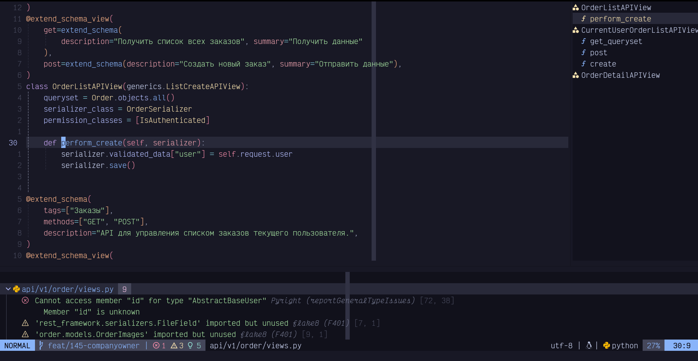

## Оглавление

TODO

## Вступление

В современном мире, когда технологии развиваются с невероятной скоростью, многие сферы жизни человека претерпевают кардинальные изменения. Одной из таких сфер является автомобильный транспорт и обслуживание автомобилей. С ростом числа автомобилей на дорогах, увеличивается и потребность в качественных автосервисах, которые могут удовлетворить потребности автовладельцев в ремонте, обслуживании и диагностике.

Актуальность темы данной дипломной работы заключается в том, что создание удобного и эффективного веб-приложения для поиска автосервисов может значительно упростить жизнь автовладельцам, предоставив им доступ к актуальной информации о ближайших автосервисах, их услугах, ценах и отзывах других клиентов. Кроме того, такое приложение может помочь автосервисам увеличить свою клиентскую базу, улучшить качество обслуживания и оптимизировать рабочие процессы.

В ходе работы над бэкенд частью проекта будут использоваться современные технологии, такие как Django, PostgreSQL, Docker, Poetry, REST, Python и другие.

Разработанное веб-приложение для поиска автосервисов будет доступно для использования широкой аудитории автовладельцев, а также сможет стать полезным инструментом для автосервисов в продвижении своих услуг и улучшении качества обслуживания клиентов. Результаты данной дипломной работы могут быть использованы как в коммерческих, так и в некоммерческих целях, способствуя развитию отрасли автосервиса и улучшению качества жизни автовладельцев.

## Описание проекта

### Цель проекта

Целью данной дипломной работы является разработка бэкенд части веб-приложения, которое будет обеспечивать эффективный поиск автосервисов, а также предоставление пользователям подробной информации о каждом автосервисе. Для достижения данной цели необходимо решить следующие задачи:

1. Разработать архитектуру веб-приложения с учетом современных требований и стандартов веб-разработки.
2. Реализовать функционал поиска и фильтрации автосервисов по различным параметрам, таким как местоположение, предоставляемые услуги, стоимость и отзывы клиентов.
3. Обеспечить интеграцию с внешними сервисами для получения актуальной информации об автосервисах и отзывов клиентов.
4. Разработать удобный пользовательский интерфейс, который позволит пользователям быстро и легко находить необходимую информацию.
5. Протестировать разработанное веб-приложение на предмет его эффективности, надежности и удобства использования.
6. Развернуть и запустить полнофункциональное приложение на сервере, объединяющее в себе бэкенд, фронтенд, базу данных и веб-сервер,

По результатам разработки, приложение должно соответствовать требованиям и обладать минимально необходимым набором функций. В этот набор должны входить:

- регистрация пользователя в приложении;
- регистрация представителя автосервиса в приложении;
- возможность изменения личных данных пользователя в его личном кабинете;
- возможность корректировки информации о представителе автосервиса в его личном кабинете;
- отображение списка ближайших автосервисов для пользователя;
- опция отправки запроса на обслуживание в автосервисе;
- просмотр запросов на ремонт представителем автосервиса;
- общение с клиентом через приложение по отправленному запросу;
- смена статуса запроса;
- закрытие запроса с различными статусами.

### Структура проекта

Современные веб-приложения имеют сложную структуру, состоящую из множества компонентов. Одним из популярных подходов к разработке веб-приложений является использование React для фронтенд-части и Django/PostgreSQL для бэкенд-части. В этом случае, фронтенд и бэкенд могут быть расположены в разных репозиториях для удобства разработки и масштабирования.

В таком случае, веб-приложение будет состоять из двух частей: фронтенд на React и бэкенд на Django/PostgreSQL. Обе части будут работать вместе, обмениваясь данными через API.

Для реализации такого подхода, необходимо выполнить следующие шаги:

1. Разработать фронтенд-часть на React. Это включает в себя создание компонентов, которые будут использоваться для отображения данных, и разработку логики работы с API.
2. Разработать бэкенд на Django. Это включает создание моделей для работы с данными, разработку API и создание контроллеров для обработки запросов.
3. Создать базу данных и таблицы для хранения данных.
4. Интегрировать React и Django. Для этого необходимо создать RESTful API, который будет обрабатывать запросы от фронтенда и возвращать ответы.
5. Протестировать работу приложения. Необходимо провести тестирование как фронтенд, так и бэкенд-части приложения, чтобы убедиться в их корректной работе.

Такой подход позволяет создавать масштабируемые и гибкие веб-приложения с высокой производительностью.

#### Backend репозиторий проекта

Бэкенд репозиторий проекта расположен на GitHub по адресу - https://github.com/car-service-with-geolocation/backend

Так как моей специализацией является бэкенд разработка на Python это основной репозиторий где я работал.

#### Frontend репозиторий проекта

Фронтенд репозиторий проекта расположен на GitHub по адресу - https://github.com/car-service-with-geolocation/frontend

В репозитории фронтенда размещен код для веб-сайта. Над разработкой фронтальной части приложения работает команда фронтенд-разработчиков. Я использовал этот репозиторий для запуска фронтальной части приложения в контейнере Docker для тестирования интеграции фронтенда и бэкенда через API.

### Технологии и инструменты

- Для работы приложения на сервере используется операционная система Linux. В свою очередь, на рабочей станции я также использую Linux, а конкретно - Fedora Workstation - https://fedoraproject.org/workstation/
- Для размещения готового приложения на сервере, а также для облегчения процесса разработки через создание контейнеров для тестирования фронтенд и бэкенд частей, используется Docker - https://www.docker.com/
- GitHub Actions помогает в развертывании приложения на сервере и организует процесс CI-CD (непрерывная интеграция и доставка) - https://docs.github.com/en/actions
- Django фреймворк для создания веб-приложений - https://www.djangoproject.com/
- Django REST Framework используется для создания API - https://www.django-rest-framework.org/
- С помощью DRF Spectacular создается документация для API - https://drf-spectacular.readthedocs.io/en/latest/
- Poetry служит для управления зависимостями проекта, сборки и управления пакетами - https://python-poetry.org/
- Black используется для форматирования кода на Python - https://pypi.org/project/black/
- Flake8 — это линтер кода на Python, который помогает находить и исправлять ошибки в коде - https://flake8.pycqa.org/en/latest/
- Pyright — это языковой сервер, который предоставляет автодополнение в редакторе и выполняет статический анализ кода - https://github.com/microsoft/pyright
- В качестве редактора кода я использую Neovim - https://neovim.io/

Далее я более подробно разберу использование каждого из этих инструментов и технологий.

## Подготовка окружения для разработки приложения

### Выбор операционной системы для работы приложения

Для операционной системы сервера, на котором будет функционировать приложение, в рамках проекта был выбран Linux. Эта ОС идеально подходит для данной задачи по ряду причин:

— Открытость. Linux является открытым исходным кодом, что даёт пользователям и разработчикам право свободно изучать, модифицировать и распространять систему. Такой подход обеспечивает гибкость и возможность адаптации системы под индивидуальные потребности.
— Бесплатное распространение. Linux предлагается бесплатно, что помогает снизить затраты на внедрение и поддержку сервера.
— Поддержка сообщества. Linux обладает огромным и активным сообществом разработчиков, пользователей и поставщиков, что обеспечивает поддержку и развитие системы.
— Безопасность. В Linux применяется модель безопасности на основе привилегий, которая препятствует несанкционированному доступу к системе. Помимо этого, ядро Linux создано так, чтобы минимизировать уязвимости и эксплойты.
— Надёжность. Linux зарекомендовал себя как стабильная и надёжная операционная система для серверов. Он обеспечивает бесперебойную работу и устойчивость к сбоям, что особенно важно для онлайн-сервисов и веб-приложений.
— Масштабируемость. Linux без труда масштабируется для работы на различных типах серверов, от небольших и недорогих до высокопроизводительных и мощных. Это позволяет использовать Linux для различных задач, включая веб-хостинг, облачные вычисления, базы данных и многое другое.
— Совместимость. Linux поддерживает множество аппаратных и программных компонентов, что делает его совместимым с широким спектром оборудования. Это облегчает процесс развертывания и поддержки сервера.
— Гибкость и настраиваемость. Linux предлагает богатый выбор дистрибутивов и пакетов, что позволяет быстро и легко адаптировать систему для решения конкретных задач.

Один из популярных дистрибутивов Linux — Ubuntu. Именно он был выбран для запуска на сервере.

### Установка Linux для разработки и тестирования приложения

Для разработки и тестирования приложения, предназначенного для платформы Linux, необходимо создать среду разработчика, позволяющую запускать и тестировать приложение непосредственно на целевой платформе. Следовательно, требуется установка Linux в среде разработчика.

Варианты установки Linux в среду разработчика могут быть разными, в зависимости от требований к оборудованию, удобству использования и доступности инструментов. Вот несколько вариантов:

- Использование виртуальной машины (VM): Этот вариант подходит для тех, кто работает на платформе Windows или macOS и хочет протестировать свое приложение на Linux без необходимости установки этой операционной системы на свой компьютер. Виртуальная машина позволяет создать изолированную среду Linux, которую можно запускать на компьютере без влияния на основную операционную систему. Преимущества: простота использования, возможность легкого переключения между разными версиями Linux, совместимость с различными платформами. Недостатки: производительность может быть ниже, чем при использовании реальной установки Linux, некоторые приложения могут не работать должным образом.
- Установка Linux на отдельный жесткий диск или раздел: Этот вариант идеально подходит для тех, кому нужно постоянное и стабильное окружение для разработки на Linux. Преимущества: стабильная среда, возможность использовать все доступные инструменты Linux, высокая производительность. Недостатки: требуется больше времени на первоначальную настройку, нужен отдельный компьютер или отдельный раздел на компьютере.
- Использование облачной платформы: Некоторые облачные платформы, такие как Amazon Web Services (AWS), Microsoft Azure и Google Cloud Platform, предлагают предустановленные образы Linux для разработки и тестирования. Преимущества: возможность быстро развернуть среду Linux в облаке, масштабируемость, доступность инструментов для разработки. Недостатки: возможно, потребуется оплатить подписку на облако, производительность может зависеть от качества соединения с интернетом.
- Использование контейнеров: Это относительно новый подход к развертыванию и управлению приложениями, который позволяет упаковывать приложение и все его зависимости в один легкий и переносимый контейнер. Преимущества: быстрое развертывание и масштабирование, легкое обновление и миграция приложений. Недостатки: некоторые инструменты могут быть сложнее в использовании, чем виртуальные машины.

Я решил установить Linux на жесткий диск, чтобы не только иметь возможность разрабатывать приложение непосредственно для той платформы, на которой оно будет использоваться, но и воспользоваться всеми остальными преимуществами этой системы.

Для установки на свой домашний компьютер я выбрал дистрибутив Fedora Workstation - https://fedoraproject.org/workstation/

### Установка Python при помощи pyenv

Проект использует Python версии 3.9.18, в то время как Fedora 39 включает в себя версию Python 12. Чтобы использовать версию 3.9.18 для проекта, утилита pyenv была установлена. Pyenv обеспечивает удобное переключение между различными версиями Python.

Для установки pyenv перейдем на официальный сайт проекта - https://github.com/pyenv/pyenv

Воспользуемся официальным скриптом для установки pyenv на UNIX системы:

```shell
curl https://pyenv.run | bash
```

> curl - это универсальная утилита командной строки, которая используется для передачи данных с или на сервер. Она поддерживает множество протоколов и может использоваться для выполнения различных задач, таких как загрузка файлов, отправка форм, передача данных в формате HTTP и т.д. Curl также может работать с защищенными соединениями (HTTPS) и поддерживает передачу файлов> большого размера.

Чтобы использовать pyenv, нужно добавить соответствующие конфигурации в файл настроек моей оболочки (shell). Я использую zsh, поэтому файл конфигурации называется `$HOME/.config/zsh/.zshrc`. Нужно добавить в него следующие строки:

```shell
export PYENV_ROOT="$HOME/.pyenv"
[[ -d $PYENV_ROOT/bin ]] && export PATH="$PYENV_ROOT/bin:$PATH"
eval "$(pyenv init -)"
```

Перезапустив оболочку установим python версии 3.9.18 следующей командой:

```shell
pyenv install 3.9.18
```

Создадим в директории проекта файл `.python-version`. Запишем в него версию python для проекта: `3.9.18`.

Теперь при переходе в директорию проекта, текущая версия python будет автоматически переключаться на 3.9.18.


### Установка Poetry

Poetry - это инструмент управления зависимостями и виртуальной средой для проектов на Python. Он позволяет устанавливать и управлять зависимостями проекта, создавать виртуальную среду и управлять ее настройками.

Poetry заменяет `setup.py`, `requirements.txt`, `setup.cfg`, `MANIFEST.in` и `Pipfile` на простой формат файла проекта `pyproject.toml`.

Чтобы начать использовать Python Poetry, его нужно установить. Это можно сделать разными способами:

- Если виртуальное окружение для проекта уже создано, установить Poetry можно с помощью команды pip: `pip install poetry`.
- Для установки Poetry глобально можно использовать pipx. Этот инструмент изолирует Poetry в виртуальном окружении и позволяет управлять обновлениями и удалениями.
- Пользовательская программа установки Poetry позволяет установить его в новое виртуальное окружение. После установки Poetry может управлять своим окружением.

Я использовал официальный пользовательский установщик Poetry. Для этого я скачал и запустил установочный скрипт с официального сайта:

```shell
curl -sSL https://install.python-poetry.org | python3 -
```

Программа установки создает wrapper для использования Poetry из командной строки. В Linux он обычно размещается в каталоге `$HOME/.local/bin`. Этот каталог содержит исполняемые файлы, привязанные к конкретному пользователю. Чтобы добавить этот каталог в переменную окружения PATH, я добавил следующую строку в файл конфигурации оболочки zsh - `$HOME/.config/zsh/.zshrc`:

```shell
PATH="$PATH:$HOME/.local/bin"
export PATH
```

Это позволит использовать Poetry из любой директории, не указывая полный путь к исполняемому файлу.

### Установка редактора

> В 2023 году мы с прискорбием узнали, что Брам Моленар, создатель редактора Vim, покинул нас в возрасте 62 лет. Эта часть посвящается ему.

Редактор текста это основной инструмент разработчика. Поэтому среди разработчиков популярна тема выбора подходящего текстового редактора.

Популярные варианты включают полнофункциональные интегрированные среды разработки (IntelliJ IDEA, PyCharm, Visual Studio), редакторы с графическим интерфейсом (VSCode, Sublime Text) и редакторы для эмуляторов терминала (Neovim, Vim). Опросив разработчиков на сайте Stack Overflow, мы составили диаграмму популярности текстовых редакторов:

- Полноценные IDE такие как IntelliJ IDEA, PyCharm, Visual Studio.
- Редакторы с графическим интерфейсом такие как VSCode, Sublime Text.
- Редакторы используемые внутри эмулятора терминала такие как Neovim, Vim, Helix.

На диаграмме представлены наиболее популярные текстовые редакторы согласно данным опроса, проведенного на сайте Stack Overflow:


В начале карьеры разработчика я узнал о редакторе Vim и его системе горячих клавиш. Мне очень понравилась идея такого подхода к редактированию текста, и я начал осваивать Vim параллельно с программированием. Теперь я не могу представить, как можно редактировать код без горячих клавиш Vim. Я убеждён, что освоение горячих клавиш Vim — одна из лучших инвестиций времени для разработчика.

Я пишу код в [Neovim](https://neovim.io/) — современном форке классического [Vim](https://www.vim.org/), созданного Брамом Моленаром (Эта пояснительная записка, также полностью написана в Neovim).



Neovim обогатил и улучшил функциональность Vim. Он поддерживает все функции современных редакторов: автодополнение, статический анализ кода, навигацию в проекте, линтинг и форматирование. У Neovim есть преимущества перед другими текстовыми редакторами:

- Визитная карточка Neovim – система горячих клавиш Vim. Это позволяет отказаться от мыши для выделения и перемещения текста, все действия выполняются с помощью клавиатуры, руки остаются на среднем ряду клавиатуры. Хотя в других редакторах тоже можно установить расширения для поддержки клавиш Vim, они все уступают встроенной поддержке Neovim.
- Горячие клавиши Vim работают не только в самом редакторе. Их могут использовать и другие программы. Zsh, Obsidian, Logseq, Emacs, Visual Studio Code и продукты JetBrains поддерживают горячие клавиши Vim. Благодаря этому при переходе на новую среду разработки можно продолжать использовать привычные комбинации клавиш, не тратя время на запоминание новых.
- Neovim как и Vim — консольное приложение, работающее в терминале. Это удобно, потому что можно работать с текстом на удалённом сервере без установки дополнительного ПО. Vim предустановлен на большинстве Unix-подобных систем. Работа в терминале позволяет использовать команды терминала прямо в редакторе: вставлять путь рабочей директории, фильтровать и форматировать текст с помощью grep и sed, выполнять Git-команды.
- В паре с Tmux Neovim становится мощной средой разработки, в которой можно работать над проектами, сохранять и восстанавливать состояние среды между сессиями. Тестирование и отладка кода возможны прямо в терминале, а переключение между редактором и процессом в консоли почти мгновенно.
- Конфигурация Neovim происходит через текстовые файлы с использованием Vim script или Lua. Для новичков это может показаться необычным, ведь они привыкли к графическому интерфейсу. Однако такой метод конфигурации проще и понятнее: пользователь сам решает, какие настройки добавить. Он может постепенно понять, как влияют на него выбранные опции. Изменения в текстовых файлах легко отслеживать через Git. Если изменение настроек не понравилось пользователю, их можно легко откатить к предыдущему состоянию.
- Neovim предлагает множество плагинов и расширений, которые увеличивают его функциональность и превращают его в полноценную среду разработки. Среди них LSP, дополнения, tree-sitter и другие. В зависимости от нужд пользователя Neovim может быть как простым текстовым редактором, так и соперником продуктов Jetbrains по функциональности.

## Установка проекта

### Создание проекта при помощи Poetry

Описание: Python Poetry - это утилита для управления зависимостями и автоматизации сборки проектов на языке программирования Python. Она позволяет легко устанавливать, обновлять и управлять зависимостями вашего проекта, а также автоматизировать процесс сборки и публикации вашего кода.
Руководство:
Создание нового проекта: После установки Python Poetry вы можете создать новый проект. Для этого используйте команду poetry:
poetry new my_project
Управление зависимостями: После создания проекта вы можете добавить зависимости с помощью файла pyproject.toml. Этот файл находится в корне вашего проекта и содержит информацию о зависимостях, а также другие настройки проекта. Добавить зависимость можно с помощью команды poetry add:
poetry add some-dependency
Обновление зависимостей: Чтобы обновить зависимости проекта, используйте команду poetry update:
poetry update
Публикация проекта: Вы можете опубликовать свой проект на PyPi (Python Package Index) или другом хранилище с помощью команды publish:
poetry publish

### Файл pyproject.toml

Сборка проекта: Python Poetry также может автоматизировать процесс сборки вашего проекта. Для этого нужно создать файл с расширением .poetry.lock в корне проекта. В этом файле будет храниться информация о зависимостях и их версиях. Затем вы можете настроить процесс сборки с помощью файла build.rs:

```toml
[build-system]
requires = ["poetry-core>=1.0.0"]
build-backend = "poetry.core.masonry.api"

[tool.poetry]
name = "my_project"
version = "0.1.0"
description = "My project description"
authors = ["Your Name <your@email.com>"]

[tool.build]
publish = true
```

Использование виртуальных окружений: Python Poetry поддерживает использование виртуальных окружений. Вы можете создать новое виртуальное окружение с помощью команды poetry env use:

```shell
poetry env use 3.9
```

Настройка: Python Poetry позволяет настроить множество параметров вашего проекта. Вы можете сделать это, отредактировав файл pyproject.toml:
[tool.poetry.source]
remotes = ["https://example.com/simple/"]

### Определение зависимостей

При работе с poetry все зависимости явно указываются в файле pyproject.toml. При этом poetry позволяет разделять зависимости на группы. Например на основную группу, зависимосити из которой будут использоваться как при разработке, тестировании проекта, так и при сборке продакшн версии приложения. А в отдельную группу `dev` можно выделить те зависимости, которые будут использваться только в процессе разработки и тестирования проекта, но которые не нужны в продакшене. Эти зависимости могут быть: тестовые фреймворки, инструменты как например линтеры и языковые серверы, и тд.

Для этого конкретного проекта определены следующие зависимости в файле pyproject.toml:

```toml
[tool.poetry.dependencies]
python = "3.9.18"
djangorestframework = "3.14.0"
Django = "3.2.16"
djoser = "2.1.0"
drf-spectacular = "0.26.5"
drf-spectacular-sidecar = "*"
drf-yasg = "1.21.5"
django-filter = "22.1"
django-cors-headers = "3.14.0"
gunicorn = "20.1.0"
python-dotenv = "0.21.0"
geoip2 = "2.9.0"
pytz = "2023.3.post1"
requests = "2.28.1"
Pillow = "9.3.0"


[tool.poetry.group.dev.dependencies]
black = "*"
Flake8-pyproject = "*"
django-extensions = "*"
Werkzeug = "*"
pyOpenSSL = "*"
django-stubs = "*"
djangorestframework-stubs = "*"
```

Как мы видем, зависимости разделены на две группы. В первой группе `main` находятся обязательные основные зависимости. Во второй группе `dev` находятся необязательные зависимости используемые только в ходе разработки проекта.

### Установка дополнительных инструментов

#### Установка языкового сервера и статического анализатора кода

В современном мире написание кода не представляется без использования статических анализаторов кода и языковых серверов.

Статический анализатор кода это программа которая парсит кодовую базу проекта и определяет ошибки типов, синтаксиса, логики в коде. Она показывает пользователю отчет с диагностическми данными и указывает как эти несоответсвия можно исправить.

Изначально статические анализаторы кода представляли собой cli инструмент который применяется из коммандной строки. Но с развитием инструментов, и со стремлением компании Microsoft продвигать свой редактор VS Code, этой компанией был разработан language server protocol. Этот протокол устанавливает стандартный способ взаимодействия между инструментами командной строки либо редакторами кода и языковым сервером.

Языкой сервер это программа которая обрабатывает код внутри файла или во всей кодовой базе и статически анализирует его. Клиентами же могут выступать редакторы кода инструменты командной строки и так далее.

Так language server protocol это opensorce технология, большинство современных редакторов кода поддерживают интеграцию с языковыми серверами.

Для python существует несколько языковых серверов. Одним из наиболее популярных является языковой сервер pyright разработанных компанией Microsoft.

Pyright можно выполнить несколькими способами. Установить локально в проект, установить глобально на систему, установить внутри редактора кода, где он будет доступен при редактировании.

В этом проекте я добавил его как development зависимость в файл pyproject.toml. Это позволит использовать его при необходимости из командной строки. Также это послужит своего рода документаций для других разработчиков о том, какие инструменты используются в проекте.

Текстовый редактор Neovim поддерживает протокол языкового сервера и может использовать языковой сервер pyright при работе для предоставления автодополнения, подсвечивания ошибок в коде, статического анализа и его визуализации внутри редактора, перемещения внутри файла и кодовой базы.

Для настройки статического анализатора кода используется файл pyproject.toml. Для этого нужно перечислить желаемые настройки в разделе `[tool.pyright]`.

_Код настройки pyright_

```toml
[tool.pyright]
include = []
exclude = [".pytest_cache",
    "**/__pycache__",
]
pythonVersion = "3.9.18"
typeCheckingMode = "standard"
```

Эти настройки озанчают:

- include - файлы или директории которые мы хотим явно включить в путь в котором работает pyright.
- exclude - файлы или директории которые мы хотим исключить пути. Это делается для улучшения скорости работы инструмента.
- pythonVersion - версия питон. В зависимости от версии python pyright будет указывать на устаревшие либо пока еще не используемые в данной версии питон синтаксические конструкции.
- typeCheckingMode - строгость к которой pyright будет подходить к анализу кода.

#### Установка линтера

Линтер это программа которая проверяет соответсвие написанного кода определенным правилам форматирования текста. Величина отступов, колличество пустых строк между параграфами и так далее.

Как и в случае с языковыми серверами существует несколько популярных линтеров для python. Некоторые из них это:

- flake8
- pylint
- ruff

Для данного проекта выбран линтер flake8.

flake8 проверяет код на соответствие стандарту pep8.

flake8 можно установить несколькими способами. Установить локально в проект, установить глобально на систему, установить внутри редактора кода, где он будет доступен при редактировании.

В этом проекте я добавил его как development зависимость в файл pyproject.toml. Это позволит использовать его при необходимости из командной строки. Также это послужит своего рода документаций для других разработчиков о том, какие инструменты используются в проекте.

Для настройки линтера кода используется файл pyproject.toml. Для этого нужно перечислить желаемые настройки в разделе `[tool.flake8]`.

_Код настройки flake8_

```toml
[tool.flake8]
max-line-length = 88
extend-ignore = ["E203", "I001", "I005", "R504"]
exclude = [
    ".git",
    "__pycache__",
    "env",
    "migrations",
    "settings.py",
    "venv",
    "management"
]
max-complexity = 10
```

max-line-length - Устанавливает максимальную длину, которую может иметь любая строка (за некоторыми исключениями).
extend-ignore - Указывает список кодов для добавления в список игнорируемых.
exclude - Укажите список глобальных паттернов, разделенных запятыми, чтобы исключить их из проверок.
max-complexity - Устанавливает максимально допустимое значение сложности McCabe для блока кода.

#### Установка форматера

Если линтер только проверяет код на соответсвие стилю, то форматер автоматически редактирует код так чтобы он соответсветствовал выбарнным правилам. Наиболее популярными форматерами для python являются:

- Black
- Ruff

Для данного проекта был выбран форматтер black. Он позволяет форматировать код согласно установленным правилам, либо согласно правилам выбарнным разработчиками форматтера как значения по умолчанию.

Разработчики называют black - optionated. Это означает что ряд правил которые установленны для него как правил форматирования по умолчанию не соответствуют стандартам pep8. К примеру pep8 определяет максимальную ширину строки в 79 знаков. Когда как black по умолчанию устанавливает максимальную ширину строки в 88 знаков.

black можно установить несколькими способами. Установить локально в проект, установить глобально на систему, установить внутри редактора кода, где он будет доступен при редактировании.

В этом проекте я добавил его как development зависимость в файл pyproject.toml. Это позволит использовать его при необходимости из командной строки. Также это послужит своего рода документаций для других разработчиков о том, какие инструменты используются в проекте.

Для настройки форматера кода используется файл pyproject.toml. Для этого нужно перечислить желаемые настройки в разделе `[tool.black]`.

_Код настройки black_

```toml
[tool.black]
line-length = 88
```

Для black явно указываем длину строки. Остальные правила используем по умолчанию.

## Работа над проектом

### Структура проекта Django

Если вы впервые используете Django, вам придется позаботиться о начальной настройке. В частности, вам нужно будет автоматически сгенерировать код, который создаст проект Django - набор настроек для экземпляра Django, включая конфигурацию базы данных, специфические для Django опции и настройки для приложения.

В командной строке перейдите в каталог, где будет храниться ваш код, и выполните следующую команду:

```shell
django-admin startproject mysite
```

Это создаст каталог mysite в вашем текущем каталоге.

Давайте посмотрим, что создал startproject:

```
mysite/
    manage.py
    mysite/
        __init__.py
        settings.py
        urls.py
        asgi.py
        wsgi.py
```

Эти файлы:

- Внешний корневой каталог mysite/ - это контейнер для вашего проекта. Его имя не имеет значения для Django; вы можете переименовать его во что угодно.
- manage.py: Утилита командной строки, которая позволяет вам взаимодействовать с проектом Django различными способами. Все подробности о manage.py вы можете прочитать в разделах django-admin и manage.py.
- Внутренний каталог mysite/ - это собственно Python-пакет для вашего проекта. Его имя - это имя пакета Python, которое вам нужно будет использовать для импорта всего, что находится внутри него (например, mysite.urls).
- mysite/**init**.py: Пустой файл, который сообщает Python, что эта директория должна считаться пакетом Python. Если вы новичок в Python, прочитайте больше о пакетах в официальной документации Python.
- mysite/settings.py: Настройки/конфигурация для этого проекта Django. Django settings расскажет вам все о том, как работают настройки.
- mysite/urls.py: Декларации URL для этого Django-проекта; "оглавление" вашего сайта на базе Django. Подробнее об URL-адресах вы можете прочитать в разделе "Диспетчер URL".
- mysite/asgi.py: Точка входа для ASGI-совместимых веб-серверов для обслуживания вашего проекта. Подробнее см. в разделе Как развертывать с помощью ASGI.
- mysite/wsgi.py: Точка входа для WSGI-совместимых веб-серверов для обслуживания вашего проекта. Подробнее см. в разделе Как развернуть с помощью WSGI.

Теперь, когда ваше окружение - "проект" - создано, вы можете приступать к работе.

Каждое приложение, которое вы пишете в Django, состоит из пакета Python, который следует определенным соглашениям. Django поставляется с утилитой, которая автоматически генерирует базовую структуру каталогов приложения, так что вы можете сосредоточиться на написании кода, а не на создании каталогов.

В чем разница между проектом и приложением? Приложение - это веб-приложение, которое что-то делает - например, система блогов, база данных публичных записей или небольшое приложение для опросов. Проект - это набор конфигураций и приложений для определенного веб-сайта. Проект может содержать несколько приложений. Приложение может находиться в нескольких проектах.

Ваши приложения могут находиться в любом месте вашего пути к Python. В этом уроке мы создадим наше приложение poll в том же каталоге, что и файл manage.py, чтобы его можно было импортировать как собственный модуль верхнего уровня, а не как подмодуль mysite.

Чтобы создать приложение, убедитесь, что вы находитесь в той же директории, что и файл manage.py, и введите эту команду:

```
python manage.py startapp polls
```

### Структура данных проекта

Данные которыми будет оперировать приложение представляют собой следующую структуру:


#### Базовые модели проекта

Транспорт

Модель для выбора марки автомобиля при фильтрации поиска и указания конкретной специализации автосервиса.

Поля модели:

    brand

Виды работ

Модель хранит список производимых автосервисами работ, с указанием стоимости определенного вида работы для конкретного автосервиса. Также позволяет производить фильтрацию по полю при выполнении поиска. Связана с моделью автосервиса через AutoserviceJob.

Поля модели:

    title
    description

Компания

Хранит информацию о компании владеющей сетью автосервисов. Представляет собой не редактируемый личный кабинет компании. В дальнейшем представляет возмодность сделать полноценный личный кабинет для владельца.

Поля модели:

    title
    description
    logo
    legal_address

Автосервис

Хранит информацию об автосервисе.

Поля модели:

    company
    address
    geolocation
    city
    working_time
    phone_number
    email
    site
    job
    car_service

WorkingTime

Модель позволяет создать расписание работы автосервиса в разные дни недели
Отзыв

Модель позволяет создать отзыв на автосервис. Находится в доработке. На текущий момент любой авторизованный пользователь может оставить отзыв на любой сервис. В будущем будет добавлен функционал позволяющий оставить отзыв только после оформления пользователем заявки в выбранный автосервис.

Поля модели:

    author
    autoservice
    text
    score
    pub_date

Пользователь (нужна помощь с реализацией)

Модель кастомного пользователя. Для работы с пользователями используются возможности библиотеки Djoser. Для пользователя предусмотрена авторизация по электронной почте, номеру телефона или никнейму, для этого используется класс AuthBackend. В разработке находится процесс регистрации пользователя по телефону или электронной почте. На текущий момент возникают сложности с сохранением пароля. Предположительное решение проблемы - добавление кастомного сериализатора для регистрации.

Поля модели:

- email - Поле для хранения информации о электронной почте пользователя
- name - Поле для хранения информации о имени пользователя
- phone_number - Поле для хранения информации о телефоне пользователя
- date_joined - Поле для хранения информации о дате регистрации пользователя
  username
  email
  last_name
  first_name
  last_name
  phone_number
  date_joined
  image

### Описание API проекта.

REST - это архитектурный стиль, который описывает, как должны быть организованы и взаимодействовать компоненты системы. Он был разработан для того, чтобы обеспечить гибкость и масштабируемость системы.

REST имеет несколько ключевых принципов, которые делают его хорошим выбором для создания API:

    Независимость ресурсов. Каждый ресурс в системе может быть доступен независимо от других ресурсов. Это позволяет легко добавлять новые ресурсы или удалять старые без влияния на другие ресурсы.

    Кэширование. Ресурсы могут быть кэшированы, что позволяет ускорить работу системы и уменьшить нагрузку на сервер.

    Многообразие методов. REST поддерживает множество методов, включая GET, POST, PUT и DELETE. Это позволяет разработчикам выбирать наиболее подходящий метод для выполнения конкретной операции.

    Гипермедиа. REST позволяет использовать гипермедиа для описания связей между ресурсами. Это означает, что ресурсы могут быть связаны друг с другом при помощи ссылок, а не прямых указаний на их расположение.

Все эти принципы делают REST хорошим выбором для создания API. Он обеспечивает гибкость, масштабируемость и удобство использования, что важно для любого успешного API.
В данный момент структура Django-приложения состоит из приложений для соответствующих моделей и приложение api, в котором находтся все файлы urls.py,serializers.py,, views.py. Данная структура позволяет быстро создать новую версию api, но нагромождает проект директориями. Нужна помощь в подходе к выбору структуры Django-приложения.

Приложение является API сервером. Все возможности предоставляются при помощи создания точек API к которым фронтенд приложение обращаеся с запросами.

Файлы urls.py, serializers.py, views.py расположенны в директории api/v1/. Такое размещение файлов позволяет контролировать их изменения и упростит развитие API в дальнейшем. При появлении потребности серьезно изменить функционал API, возможно будет создать отдельную директорию v2 и зазрабатывать новую версию
Приложение является API сервером. Все возможности предоставляются при помощи создания точек API к которым фронтенд приложение обращаеся с запросами.

Файлы urls.py, serializers.py, views.py расположенны в директории apiv1. Такое размещение файлов позволяет контролировать их изменения и упростит развитие API в дальнейшем. При появлении потребности серьезно изменить функционал API возможно будет создать новую директорию v2 и разрабатывать новую версию API не опасаясь за работоспособность версии API которая используется в продакшене.

Работоспособность API обеспечивают файлы различных типов:

- models.py - Здесь содержатся модели данных для связи с таблицами базы данных
- views.py - Здесь содеражаться функции отвечающие за обрабоку, представление данных полученных из базы данных либо из запроса.
- serializers.py - Здесь содержаться сериализаторы данных, отвечающие за сериализацию, десериализацию и валидацию данных.
- urls.py - Здесь содержаться рутинги для связи view функций конкретными путями которым они соответсвуют.

### Фреймворк аутентификации и работа с пользователем

Django поставляется с системой аутентификации пользователей. Она работает с учетными записями пользователей, группами, разрешениями и пользовательскими сессиями на основе cookie. В этом разделе документации рассказывается о том, как работает стандартная реализация из коробки, а также о том, как расширить и настроить ее под нужды вашего проекта.
Обзор

Система аутентификации Django работает как с аутентификацией, так и с авторизацией. Вкратце, аутентификация проверяет, является ли пользователь тем, за кого он себя выдает, а авторизация определяет, что разрешено делать аутентифицированному пользователю. Здесь термин аутентификация используется для обозначения обеих задач.

Система аутентификации состоит из:

- Пользователи .
- Разрешения: Двоичные (да/нет) флаги, обозначающие, может ли пользователь выполнять определенную задачу.
- Группы: Общий способ применения меток и разрешений к нескольким пользователям.
- Настраиваемая система хеширования паролей
- Формы и инструменты просмотра для регистрации пользователей или ограничения содержимого.
- Подключаемая бэкэнд-система

Система аутентификации в Django стремится быть очень общей и не предоставляет некоторых возможностей, обычно встречающихся в веб-системах аутентификации. Решения некоторых из этих общих проблем были реализованы в сторонних пакетах:

- Проверка надежности пароля
- Ограничение попыток входа в систему
- Аутентификация от третьих лиц (например, OAuth)
- Разрешения на уровне объектов

Для упрощения работы с представлениями рутингами и системой аутентификации пользователя в проекте используется бибилиотека Djoser.

REST-реализация системы аутентификации Django. Библиотека djoser предоставляет набор представлений Django Rest Framework для обработки основных действий, таких как регистрация, вход, выход, сброс пароля и активация аккаунта. Она работает с пользовательской моделью пользователя.

Вместо того чтобы повторно использовать код Django (например, PasswordResetForm), мы переделали несколько вещей, чтобы они лучше вписывались в архитектуру Single Page App.

### Приложения проекта

Теперь, когда ваше окружение - "проект" - создано, вы можете приступать к работе.

Каждое приложение, которое вы пишете в Django, состоит из пакета Python, который следует определенному соглашению. Django поставляется с утилитой, которая автоматически генерирует базовую структуру каталогов приложения, так что вы можете сосредоточиться на написании кода, а не на создании каталогов.

Проекты против приложений

В чем разница между проектом и приложением? Приложение - это веб-приложение, которое что-то делает - например, система блогов, база данных публичных записей или небольшое приложение для опросов. Проект - это набор конфигураций и приложений для определенного веб-сайта. Проект может содержать несколько приложений. Приложение может находиться в нескольких проектах.

Ваши приложения могут находиться в любом месте на пути Python. В этом уроке мы создадим наше приложение poll в той же директории, что и файл manage.py, чтобы его можно было импортировать как собственный модуль верхнего уровня, а не как подмодуль mysite.

Для проекта создано несколько приложений которые определяют его структуру:

- autoservice - приложение для работы с данными автосервиса
- users - приложение для работы с данными пользователей
- orders - приложение для работы с заявками пользователей автосервисам

## Тестирование и отладка проекта

### Тестовый фреймворк django

Автоматизированное тестирование - чрезвычайно полезный инструмент для устранения ошибок для современного веб-разработчика. Вы можете использовать набор тестов - набор тестов - для решения или предотвращения ряда проблем:

При написании нового кода вы можете использовать тесты для проверки того, что ваш код работает так, как ожидалось.
При рефакторинге или модификации старого кода вы можете использовать тесты, чтобы убедиться, что внесенные изменения не повлияли на поведение приложения неожиданным образом.

Тестирование веб-приложения - сложная задача, поскольку веб-приложение состоит из нескольких слоев логики - от обработки запросов на уровне HTTP, проверки и обработки форм до рендеринга шаблонов. С помощью фреймворка Django для тестирования и различных утилит вы можете имитировать запросы, вставлять тестовые данные, проверять результаты работы приложения и вообще проверять, что ваш код делает то, что должен делать.

Предпочтительным способом написания тестов в Django является использование модуля unittest, встроенного в стандартную библиотеку Python.

### Тестирование API

#### Docker контейнер для тестирования API

Для удобства тестирования и ускорения итерации в процессе разработки приложение запускается в Docker контейнере.

#### Использование Postman для тестирования API

Для тестирования API проекта я использовал приложение Postman.

## Развертывание проекта на сервере

### Docker контейнер для запуска приложения на сервере

### Запуск приложения на сервере

## Результаты работы над проектом
