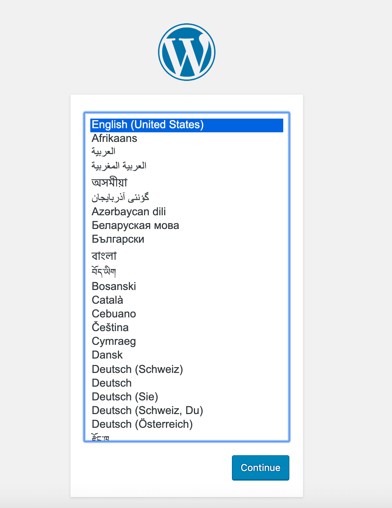

## Введение

Рассмотрим процесс запуска и организации работы [Docker](https://www.docker.com/)  контейнеров при помощи [Docker Compose](https://docs.docker.com/compose/). Выполним это на примере запуска сервиса [WordPress](https://ru.wordpress.org/) в связке с базой данных [MySQL](https://www.mysql.com/) и веб-сервером [Nginx](https://nginx.org/ru/).

## Настройка конфигурации веб-сервера

Для начала создадим директорию в которой будут размещены файлы конфигурации проекта.

```shell
mkdir wordpress
```

Перейдем в директорию проекта и создадим директорию для файла конфигруации веб-сервера.

```shell
cd wordpress
mkdir nginx-conf
```

Создадим файл конфигурации веб-сервера при помощи редактора Vim.

```shell
vim nginx-conf/nginx.conf
```

Внесем следующую конфигурацию в файл (далее рассмотрим ее более подробно).

```nginx
server {
        listen 80;
        listen [::]:80;

        server_name <имя_домена> www.<имя_домена>;

        index index.php index.html index.htm;

        root /var/www/html;

        location ~ /.well-known/acme-challenge {
                allow all;
                root /var/www/html;
        }

        location / {
                try_files $uri $uri/ /index.php$is_args$args;
        }

        location ~ \.php$ {
                try_files $uri =404;
                fastcgi_split_path_info ^(.+\.php)(/.+)$;
                fastcgi_pass wordpress:9000;
                fastcgi_index index.php;
                include fastcgi_params;
                fastcgi_param SCRIPT_FILENAME $document_root$fastcgi_script_name;
                fastcgi_param PATH_INFO $fastcgi_path_info;
        }

        location ~ /\.ht {
                deny all;
        }
        
        location = /favicon.ico { 
                log_not_found off; access_log off; 
        }
        location = /robots.txt { 
                log_not_found off; access_log off; allow all; 
        }
        location ~* \.(css|gif|ico|jpeg|jpg|js|png)$ {
                expires max;
                log_not_found off;
        }   
}
```

Блок конфигурации server включает в себя следующую информацию:

### Директивы

- **listen**: Эта директива указывает Nginx прослушивать порт 80.
- **server_name**: Здесь задается имя сервера и серверный блок, который должен использоваться для запросов к серверу.
- **index**: Эта директива определяет файлы, которые будут использоваться в качестве индексов при обработке запросов к серверу. Здесь мы изменили стандартный порядок приоритетов, переместив `index.php` перед `index.html`, чтобы Nginx отдавал приоритет файлам с именем `index.php`, когда это возможно.
- **root**: Эта директива определяет корневой каталог для запросов к вашему серверу. Этот каталог, `/var/www/html`, создается в качестве [точки монтирования](https://github.com/docker-library/wordpress/blob/07958d19ed465fb7fe50626be740d88a2c2260a7/php7.2/fpm-alpine/Dockerfile#L53) во время сборки с помощью инструкций в WordPress Dockerfile. Эти инструкции Dockerfile также гарантируют, что файлы из релиза WordPress будут смонтированы в этот том.

### Блоки location

- **location ~ /.well-known/acme-challenge**: Этот блок будет обрабатывать запросы к каталогу `.well-known`, в котором Certbot разместит временный файл для проверки того, что DNS для домена разрешается на сервер. После установки этой конфигурации можно будет использовать плагин webroot от Certbot для получения сертификатов для домена.
- **location /**: В этом блоке location используется директива `try_files` для проверки файлов, соответствующих отдельным URI-запросам. Однако вместо того, чтобы по умолчанию возвращать статус `404 Not Found`, мы передаем управление файлу `index.php` WordPress вместе с аргументами запроса.
- **location ~ \.php$**: Этот блок размещения будет обрабатывать запросы PHP и передавать их через прокси-сервер в контейнер `wordpress`. Поскольку ваш Docker-образ WordPress будет основан на образе `php:fpm,` в этот блок также будут включены параметры конфигурации, специфичные для протокола [FastCGI](https://en.wikipedia.org/wiki/FastCGI). Nginx требует независимого PHP-процессора для обработки PHP-запросов. В данном случае эти запросы будут обрабатываться процессором `php-fpm`, входящим в состав образа `php:fpm`. Кроме того, этот блок содержит директивы, переменные и опции, специфичные для FastCGI, которые проксируют запросы к приложению WordPress, запущенному в контейнере `wordpress`, устанавливают предпочтительный индекс для URI разобранного запроса и разбирают URI-запросы.
- **location ~ /\.ht**: Этот блок будет обрабатывать файлы `.htaccess`, поскольку Nginx не будет их обслуживать. Директива `deny_all` гарантирует, что файлы `.htaccess` никогда не будут обслуживаться пользователями.
- **location = /favicon.ico, location = /robots.txt**: Эти блоки гарантируют, что запросы к `/favicon.ico` и `/robots.txt` не будут логироваться.
- __location ~* \.(css|gif|ico|jpeg|jpg|js|png)$__: Этот блок отключает логирование запросов к статическим ресурсам и обеспечивает высокую степень кэшируемости этих ресурсов, так как их обычно затратно загружать при запросах.

## Задание переменных среды

Зададим переменные среды необходимые для работы наших приложений. Эти переменные могут содержать как чувствительную, так и нечувствительную к раскрытию информацию:

- чувствительная информация - пароль root для MySQL, а также имя и пароль пользователя базы данных.
- нечувствительная информация - имя и хост базы данных приложения.

Вместо того чтобы задавать все эти значения в файле Docker Compose - основном файле, содержащем информацию о том, как будут работать контейнеры, - задим конфиденциальные значения в файле `.env` и ограничим его распространение. Это позволит избежать копирования этих значений в репозиторий проекта и их публичного раскрытия.

Создадим файл `.env` в корне директории проекта.

```shell
vim .env
```

Конфиденциальные значения, задаваемые в этом файле, включают пароль для root пользователя MySQL, а также имя пользователя и пароль, которые WordPress будет использовать для доступа к базе данных.

Внесем переменные среды в файл `.env`

```shell
MYSQL_ROOT_PASSWORD=<пароль_root>
MYSQL_USER=<имя_пользователя_базы_данных_wordpress>
MYSQL_PASSWORD=<пароль_базы_данных_wordpress>
```

Поскольку файл .env содержит конфиденциальную информацию, необходимо убедиться, что он включен в файлы `.gitignore` и `.dockerignore` проекта.

[Инициализируем](https://git-scm.com/docs/git-init) Git репозиторий в директории проекта.

```shell
git init
```

Создадим файл `.gitignore` и добавим в него `.env`.

```shell
vim .gitignore
```

Содержимое файла `.gitignore`:

```gitignore
.env
```

Создадим файл `.dockerignore` и добавим в него `.env`.

```shell
vim .dockerignore
```

Содержимое файла `.dockerignore`:

```dockerignore
.env
.git
docker-compose.yml
.dockerignore
```

## Определение служб с помощью docker-compose

Файл `docker-compose.yml` будет содержать определения сервисов для нашей установки. Сервис в Compose - это работающий контейнер, а определения сервисов определяют то как будет работать каждый контейнер.

Используя Compose, можно определять различные сервисы для запуска многоконтейнерных приложений, поскольку Compose позволяет связывать эти сервисы между собой с помощью общих сетей и томов. Это будет полезно для текущей конфигурации, поскольку мы создаем различные контейнеры для базы данных, приложения WordPress и веб-сервера.

Для начала создадим и откроем файл `docker-compose.yml`:

```shell
vim docker-compose.yml
```

### Определение службы базы данных

Код для определения версии файла Compose и службы базы данных `db`:

```yaml
version: '3'

services:
  db:
    image: mysql:8.0
    container_name: db
    restart: unless-stopped
    env_file: .env
    environment:
      - MYSQL_DATABASE=wordpress
    volumes: 
      - dbdata:/var/lib/mysql
    command: '--default-authentication-plugin=mysql_native_password'
    networks:
      - app-network
```

Определение службы `db` содержит следующие опции:

- **image**: Это указывает Compose, какой образ следует использовать для создания контейнера. Мы закрепляем здесь образ `mysql:8.0`, чтобы [избежать конфликтов](https://docs.docker.com/develop/develop-images/dockerfile_best-practices/) в будущем, поскольку образ `mysql:latest` продолжает обновляться.
- **container_name**: Здесь задается имя контейнера.
- **restart**: Здесь задается политика перезапуска контейнера. По умолчанию - нет, но мы зададим перезапуск контейнера, если он не остановлен вручную.
- **env_file**: Эта опция сообщает Compose, что мы хотим добавить переменные окружения из файла `.env`, расположенного в контексте сборки. В данном случае контекст сборки - это текущий каталог.
- **environment**: Эта опция позволяет добавить дополнительные переменные окружения, помимо тех, что определены в файле `.env.` Мы установим переменную MYSQL_DATABASE равной wordpress, чтобы задать имя для базы данных приложения. Поскольку эта информация не является конфиденциальной, ее можно включить непосредственно в файл `docker-compose.yml`.
- **volumes**: Здесь мы монтируем именованный [том](https://docs.docker.com/storage/volumes/) `dbdata` в каталог `/var/lib/mysql` в контейнере. Это стандартный каталог данных для MySQL в большинстве дистрибутивов.
- **command**: Эта опция задает команду, которая заменяет стандартную инструкцию CMD для образа. В данном случае добавляется опция к стандартной команде `mysqld` образа Docker, которая запускает сервер MySQL в контейнере. Эта опция, `--default-authentication-plugin=mysql_native_password`, устанавливает системную переменную `--default-authentication-plugin` в значение `mysql_native_password`, определяя, какой механизм аутентификации должен управлять новыми запросами аутентификации к серверу. Поскольку PHP и, соответственно, образ WordPress не поддерживают новую аутентификацию MySQL по умолчанию, то для аутентификации пользователя базы данных приложения необходимо выполнить эту настройку.
- **networks**: Это указывает на то, что наша служба приложений присоединится к сети `app-network`, которую мы определим в нижней части файла.

### Определение службы приложения WordPress

Код для определения службы приложения `wordpress`:

```yaml
  wordpress:
    depends_on: 
      - db
    image: wordpress:5.1.1-fpm-alpine
    container_name: wordpress
    restart: unless-stopped
    env_file: .env
    environment:
      - WORDPRESS_DB_HOST=db:3306
      - WORDPRESS_DB_USER=$MYSQL_USER
      - WORDPRESS_DB_PASSWORD=$MYSQL_PASSWORD
      - WORDPRESS_DB_NAME=wordpress
    volumes:
      - wordpress:/var/www/html
    networks:
      - app-network
```

В этом определении службы мы даем имя контейнеру и определяете политику перезапуска, как это было сделано в случае службы `db`. Также добавляются некоторые опции, специфичные для данного контейнера:

- **depends_on**: Эта опция гарантирует, что контейнеры будут запускаться в порядке зависимости, причем контейнер `wordpress` будет запускаться после контейнера `db`. Приложение WordPress зависит от существования базы данных приложения и пользователя, поэтому выражение такого порядка зависимостей позволит приложению запуститься правильно.
- **image**:  Для данной установки используется образ `5.1.1-fpm-alpine` WordPress. Использование этого образа гарантирует, что приложение будет иметь процессор `php-fpm`, который требуется Nginx для обработки PHP. Это также образ `alpine`, полученный из проекта Alpine Linux, что позволяет уменьшить общий размер образа.
- **env_file**: Мы указываем, что хотим взять значения из файла `.env`, поскольку именно в нем мы определили пользователя и пароль базы данных приложения.
- **environment**: Здесь мы используем значения, определенные в файле `.env`, но присваивам их именам переменных, которые ожидает образ WordPress: `WORDPRESS_DB_USER` и `WORDPRESS_DB_PASSWORD`. Мы также определяем `WORDPRESS_DB_HOST`, который будет являться сервером MySQL, работающим в контейнере `db` и доступным через порт MySQL по умолчанию, `3306`. Имя `WORDPRESS_DB_NAME` будет соответствовать значению, которое мы указали в определении службы MySQL для своей `MYSQL_DATABASE`: `wordpress`.
- **volumes**: Мы монтируем именованный том `wordpress` в точку монтирования `/var/www/html,` созданную образом WordPress. Такое использование именованного тома позволит нам совместно использовать код приложения с другими контейнерами.
- **networks**: Мы также добавляем контейнер `wordpress` в сеть `app-network`.

### Определение службы веб-сервера Nginx

Код для определения службы веб-сервера `Nginx`:

```yaml
  webserver:
    depends_on:
      - wordpress
    image: nginx:1.15.12-alpine
    container_name: webserver
    restart: unless-stopped
    ports:
      - "80:80"
    volumes:
      - wordpress:/var/www/html
      - ./nginx-conf:/etc/nginx/conf.d
    networks:
      - app-network
```

Здесь мы присваиваем имя своему контейнеру и делаем его зависимым от контейнера `wordpress` в порядке запуска. Также используется образ `alpine` - образ `1.15.12-alpine Nginx`.

Это определение сервиса также включает следующие опции:

- **ports**: При этом открывается порт `80` для включения опций конфигурации, заданных в файле `nginx.conf`.
- **volumes**: Здесь задается комбинация именованных томов и связанных точек монтирований:
  - **wordpress:/var/www/html**: В результате код приложения WordPress будет смонтирован в каталог `/var/www/html`, который мы задали в качестве корневого в блоке сервера Nginx.
  - **./nginx-conf:/etc/nginx/conf.d**: Это позволит привязать каталог конфигурации Nginx на хосте к соответствующему каталогу в контейнере, что гарантирует, что все изменения, внесенные в файлы на хосте, будут отражены в контейнере.
- **networks**: Мы также добавляем контейнер `webserver` в сеть `app-network`.

### Определение томов и сетей

Добавим код для определения названий томов и сетей. Эти названия мы уже прописали в определении служб ранее:

```yaml
volumes:
  wordpress:
  dbdata:

networks:
  app-network:
    driver: bridge
```

Ключ `volumes` верхнего уровня определяет тома `wordpress` и `dbdata`. Когда Docker создает тома, содержимое тома хранится в каталоге файловой системы хоста `/var/lib/docker/volumes/`, который управляется Docker. Затем содержимое каждого тома монтируется из этого каталога в любой контейнер, использующий этот том. Таким образом, становится возможным обмен кодом и данными между контейнерами.

Определяемая пользователем мостовая сеть `app-network` обеспечивает связь между контейнерами, поскольку они находятся на одном хосте демона Docker. Это упрощает трафик и коммуникации внутри приложения, поскольку открывает все порты между контейнерами в одной мостовой сети, не открывая ни одного порта внешнему миру. Таким образом, контейнеры db, wordpress и web-сервера могут взаимодействовать друг с другом, а для внешнего доступа к приложению необходимо открыть только порт 80.

## Запуск контейнеров

Запустим контейнеры с помощью команды `docker-compose up`, которая создаст и запустит контейнеры в указанном порядке. Добавив флаг `-d`, команда запустит контейнеры `db`, `wordpress` и `webserver` в фоновом режиме:

```shell
docker-compose up -d
```

Следующий вывод подтверждает, что службы созданы:

```shell
Creating db ... done
Creating wordpress ... done
Creating webserver ... done
```

С помощью `docker-compose ps` проверим состояние сервисов:

```shell
docker-compose ps
```

Службы `db`, `wordpress` и `webserver` будут находиться в состоянии `Up`:

```shell

  Name                 Command               State           Ports       
-------------------------------------------------------------------------
db          docker-entrypoint.sh --def ...   Up       3306/tcp, 33060/tcp
webserver   nginx -g daemon off;             Up       0.0.0.0:80->80/tcp 
wordpress   docker-entrypoint.sh php-fpm     Up       9000/tcp           
```

## Проверка через веб интерфейс

Запустив контейнеры, проверим установку через веб-интерфейс WordPress.

В браузере перейдем к домену нашего сервера. Нужно заменить `<имя_домена>` на собственное доменное имя:

```
http://<имя_домена>
```

Браузер покажет экран настройки нашего приложения WordPress:

 
