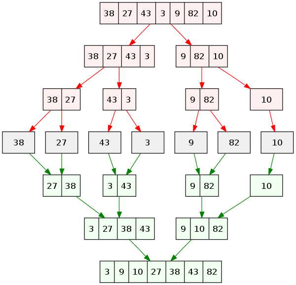
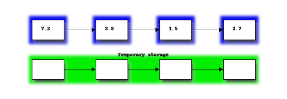
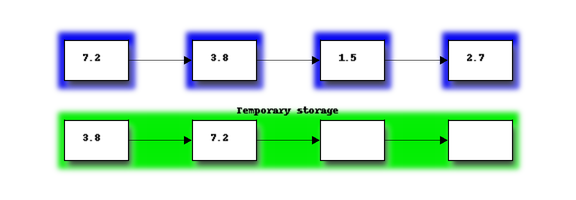
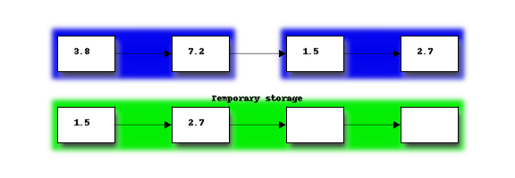
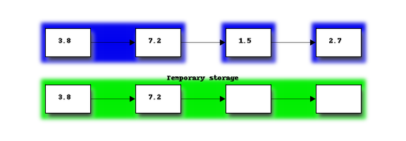
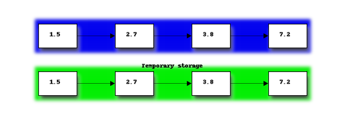

## Что такое быстрая сортировка

Пузырьковая сортировка, сортировка вставками или сортировка выбором - это медленные виды сортировок. Скорость их выполнения `O(N^2)`.
Сортировка слиянием - это вид быстрой сортировки. Скорость ее выполнения равна `O(logN*N^2)`.

## Как работает сортировка слиянием



### Деление массива на части

Сортировка слиянием использует принцип деления массива на секции. Деление происходит по индексу. В качестве точки деления берется индекс середины массива. Затем для каждой из получившихся секций также происходит разделение по срединному индексу.
Деление продолжается до тех пор, когда длина секций массива станет равна 1. Секция длины 1 - это отсортированный массив.



### Слияние частей массива

Следующий шаг - совместить между собой отдельные секции.  Секция длины 1 уже отсортирована, поэтому сортировка начинается при совмещении секций длиной 1 в новую секцию длиной 2.
При совмещении элементов секции наименьший элемент из первой секции и сравнивается с наименьшим элементом во второй секции:



- Если элемент из первой секции меньше элемента из второй секции - то копируется в новый массив. Затем для сравнения выбирается следующий по порядку элемент первой секции.
- Если значение из первого элемента больше значения из второго элемента - то значение значение из второго элемента ставится в совмещенный массив как наименьшее. Затем для сравнения выбирается следующее значение из второго элемента.
- Когда все значения из одного элемента попадут в совмещенный массив, подставим значения другого элемента в конец совмещенного массива. Для них не нужно выполнять сортировку. Они были отсортированы на предыдущем цикле совмещения.



Получившийся отсортированный подмассив совмещается со следующим подмассивом его уровня.



После совмещения всех подмассивов, получаем отсортированный оригинальный массив.



## Определение О-большое

Размер отсортированной секции удваивается при каждой итерации слияния. После `M` количества шагов размер сортированных секций будет `2^M`. Как только `2^M` больше N-количества элементов листе, весь лист отсортирован.
Таким образом для листа размером `N` нужно количество шагов `M` равное `log2(N)`.
Каждый шаг требует прохода по всем элементам в подмассивах. Следовательно требуется `N` сравнений на каждом шаге.
Таким образом сложность алгоритма сортировки равна `O(log2(N)*N)`.

## Реализация на языке Python

### Итеративная реализация

```python
def merge_sort(items):
 """Функция разбивает массив на секции. Собирает секции вместе"""
    n = len(items)
    temporary_storage = [None] * n
    size_of_subsections = 1 # Начальный размер секций

    while size_of_subsections < n:
    # Фукция будет выполняться пока размер секций не достигнет длины списка items.
        for i in range(0, n, size_of_subsections * 2):
        # Разбиваем список на секции и объединяем их при помощи функции merge
            i1_start, i1_end = i, min(i + size_of_subsections, n)
            i2_start, i2_end = i1_end, min(i1_end + size_of_subsections, n)
            sections = (i1_start, i1_end), (i2_start, i2_end)
            merge(items, sections, temporary_storage)
        size_of_subsections *= 2
  # Увеличиваем размер секций для следующей итерации
    return items


def merge(items, sections, temporary_storage):
 """Функция для соединения секций массива"""
    (start_1, end_1), (start_2, end_2) = sections
    i_1 = start_1
    i_2 = start_2
    i_t = 0

    while i_1 < end_1 or i_2 < end_2:
  # Выполняем соединение элементов двух секций пока не будут полностью обработаны элементы обеих секций
        if i_1 < end_1 and i_2 < end_2:
         # Условие когда элементы есть в обеих секциях
            if items[i_1] < items[i_2]:
             # Если элемент первой секции меньше, добавляем его во временное хранилище
                temporary_storage[i_t] = items[i_1]
                i_1 += 1
            else:  # the_list[i_2] >= items[i_1]
             # Если элемент второй секции меньше, добавляем его во временное хранилище
                temporary_storage[i_t] = items[i_2]
                i_2 += 1
            i_t += 1

        elif i_1 < end_1:
         # Если элементы остались только в первой секции, присоеденить их в конец временного хранилища
            for i in range(i_1, end_1):
                temporary_storage[i_t] = items[i_1]
                i_1 += 1
                i_t += 1

        else:  # i_2 < end_2
         # Если элементы остались только во второй секции, присоеденить их в конец временного хранилища
            for i in range(i_2, end_2):
                temporary_storage[i_t] = items[i_2]
                i_2 += 1
                i_t += 1

    for i in range(i_t):
     Записать все элементы из временного хранилища в оригинальный список
        items[start_1 + i] = temporary_storage[i]


arr = [11, 3, 64, 63, 23, 9, 2, 7, 10, 17]
element_index = merge_sort(arr)
print(element_index)
```

### Рекурсивная реализация

```python
def merge_sort(arr) -> list:
    """Рекурсивная функция для разделения и слияния секций массива"""
    if len(arr) == 1:
        # Базовый случай - длина секции равна 1
        return arr
    pivot = len(arr) // 2
    left: list = merge_sort(arr[:pivot])
    right: list = merge_sort(arr[pivot:])
    # Рекурсивно делим массив на секции, пока не достигнем базового случая
    left_index = 0
    right_index = 0
    temp_index = 0
    while left_index < len(left) and right_index < len(right):
        # Выполняем соединение элементов двух секций пока не будут полностью обработаны элементы обеих секций
        if left[left_index] < right[right_index]:
            # Если элемент первой секции меньше, добавляем его во временное хранилище
            arr[temp_index] = left[left_index]
            left_index += 1
        else:
            # Если элемент второй секции меньше, добавляем его во временное хранилище
            arr[temp_index] = right[right_index]
            right_index += 1
        temp_index += 1
    while left_index < len(left):
        # Если элементы остались только в первой секции, присоединить их в конец временного хранилища
        arr[temp_index] = left[left_index]
        left_index += 1
        temp_index += 1

    while right_index < len(right):
        # Если элементы остались только во второй секции, присоеденить их в конец временного хранилища
        arr[temp_index] = right[right_index]
        right_index += 1
        temp_index += 1
    return arr


arr = [8, 3, 7, 2, 5, 9, 1, 6, 4,]
print(merge_sort(arr))
```
