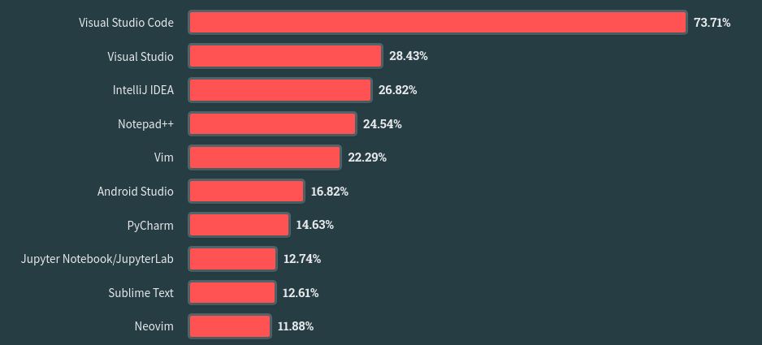

## Введение

Каждый год на сайте StackOverflow проходит опрос пользователей сайта на темы связанные с разработкой программного обеспечения. В 2022 году в нем приняло участие более 74 тысячи человек.
[Stack Overflow survey](https://survey.stackoverflow.co/2023/)

На вопрос какую среду разработки используют пользователи сайта были получены следующие результаты:

Visual Studio Code с большим отрывом опережает другие редакторы кода. Но интересно что редактор Vim занял пятое место и обошел другие более современные IDE.

В этой статье дан разбор преимуществ редактора Vim которые привлекают пользователей.

## Преимущества Vim

### Скорость редактирования кода

Визитной карточкой Vim является система горячих клавиш. В отличии от “обычных” редакторов текста, Vim использует систему режимов. В обычном режиме клавиши на клавиатуре используется для перемещения по тексту. Чтобы вводить текст нужно включить режим ввода текста.

Подобный подход позволяет отказаться от использования мыши для выделения и перемещения по тексту. Все действия выполняются с клавиатуры а руки не отрываются от среднего ряда клавиатуры.

В таком режиме выделение и редактирование текста происходит быстрее чем при использовании мыши. Например в случае если необходимо изменить текст внутри круглых скобок нужно набрать короткую фразу `ci(`. Текст внутри скобок будет удален и редактор перейдет в режим ввода текста.

Грамматика команд Vim может быть освоена в течении недели. После чего она поможет сэкономить гораздо большее времени затраченного на ее изучение.

### Использование горячих клавиш Vim в других программах

Клавиши Vim могут помочь не только при работе в самом редакторе Vim. Другие программы также имеют возможность использовать Vim режимы и клавиши. Zsh, Obsidian, Logseq, Emacs, Visual studio Code и продукты JetBrains - эти программы имеют возможность использовать горячие клавиши Vim в своей работе.

Если уметь работать в Vim даже при переходе на новую среду разработки можно будет продолжить использовать известные комбинации клавиш. Не придется тратить время чтобы запомнить либо переназначить клавиши в новой программе.

### Близость к терминалу

Vim это консольное приложение. Это означает что оно запускается непосредственно в терминале. Что это значит для пользователя? Даже если ему придется работать с текстом на удаленном сервере, он сможет использовать Vim. Ему не придется устанавливать редактор, Vim или Vi предустановлены на большинстве Unix like систем.

Работа Vim в терминале означает что при работе с ним можно использовать любые команды из терминала.

- Можно вставить путь рабочей директории сразу в текст.
- Можно форматировать и фильтровать текст при помощи программы awk.
- Можно выполнять Git команды непосредственно в редакторе.

Vim позволяет по полной использовать coreutils.

### Работа в связке с TMUX

В связке с мультиплексором терминалов VIm превращается в мощную среду разработки в которой можно работать над проектами, сохранять и восстанавливать состояние среды разработки между сессиями.

Тестирование и дебагинг кода может выполняться непосредственно в терминале. При этом переключение между редактором и процессом в консоли практически мгновенное.

### Конфигурирование в текстовых файлах

Вим конфигурируется в текстовых файлах при помощи Vim script или Lua. По началу это может показаться странным тем пользователям, кто привык к выбору настроек в графическом интерфейсе. Но такой способ конфигурации является более простым и понятным. На пользователя не вываливается разом огромный набор возможных настроек. Пользователь сам выбирает какие настройки добавить в конфигурацию. Он может постепенно разобраться что дают ему выбранные им опции.

Изменения в текстовых файлах легко контролировать при помощи Git. В случае если изменение в настройках не устроило пользователя, оно может быть легко возвращено назад к предыдущему состоянию.

### Большое число плагинов и расширений

В Vim есть большое число различных плагинов и расширений. Они расширяют функционал работы редактора и превращают его в полноценную среду разработки. LSP, completions, tree-sitter все это есть в Vim. В зависимости от потребностей пользователя Vim может быть как простым текстовым редактором так и не уступать в функциональности продуктам Jetbrains.
