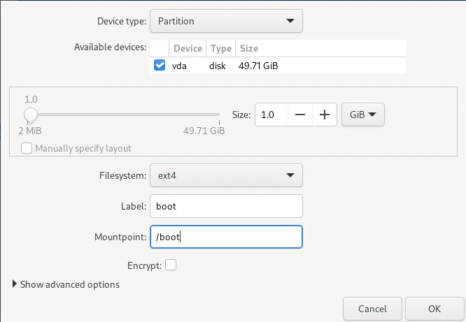

## Почему Fedora Linux

Я начал свое знакомство с Linux с [Ubuntu](https://ubuntu.com/), затем попробовал [Arch Linux](https://archlinux.org/), но идеальной для меня стала [Fedora](https://fedoraproject.org/ru/). Fedora предлагает идеальный баланс между стабильностью и актуальностью, имеет хорошую документацию и поддерживает RPM-пакеты, что делает установку приложений простой, даже если их нет в официальном репозитории.

## Преимущества Fedora Linux

Fedora Linux предлагает ряд преимуществ для пользователей, которые ищут стабильную, надежную и современную операционную систему. Вот некоторые из основных преимуществ использования Fedora:

### Стабильность

Fedora Linux известна своей стабильностью и надежностью. В отличие от Arch Linux, при использовании которого необходимо создавать резервные копии перед каждым обновлением, и [Pop!\_OS](https://pop".system76.com/), система которой дала сбой после первого мажорного обновления, Fedora не вызывает таких проблем. Обновления на этой системе проходят гладко и без вмешательства пользователя.

### Новые технологии

Fedora Linux активно использует новейшие технологии, что делает ее одной из самых передовых и современных операционных систем. Например, она перешла на использование файловой системы [Btrfs](https://habr.com/ru/companies/otus/articles/725424/) и протоколу [Wayland](https://wayland.freedesktop.org/) по умолчанию, что обеспечивает более высокую производительность и стабильность. Кроме того, в Fedora включены пакеты [Flatpak](https://flatpak.org/) и платформа [Flathub](https://flathub.org/), которые позволяют легко устанавливать и обновлять sandbox приложения.

### Менеджер пакетов

Менеджер пакетов [DNF](https://docs.fedoraproject.org/en-US/quick-docs/dnf/), используемый в Fedora, предлагает более свежие версии программ по сравнению с [APT](https://help.ubuntu.ru/wiki/apt), используемым в Ubuntu. Он также не имеет проблем с установкой пакетов из репозиториев, которые иногда возникают в Arch Linux. Репозиторий [AUR](https://aur.archlinux.org/) в Arch Linux содержит большое количество пользовательских пакетов, которые не всегда могут быть установлены корректно. В некоторых случаях эти пакеты могут заменить стандартные пакеты и вызвать проблемы в системе. В DNF подобные проблемы редки, так как все пакеты проверяются и тестируются перед добавлением в официальный репозиторий.

### Пакеты RPM

Fedora использует [RPM](https://rpm.org/), который является одним из наиболее распространенных форматов пакетов в [enterprise](https://www.redhat.com/en/technologies/linux-platforms/enterprise-linux) дистрибутивов Linux. Это означает, что большинство профессиональных инструментов для разработки ПО имеют RPM-версии, которые легко установить на Fedora.

### Поддержка большинства окружений рабочего стола

Fedora предлагает различные версии (так называемые "[spins](https://fedoraproject.org/spins/)") для большинства популярных окружений рабочего стола, включая [GNOME](https://www.gnome.org/), [KDE Plasma](https://kde.org/plasma-desktop/), [Xfce](https://www.xfce.org/), [MATE](https://mate-desktop.org/ru/) и другие. Это делает ее идеальным выбором для пользователей, предпочитающих определенные рабочие окружения. Разработчики Fedora также активно поддерживают развитие GNOME, что делает эту систему особенно привлекательной для пользователей, работающих с этим окружением.

## Как правильно установить Fedora

Для использования всех возможностей снимков Btrfs в Fedora Linux необходимо правильно настроить систему во время установки. Это включает в себя выбор правильной файловой системы (Btrfs), настройку разделов и создание subvolumes с правильными параметрами.

## Процесс установки

### Получение образа операционной системы

ISO-образы и другие файлы для загрузки Fedora Linux доступны на официальном [веб-сайте проекта](https://fedoraproject.org/). Здесь пользователи могут найти различные версии операционной системы, включая Workstation, Server, IoT и другие. Кроме того, на сайте доступны файлы контрольных сумм для проверки подлинности загруженных файлов.

Ссылки на версии с различными окружениями рабочего стола:

- [GNOME](https://fedoraproject.org/workstation/download)
- [KDE Plasma](https://fedoraproject.org/spins/kde/download)
- [Xfce](https://fedoraproject.org/spins/xfce/download)
- [Cinnamon](https://fedoraproject.org/spins/cinnamon/download)
- [MATE](https://fedoraproject.org/spins/mate/download)

### Запись образа на установочный USB

Для записи образа Fedora можно использовать различные программы, например, [Rufus](https://rufus.ie/ru/), [balenaEtcher](https://etcher.balena.io/) и другие. Однако, Fedora рекомендует использовать свое ПО под названием [Fedora Media Writer](https://docs.fedoraproject.org/en-US/fedora/latest/preparing-boot-media/#_fedora_media_writer), которое можно загрузить с официального сайта. Эта программа предлагает простой и понятный интерфейс для выбора образа и записи его на USB-накопитель. Кроме того, она позволяет выбрать версию Fedora и предпочитаемое окружение рабочего стола, что облегчает процесс установки.

### Запуск системы в режиме Live USB

Во время загрузки с USB-накопителя Fedora Linux необходимо нажать клавишу **F12**, чтобы отобразить меню выбора загрузочного диска. Это позволит выбрать нужный USB-накопитель и начать загрузку с него.

После успешной загрузки с USB-накопителя пользователь увидит программу установки Fedora Linux.

Однако, перед началом установки рекомендуется подключиться к Wi-Fi, если доступна такая возможность. Это позволит автоматически обновить систему и проверить наличие доступных обновлений для ПО.

### Выбор языка программы установки

При выборе языка для программы установки Fedora Linux рекомендуется использовать английский язык, так как он предоставляет более точные и понятные инструкции для пользователей.

### Выбор часового пояса

При выборе часового пояса в программе установки Fedora Linux можно использовать автоматическое определение, если система подключена к Интернету. В этом случае часовой пояс будет определен автоматически в соответствии с местоположением пользователя. Если подключение к Интернету отсутствует, можно вручную выбрать часовой пояс, кликнув на карте мира и выбрав нужное местоположение.

### Выбор места установки

После выбора языка, часового пояса и сетевых параметров, нужно выбрать раздел для установки Fedora Linux.

#### Выбор устройства и метода конфигурации разделов

- Пользователь должен выбрать одно либо несколько устройств для установки системы. Устройство выбирается путем нажатия на него, после чего рядом с ним появляется белая галочка на черном фоне. Если нужное устройство не выбрано, необходимо нажать на него, чтобы поставить отметку.
- Для конфигурации разделов доступны несколько методов.
  - **Аutomatic** - автоматическая конфигурация.
  - **Custom** - пользовательская конфигурация, с упрощенным интерфейсом.
  - **Advanced Custom** - пользовательская конфигурация с полным интерфейсом.

#### Конфигурация разделов

При использовании пользовательской конфигурации с полным интерфейсом (Advanced Custom) в программе установки Fedora Linux, пользователь может настроить файловую систему по своему усмотрению. Это включает создание новых разделов, форматирование существующих разделов и установку системы на выбранный раздел.

В начале пользовательского интерфейса отображаются все выбранные разделы и существующие на них файловые системы. Для создания новой файловой системы с нуля необходимо удалить существующие разделы с помощью кнопки с изображением креста на круге. Однако следует помнить, что удаление разделов приведет к удалению всех данных на них. Поэтому перед началом процесса установки необходимо убедиться, что все важные данные сохранены.

- Выбрать раздел с доступным пространством.
- Нажать кнопку «+», которая добавит новый раздел.
- Указать тип раздела и его размер, затем нажать «OK».
- Повторить этот процесс для каждого нового раздела.

Fedora Linux не требует создания раздела подкачки (swap), так как по умолчанию включает виртуальный раздел zRam размером 8 ГБ для использования в качестве swap. Этот раздел обеспечивает дополнительную память для операционной системы, когда она нуждается в дополнительной памяти для выполнения задач.

Правильная настройка разделов должна включать как минимум три основных раздела:

**Раздел EFI** - его следует создать первым, и он должен быть размещен в начале файловой системы. На нем хранятся загрузчики или образы ядер для всех установленных операционных систем, драйверы аппаратных устройств компьютера, используемые микропрограммой во время загрузки, служебные программы для запуска до загрузки ОС, а также различные данные, например журналы ошибок. Размер раздела EFI должен составлять около **300 МБ** на жестком диске. Точка монтирования: `/boot/efi`. Важно отметить, что если система не поддерживает UEFI, следует выбрать раздел системы BIOS.

**Раздел Boot** - загрузочный раздел содержит основные элементы, необходимые для запуска операционной системы. При загрузке компьютера он ищет на загрузочном разделе файлы, необходимые для загрузки ОС. Размер загрузочного раздела обычно составляет около **1 ГБ** на жестком диске, файловая система - **ext4**, точка монтирования - `/boot`.

**Раздел Root** - корневой раздел является основным разделом системы и содержит все данные операционной системы и пользовательские данные. Файловая система **btrfs**, при этом **точку монтирования указывать не нужно**. Для расчета размера корневого раздела следует учесть следующее:

- Минимум 40 ГБ для файлов ОС и программ, которые будут установлены в будущем. Но для комфортной работы я рекомендую выделить не менее 100 ГБ под саму систему, чтобы избежать проблем с наличием места для контейнеров и других данных.
- Минимум 250 ГБ для пользовательских данных в каталоге /home.

Итого минимум **350 ГБ** под корневой раздел.

Имеется возможность зашифровать этот раздел.

#### Создание btrfs подразделов

После создания разделов на дисках, использующих файловую систему Btrfs, необходимо выделить подразделы ([subvolumes](https://btrfs.readthedocs.io/en/latest/Subvolumes.html)) в этих разделах. Эти разделы представлены в левой части окна под заголовком **Btrfs Volumes**.

Для создания подразделов (subvolumes) необходимо выполнить следующие действия:

- Выбрать раздел, в котором необходимо создать подраздел.
- Нажать кнопку с плюсом "+" на верхней панели.
- В появившемся окне ввести название подраздела и выбрать точку монтирования. Нажать кнопку "OK".
- Повторить эти действия для каждого нового подраздела, который необходимо создать.

Правильная конфигурация подразделов обычно включает два основных подраздела: “/”, который содержит файлы операционной системы, и “/home”, который содержит пользовательские файлы и данные:

**Root subvolume** - подраздел root. В этот подраздел будут устанавливаться файлы ОС. Имя (Name) обязательно должно быть `@` Без этого не удастся воспользоваться программой [Timeshift](https://www.altlinux.org/Timeshift) для создания резервных копий системы с использованием [снимков Btrfs](https://linuxhint.com/use-btrfs-snapshots/). Точка монтирования (Mount point) - `/`, корневая директория всей системы.

**Home subvolume** - подраздел home. В этот подраздел будут устанавливаться пользовательские файлы. Имя (Name) обязательно должно быть `@home`. Без этого невозможно будет воспользоваться программой Timeshift для создания резервных копий пользовательских данных с использованием снимков Btrfs. Точка монтирования (Mount point) - `/home`, директория для хранения пользовательских данных.

В результате мы получаем корневой раздел, разделенный на два подраздела:

#### Завершение конфигурации дисков

После подтверждения завершения конфигурации появится сообщение с описанием действий, которые будут выполнены с дисками при установке системы.

### Начало установки

Для начала установки нужно нажать **Begin installation**.

