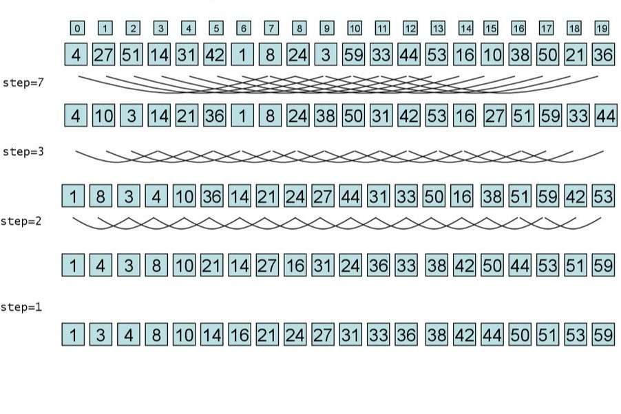

## Что такое сортировка Шелла

Сортировка Шелла - один из самых известных алгоритмов сортировки. Этот алгоритм был разработан в 1959 году американским математиком Дональдом Шеллом. Сортировка Шелла является усовершенствованным вариантом сортировки вставками и является более эффективной для больших объемов данных.
Принцип работы сортировки Шелла заключается в разбиении массива на подмассивы и последующей сортировке каждого подмассива методом вставки. При этом размер подмассивов уменьшается на каждой итерации сортировки. На первой итерации размер подмассива равен `n/2`, на второй - `n/4,` на третьей - `n/8` и т.д. После того, как размер подмассива становится равным единице, происходит окончательная сортировка всего массива методом вставки.

## Зачем использовать сортировку Шелла

Сортировка Шелла отличается от других видов сортировки тем, что она учитывает особенности расположения элементов в массиве. Например, если элементы массива уже отсортированы по возрастанию или убыванию, то сортировка Шелла будет работать значительно быстрее, чем другие алгоритмы. В то же время, если элементы массива расположены в случайном порядке, то эффективность сортировки Шелла будет ниже.

## Принцип сортировки Шелла



Для лучшего понимания работы сортировки Шелла рассмотрим ее на примере. Пусть у нас есть массив из 10 элементов: `[8, 2, 5, 1, 9, 4, 3, 7, 6, 0]`. На первой итерации сортировки Шелла размер подмассива будет равен 5. Массив разбивается на два подмассива: `[8, 2, 5, 1, 9]` и `[4, 3, 7, 6, 0]`. Каждый из этих подмассивов сортируется методом вставки. На второй итерации размер подмассива будет равен 2. Массив разбивается на четыре подмассива: `[8, 2]`, `[5, 1]`, `[9, 4]` и `[3, 7]`. Каждый из этих подмассивов сортируется методом вставки. Наконец, на третьей итерации размер подмассива будет равен 1. Массив разбивается на десять подмассивов, каждый из которых состоит из одного элемента. Каждый из этих подмассивов сортируется методом вставки. После этого массив окончательно отсортирован.

## Реализация сортировки Шелла на языке Python

Для реализации сортировки Шелла на языке Python можно использовать следующий код:

```python
def shell_sort(array: list) -> list:
    jump_size = len(array) // 2 # Определяем размер начального подмассива
    while jump_size > 0: # Производит итерацию пока размер подмассивов не достигнет 1.
        for i in range(jump_size, len(array)): # Проиводим итерацию внутри подмассивов.
            temp = array[i]
            temp_index = i
            while temp_index >= jump_size and array[temp_index - jump_size] > temp: # Сверяем значение во временной переменной со значениями отличными по индексу на размер подмассива пока не дойдем до последнего подмассива или до того пока не встретим меньшее значение
                array[temp_index] = array[temp_index - jump_size] # смещаем большие элементы вперед чтобы дать возможность сделать вставку
                temp_index -= jump_size # Сдвигаем указатель на занчение длинны подмассива
            array[temp_index] = temp # Делаем вставку
        jump_size //= 2 # Уменьшаем размер подмассива
    return array

```

В этом коде функция shell_sort() принимает массив arr и сортирует его методом Шелла. Сначала определяется размер массива и размер первого подмассива (gap). Затем происходит итерация по всем подмассивам. Для каждого подмассива происходит сортировка методом вставки. После этого размер подмассива уменьшается в два раза и происходит новая итерация. Процесс продолжается до тех пор, пока размер подмассива не станет равным единице.

## Заключение

Таким образом, сортировка Шелла является эффективным алгоритмом сортировки для больших объемов данных. Она учитывает особенности расположения элементов в массиве и позволяет значительно ускорить сортировку, если элементы уже отсортированы по возрастанию или убыванию. Реализация этой сортировки на языке Python достаточно проста и может быть использована для сортировки массивов любого размера.
