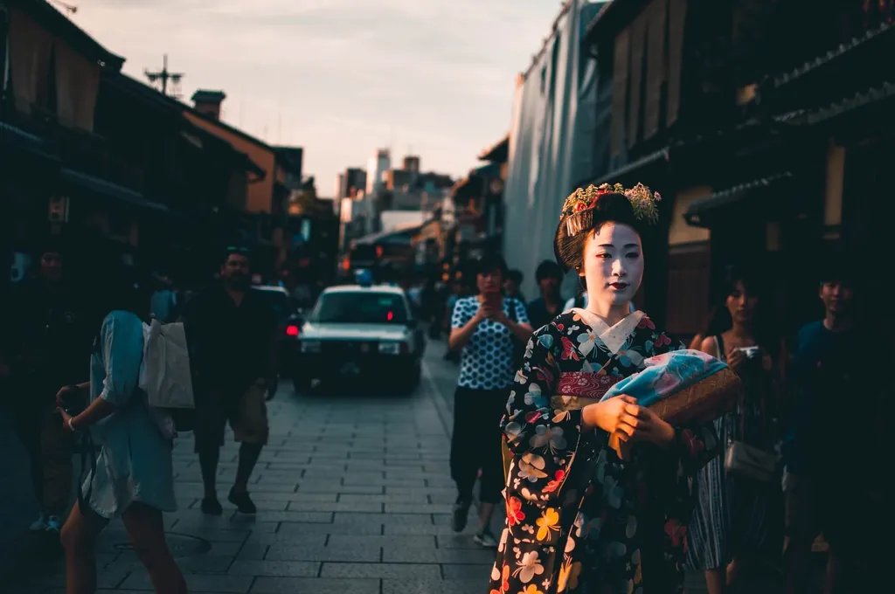
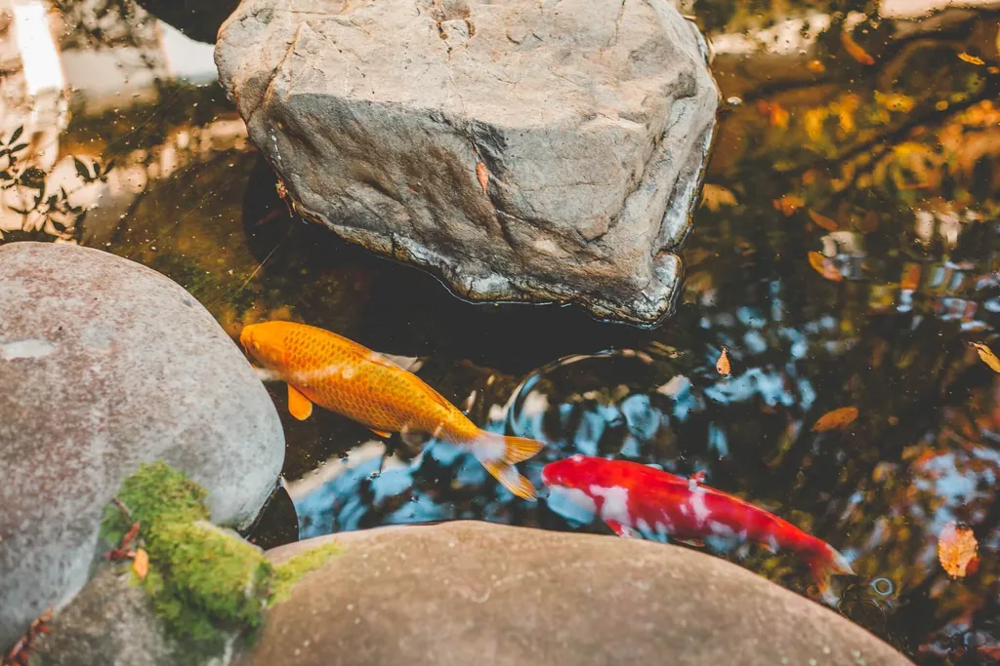
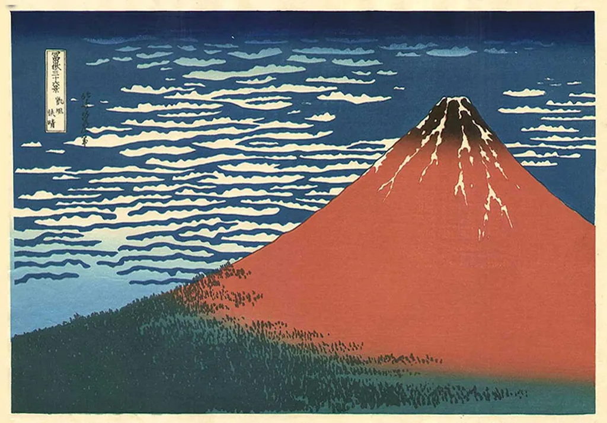
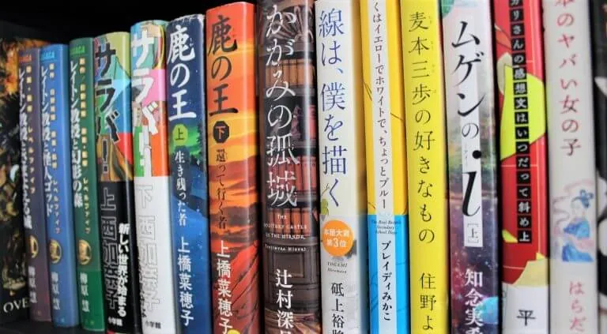
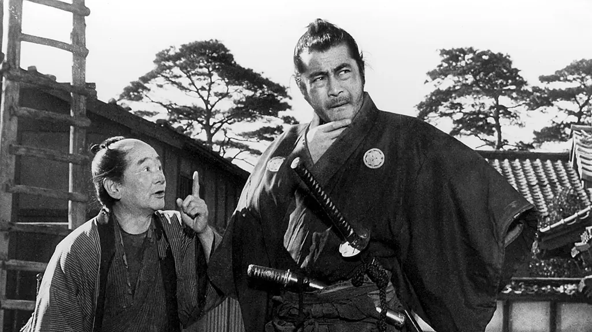

## Вступление

Задумывались ли вы вопросом какой язык учить? Говорю на собственном опыте, если не спросить себя об этом, то можно сильно ошибиться.

Я начинал учить французский язык несколько лет назад.  Всего я потратил на него полгода, но не смог найти ему применение в моей жизни. Решение изучать французский было спонтанным.

Когда я выбирал какой язык учить, китайский или японский, я задался вопросом, какой из них мне больше подойдет. Все вокруг говорили учить китайский язык. Он будет более востребован в будущем, говорили они. Но я выбрал японский.

Сейчас я рад своему выбору. Японский язык дал мне возможность увидеть Японскую культуру своими глазами. Я прикоснулся к тому, что делает Японию уникальной. И у меня никогда не было недостатка в контенте на японском языке. В этой статье я расскажу почему стоит выбрать японский язык.

- Взгляд на Японию со стороны.
- Какое влияние на японцев оказывает природа
- На каких принципах основана японская красота и как их использовать при принятие решения какой язык учить.
- О разнообразии контента на японском языке

Давайте найдем ответ что делает Японию и её язык уникальными.

## Взгляд на Японию со стороны

Что представляете вы когда думаете о Японии? Я представляю ультрасовременные города и поезда летящие над поверхностью рельс, но в тоже время, и традиционные одежды, верность заветам предков. Это все одна страна - Япония.

Японцы очень быстро воспринимают новые веяния в культуре и технологии. В 19 веке они прыгнули из феодального строя в современный. А после Второй мировой войны, они быстро приспособились к новым обстоятельствам и добились высоких темпов экономического роста. В тоже время, они остаются верны традиционным основам их общества. Казалось бы, столь падкая на западную моду японская молодежь должна была полностью отойти от нравов и обычаев старшего поколения. Но когда приходит пора свадьбы, японские девушки вновь превращаются в образец кротости и смирения. Они как бы вновь присягают законам предков.

Когда мы смотрим на Японию со стороны, мы видим только фасад, основа остается скрытой. Даже поехав туда на несколько недель, мы не поймем сути. Между нами и настоящей Японией стоит барьер. При взгляде сквозь него, видны только общие очертания настоящего. Это как смотреть сквозь мутное стекло.
Чтобы устранить это препятствие нам нужен японский язык. С ним станут доступны источники информации отражающие мысли и чувства самих японцев. Он позволит увидеть истинную суть их культуры.

## Природа Японии

Традиционная религия Японии Синтоизм крепко связана с природой. Вплоть до конца 19 века Япония оставалась аграрной страной, а ритм жизни японцев подчинялся природному циклу. И в 21 веке жизнь японцев  крепко связана с природой вокруг них.

Японцы считают свою природу уникальной. Расположение Японских островов севернее других азиатских стран сделало их климат совершенно непохожим на климат их южных соседей.

Японии 4 сезона. Для жителей России и Европы это неудивительно, ведь у нас тоже 4 сезона. Но посмотрим на Китай и Индокитай. В этих районах сезонов только два. Сезон дождей и сезон без дождей. В Японии же сочетание муссонных ветров, теплого морского течения и субтропических широт сделало её страной своеобразного климата, где весна, лето, осень, зима очерчены чрезвычайно четко, и сменяют друг друга на редкость пунктуально. Даже первая гроза, даже первый тайфун приходятся, как правило, на определенный день года.

В старину жизнь японцев подчинялась циклу смены времен года. Для различных сезонов характерны различные продукты. В зависимости от времени серьезно менялся и быт Японцев. Традиционный японский дом является символом неразрывной связи человека и окружающей его природы. Японский дом это крыша установленная на столбы. Стенами служат тонкие, бумажные перегородки. Стоит раздвинуть их, и жилище как бы превращается в летнюю веранду. И хоть в таком жилище не жарко летом, это достоинство обращается в свою противоположность зимой. А холода в Японии дают знать о себе с Ноября по Март.

Даже житель современного Токио остается чутким и отзывчивым к смене времен года. И не только потому, что в Японии нет центрального отопления. Традиционно японцы любят приурочивать семейные торжества к знаменательным явлениям природы: цветению сакуры или осеннему полнолунию. Японцы привыкли видеть на столе напоминания о времени года: ростки бамбука весной или грибы осенью. Им присуще стремление жить в гармонии с природой. Это неотъемлемая часть японской культуры.

## Принципы японского искусства

"Не сотвори, а найди и открой" - такой девиз можно дать Японскому искусству. Роль японского художника в том, чтобы помочь материалу заговорить, и на языке этого ожившего материала выразить собственные чувства. Художник уже в самом выборе материала ищет то, что способно откликнуться на его замысел.

Мерами красоты у японцев служат четыре понятия, три из которых (саби, ваби, сибуй) уходят корнями в религию синто, а четвертое (югэн) навеяно буддийской философией. Разберемся в каждом из этих понятий.

### 4 принципа Японского искусства

#### Саби

Красота и естественность для японцев тождественны. Естественные вещи красивы сами по себе, но человек может добавить материалу особые свойства, подчеркнуть его красоту. Поэтому японский дизайн это натуральные материалы, естественные текстуры и цвета. Тоже самое в японской кухне. Повар стремиться сохранить природный вкус ингредиентов, лишь подчеркнув и усилив его.
Японцы считают что время раскрывает суть вещей. Поэтому они видят особое очарование в вещах, на которых заметны следы их возраста. Это может быть цвет потемневшего от старости дерева или замшелый камень в саду. Эти следы давности и именуются саби, что буквально означает "ржавчина". В японской мифологии говорят о духах Цукумогами. Вещь которая существует в течение очень длительного периода времени одушевляется. Поэтому вещи с долгой историей ценятся в Японии очень сильно. ^a249a3

#### Ваби

Ваби - это отсутствие чего-либо вычурного и нарочитого. Это красота заключенная в обыденных вещах. Чтобы понимать заложенный в это понятие смысл, нужно воспитать в себе умение довольствоваться малым, ценить прекрасное в каждом предмете повседневного быта.
Ограниченность ресурсов на японских островах, не позволяла японцам создавать грандиозные произведения искусства. Поэтому красоту они находили в простые вещах. Не только картины или скульптуры, но и кухонная утварь, гребень для волос могут быть воплощением красоты для японца.
Если вы будете в Санкт-Петербурге, то сходите на выставку японского искусства на 3 этаже в Эрмитаже. Там вы поймете о чем идет речь. ^48e2c5

#### Сибуй

Сибуй объединяет в себе понятия саби и ваби. Это то что японец назовет красивым. Первородное несовершенство в сочетании с трезвой сдержанностью. Красота естественности плюс красота простоты. Это красота присущая назначению данного предмета, а также материалу, из которого он сделан. При минимальной обработке материала - максимальная практичность изделия. Сочетание этих качеств японцы считают идеалом.
Даже заимствуя модернистские веяния с запада, японцы принимают только как дополнение к их понимаю прекрасного - сибуй. ^581be4

#### Югэн

Тайна искусства состоит в том, чтобы вслушиваться в несказанное, любоваться невидимым. Этот принцип называется "югэн", он воплощает мастерство намека и подтекста.
Югэн родился из религии буддизма. Смысл учения Будды нельзя выразить словами, его постигают через внезапное озарение. К таким моментам ведет созерцание природы, умение находить согласие с окружающим и видеть значительность мелочей жизни.
Мир изменчив, учит буддизм, поэтому нельзя достигнуть полного совершенства в искусстве. Больше всего способно поведать о красоте то произведение, в котором не все договорено до конца.
Считая завершенность несовместимой с вечным движением жизни, японское искусство на том же основании отрицает и симметрию. Оно видит красоту в асимметричности декоративных элементов. Асимметричность олицетворяет мир живой и подвижный. ^a82b71

### Как использовать понимание принципов японского искусства

Мы рассмотрели принципы на которых основано японское искусство. Теперь, когда вы задаёте себе вопрос "Какой язык учить?", попробуйте соотнести свое понимание красоты с японским.
Почему это важно? Во время изучения японского языка вы будете встречаться с этими принципами постоянно. Если они гармонируют с вашим пониманием мира, такие встречи будут вызывать радость. Радость будет вызывать желание заниматься дальше. Тогда процесс обучения будет поддерживать сам себя, и вам больше не понадобиться сила воли.

## Контент на японском языке

У человека который изучает японский язык не будет вопросов, что почитать или посмотреть. На этом языке доступно огромное количество контента: художественная литература, манга, фильмы, аниме. Вне зависимости от вашего вкуса, вы найдете интересные для вас материалы.
Когда я выбирал какой язык учить, этот фактор стал для меня решающим. Я сравнивал японский язык с китайским. И я не смог найти для себя интересного контента на китайском языке. Если бы тогда я начал изучать китайский язык, то через некоторое время у меня бы пропал интерес к обучению.

С японским языком была обратная ситуация. С ним передо мной открывался гигантский мир традиционной и массовой культуры, которая известна на весь свет.
Посмотрим что японский язык может предложить нам во время обучения.

### Литература

Литература лежит в основе языка. Японская литература появилась в 8 веке и дошла до нас в виде одного из первых японских произведений - эпоса "Кодзики".
Отличительной чертой японской литературы является ее описательность. Как говорили ведущие подкаста "Хикибики" в выпуске про Харуки Мураками, хоть на страницах его книг особо ничего не происходит, от чтения невозможно оторваться. Данное качество присуще и другим авторам и произведениям.
Харуки Мураками это наиболее известный у нас японский писатель, но японская литература не ограничивается им одним:

- Нацуме Сосеки - один из основоположников современной японской литературы. Автор таких произведений как: "Ваш покорный слуга кот", "Ворота Расёмон", "Сердце".
- Ясунари Кавабата - лауреат Нобелевской премии по литературе (1968). Автор таких произведений как: "Снежная страна", "Мэйдзин".
- Нисио Исин - современный писатель. Автор серий новелл: "Моногатари", "Катанагатари".

Не стоит боятся читать на японском языке. Это лучший способ для его изучения. Чем раньше вы начнете это делать, тем быстрее вы достигните мастерства.

### Манга

Манга - это японские комиксы. Очень популярный жанр в Японии. Он гораздо более популярен в Японии, чем комиксы в США. При этом, не нужно думать о манга как о легкой литературе для детей. Некоторые произведения могут заткнуть за пояс большинство современной прозы. В таких манга поднимаются сложные вопросы и персонажи хорошо раскрыты.

- よつばと！ - отличная манга для начинающих учить японский язык. В ней нет иероглифов и читать её очень просто.
- バガボンド - невероятно красиво нарисованная манга. Основана на биографии японского мастера меча Миямото Мусаши.
- おやすみプンプン - глубокая история о взрослении, полном противоречивых эмоций и трудноразрешимых проблем.

Манга хороша для новичков в японском языке. В ней любой текст сопровождается рисунками, поэтому всегда есть контекст для понимания написанного.

### Фильмы и сериалы

Фильмы и сериалы сложнее для восприятия, чем литературные жанры. Без субтитров сложно проверять непонятные слова и одновременно следить за сюжетом. Русские субтитры создают ложное чувство, что вы понимаете то о чем говорят на экране. Лучше использовать оригинальные субтитры на японском языке.
Я смотрел не так много японского кино. Могу рекомендовать:

- "Ран" режиссёр Акира Куросава - псевдоисторический фильм, японский взгляд на поэму Шекспира "Макбет".
- "Рёма дэн" - исторический сериал от телекомпании NHK. Биография Сакамото Рёма - политика времен окончания правления сёгуната Токугава.
- Ханазава Наоки - популярный в Японии телесериал. Про современную японию.

Смотреть фильмы без перевода сложно. В качестве золотой середины используйте субтитры на японском языке. Если что-то непонятно в речи, нажмите паузу и попробуйте прочитать это в субтитрах.

### Аниме

Аниме - это японские мультфильмы. Как и в манга, в аниме существуют как произведения для детей, так и глубокие и трогающие за душу произведения для взрослых. Более простой язык делает аниме более подходящим для новичков, чем фильмы.
Ежегодно выходят сотни новых фильмов и сериалов аниме. В этом большом количестве сложно найти достойные вещи. Вот несколько моих рекомендаций:

- Мелочи жизни - аниме для начинающих изучать японский язык. Забавные короткие истории из жизни школьников.
- Истории монстров - подойдет для среднего знания японского. Сюжет основан на серии новелл "Моногатари". Мое любимое аниме.
- Гинтама - для продвинутого знания языка и японской культуры. Очень длинный сериал, со множеством отсылок к традиционной и современной японской культуре.

Так же как и фильмы, аниме лучше смотреть без субтитров, либо использовать оригинальные японские субтитры.

## Заключение

Для меня японский язык стал захватывающим путешествием в мир, о котором я не знал раньше. Я не разу не усомнился в правильности моего ответа на вопрос "Какой язык учить?".
Если вы заинтересованы в изучении языков и Японии, попробуйте открыть эту дверь. Изучение японского языка станет лучшим способом узнать новое о стране восходящего солнца и её культуре. А интерес к самой стране станет для вас поддержкой, когда вы столкнетесь с трудностями в обучении.
Главное не боятся. Японский язык не такой сложный как о нем говорят. В тоже время он долгое время будет для вас источником новых открытий.
