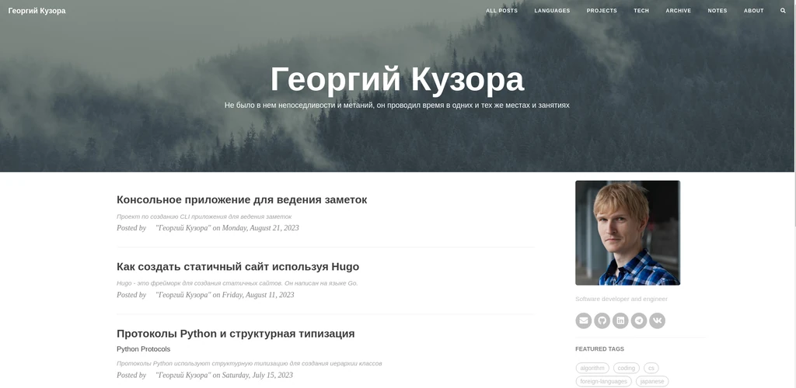

## Общая информация

- Сайт размещен по адресу - [Georgiy Kuzora](https://georgiykuzora.ru/)
- GitHub страница проекта - [My site created with Hugo](https://github.com/GeorgeKuzora/my_hugo_site)

Это проект личного сайта. Сайт включает:

- Личный блог разделенный по категориям. Каждая статья относиться к определенной категории, а также имеет несколько тегов. Теги обозначают основные темы статьи.
- Портфолио личных проектов. Проекты находятся в категории **Projects**. Проекты имеют ссылки на их GitHub страницы. Страница проекта включает описание проекта и его разработку.
- Страница автора сайта. На странице рассказано о компетенциях и интересах автора сайта.

## Создание сайта

Для создания сайта я использовал генератор статичных страниц [Hugo](https://gohugo.io/). В качестве основной темы сайта выбрана тема [CleanWhite](https://github.com/GeorgeKuzora/hugo-theme-cleanwhite). Для того чтобы можно было легко изменять базовые параметры темы сайта, я сделал форк оригинального проекта темы и внес в него некоторые изменения.

[В этой статье](https://georgiykuzora.ru/post/hugo_basic/) я описал основные этапы работы над сайтом при помощи Hugo.

## Публикация сайта

Сайт размещен на виртуальном хостинге компании [Timeweb](https://timeweb.com/ru/). В планах переместить сайт на VPS сервер.

Для публикации контента я использую `rclole` и технологию `sftp`.
